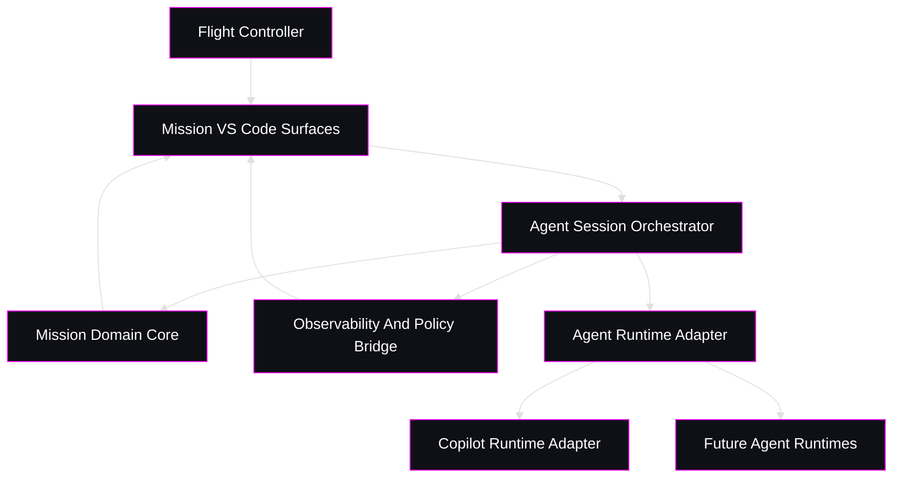

<!--
  @file apps/vscode-extension/docs/agent-runtime-architecture.md
	@description Defines the protocol-first Mission architecture that replaces the VS Code chat participant with provider-neutral coding-agent session orchestration.
-->
# Mission Agent Runtime Architecture

## Status

Accepted design direction for the next Mission architecture pass.

This document defines the target runtime design that should replace the current advisory `@mission` chat-participant-centered execution model.

## Decision

Mission should stop treating the VS Code chat participant as the primary interaction contract for execution.

The flight controller should operate Mission through a protocol-facing agent session model.

Mission should freeze a provider-neutral runtime contract before it commits to any single provider protocol.

For GitHub Copilot, ACP may become one adapter path if it proves operationally mature enough for Mission governance.

Subprocess-backed control remains a valid first adapter when it better satisfies the required lifecycle, interruption, and normalization contract.

The cockpit, roadmap, explorer, and console remain Mission presentation surfaces, but none of them should contain provider-specific execution logic.

## Why This Replaces The Participant Model

The current participant model is intentionally bounded to advisory behavior:

1. it is read-only
2. it does not own execution
3. it does not own approvals
4. it does not own session lifecycle
5. it cannot serve as the durable abstraction for cross-agent orchestration

That makes it acceptable as a temporary guidance surface, but the wrong center of gravity for Mission.

The strategic boundary is no longer `chat participant -> prompt -> tool loop`.

The strategic boundary is:

1. `Mission orchestration`
2. `provider-neutral agent session contract`
3. `provider adapter`
4. `flight-controller-facing presentation`

If provider-native protocol integrations mature as expected, the participant becomes irrelevant to core execution. Mission should therefore be designed now so that Copilot is only one provider adapter, not the architecture itself.

## Architectural Intent

Mission is the governed mission orchestrator.

It is not:

1. a thin skin over VS Code chat
2. a Copilot-specific UX wrapper
3. a terminal transcript viewer with mission branding

It is:

1. the mission-domain authority for workflow state, gates, artifacts, and approvals
2. the session orchestrator for coding-agent flights
3. the normalization boundary between provider-native protocols and Mission UX
4. the observability surface for execution, context pressure, cost, and operator intervention

## Design Goals

1. Remove the VS Code participant from the critical path for execution.
2. Freeze the Mission-facing runtime contract before deeper provider-specific integration work.
3. Preserve Mission as the owner of mission state, gates, and artifact governance.
4. Normalize runtime events so additional providers can be added later without redesigning the cockpit.
5. Keep presentation surfaces provider-agnostic.
6. Keep governance and execution separate so Mission remains the control-plane authority even when runtimes differ.
7. Support both interactive checkpointed work and longer autonomous flights.

## Non-Goals

1. Mission does not reimplement a coding agent.
2. Mission does not own model prompting semantics that are already provider-native unless they must be normalized for governance.
3. Mission does not expose provider-specific protocol objects directly to the webview.
4. Mission does not make ACP mandatory for every future provider; it defines a runtime contract that ACP-based, stdio-based, or subprocess-backed providers can satisfy cleanly.

## Primary Boundaries

The design should be implemented as five explicit subsystems.

### 1. Mission Domain Core

This subsystem remains the authority for repository mission state.

Responsibilities:

1. load and refresh mission snapshot state
2. evaluate workflow gates
3. read and mutate canonical mission artifacts
4. decide which actions are legal
5. define the bounded context for a flight

This subsystem owns:

1. mission stage truth
2. flight truth
3. task truth
4. artifact readiness truth
5. checkpoint and intervention legality

This subsystem must not know anything about ACP, JSON-RPC shapes, VS Code chat APIs, Copilot CLI flags, or provider-specific streaming formats.

### 2. Agent Session Orchestrator

This subsystem is the Mission execution coordinator for coding-agent flights.

Responsibilities:

1. start a flight session from mission context
2. resume an existing session
3. pause, cancel, or terminate a session
4. route flight-controller replies back into the active session
5. correlate a session with the current mission, stage, and flight
6. collect normalized runtime events and publish them to Mission presentation surfaces

This subsystem decides:

1. which provider runtime to use
2. what mission context is exposed to the runtime
3. when a provider event becomes a cockpit event
4. when Mission must interrupt autonomous execution because governance requires a checkpoint or intervention

### 3. Agent Runtime Adapter Boundary

This is the provider-neutral contract.

Each provider adapter implements the same Mission-facing runtime interface.

Required capabilities:

1. session start
2. session resume
3. prompt submission
4. streaming event subscription
5. permission request handling
6. session cancellation or shutdown
7. capability reporting
8. telemetry export or telemetry bridging when available

The first implementation path should prefer a tmux-backed process adapter when it provides the simplest portable control surface for interactive coding CLIs.

Tmux is a transport and terminal-control substrate, not the Mission runtime contract.

Mission still owns lifecycle, governance, event normalization, and session identity above tmux.

The first adapter may be either:

1. `CopilotAcpRuntimeAdapter`
2. `GenericProcessTmuxRuntimeAdapter`
3. `CopilotCliProcessRuntimeAdapter`

Likely future adapters:

1. `CodexRuntimeAdapter`
2. `ClaudeRuntimeAdapter`
3. `GenericProcessRuntimeAdapter`
4. `DaemonMcpRuntimeAdapter`

### 4. Presentation Surfaces

These remain VS Code surfaces, but they consume normalized Mission state only.

Surfaces:

1. cockpit sidebar
2. mission explorer tree
3. roadmap panel
4. graph panel
5. operator or runtime console

These surfaces may display:

1. current provider
2. current session state
3. permission requests
4. context usage
5. cost and token telemetry
6. active checkpoint or intervention requests

They must not speak ACP, run provider protocol state machines, or embed provider SDK logic.

### 5. Observability And Policy Bridge

This subsystem turns provider-native telemetry and approvals into Mission governance signals.

Responsibilities:

1. normalize context-window usage
2. normalize token and cost reporting
3. normalize tool execution traces
4. record session lifecycle events
5. evaluate provider permission requests against Mission policy
6. expose auditable flight history for review and later analysis

This subsystem is where Copilot CLI telemetry and future provider telemetry should converge into one Mission event model.

## Target System Shape

## Mission Runtime Contract

Mission should define a provider-neutral session contract before any deeper Copilot implementation work.

At minimum, the contract should expose the following domain objects.

### `MissionAgentRuntime`

The provider adapter interface.

Responsibilities:

1. advertise runtime capabilities
2. start sessions and resume sessions when supported
3. accept mission-scoped turn requests and control messages
4. stream normalized events back to Mission
5. shut down cleanly

For tmux-backed runtimes, `MissionAgentRuntime` should treat the tmux session, window, and pane identifiers as provider-side transport details hidden behind the adapter.

### `MissionAgentSession`

The active flight execution handle.

Responsibilities:

1. identify provider session id
2. track associated mission id and flight id
3. record current lifecycle state
4. accept flight-controller input
5. expose suspend, resume, cancel, and terminate operations

When the runtime is terminal-backed, flight-controller input includes governed terminal input injection.

That input may be implemented as prompt submission, control-key signaling, or keystroke delivery, but Mission should route it through explicit operator actions and normalized audit events rather than treating the tmux pane as an untracked side channel.

### `MissionAgentTurnRequest`

The bounded execution request composed by Mission.

Responsibilities:

1. carry working directory and bounded mission scope
2. carry operator intent and mission prompt text
3. request a fresh or resumed session explicitly
4. remain provider-neutral and protocol-neutral

### `MissionAgentEvent`

The normalized event model published into the Mission UI and logs.

Event families should include:

1. `session-started`
2. `session-resumed`
3. `agent-message`
4. `agent-thinking`
5. `permission-requested`
6. `tool-started`
7. `tool-finished`
8. `context-updated`
9. `cost-updated`
10. `checkpoint-required`
11. `intervention-required`
12. `session-completed`
13. `session-failed`
14. `session-cancelled`

### `MissionRuntimeCapabilities`

This must describe what a provider can actually do.

Examples:

1. resumable sessions
2. interactive approvals
3. tool-level approvals
4. context usage visibility
5. token visibility
6. cost visibility
7. custom instructions support
8. MCP support
9. subagent support
10. telemetry export support
11. terminal session attachment
12. governed terminal input injection
13. semantic daemon messaging

The cockpit should consume capabilities to decide what to show, rather than assuming every provider behaves like Copilot.

### Minimum Stable Boundary

Mission should freeze the following runtime boundary before it deepens any provider integration:

1. runtime identity and capability reporting
2. bounded turn request and mission scope objects
3. governed session lifecycle and control operations
4. normalized event families
5. provider-neutral approval and intervention requests
6. normalized telemetry snapshots when available
7. deterministic completion and failure end states

Mission should not freeze ACP request shapes, Copilot CLI flags, transcript parsing heuristics, or provider-specific prompt envelopes as part of the core contract.

## Copilot-Specific Design

Copilot is the first provider, not the special case that leaks through every Mission surface.

### Candidate Integration Modes

Mission should support whichever Copilot adapter best satisfies the runtime contract with the least protocol leakage.

Candidate modes:

1. Copilot CLI via ACP
2. Copilot CLI via tmux-backed process control
3. Copilot CLI via subprocess-backed process control

Selection criteria:

1. interruptibility and session lifecycle control
2. permission and approval visibility
3. event normalization quality
4. telemetry export availability
5. implementation stability inside Mission

ACP is attractive when:

1. ACP provides a stable protocol direction for IDE and automation integration.
2. Mission can manage sessions and permission requests without pretending to be the chat UI.
3. Mission can treat Copilot as a runtime service instead of embedding Chat API assumptions into its domain model.

Process control is acceptable when:

1. it better satisfies Mission lifecycle control and interruption requirements
2. the adapter still emits the same normalized Mission event model
3. provider-specific heuristics remain contained inside the adapter boundary

Tmux-backed process control is preferred for the initial implementation when:

1. the agent CLI expects a real PTY
2. the operator must be able to inspect and intervene in a live session visually
3. Mission needs a portable way to host multiple provider CLIs without provider SDK coupling

Mission should treat tmux as the session substrate for CLI runtimes, not as a replacement for Mission policy or runtime normalization.

The adapter should be responsible for:

1. creating and naming the tmux session, window, or pane deterministically
2. mapping Mission session references to tmux targets
3. capturing transcript output through tmux mechanisms or equivalent teeing
4. detecting pane exit, process exit, and operator attachment state
5. translating Mission prompts and commands into safe terminal operations

The chosen Copilot adapter is an implementation detail, not a public architectural boundary.

### Copilot Telemetry

When available, Mission should ingest Copilot CLI telemetry through OTel or another supported export path and normalize it into mission events.

This should power:

1. live context window display
2. token usage by flight
3. cost by flight
4. tool execution trace
5. checkpoint and interruption audit
6. long-running session visibility

When structured telemetry is not available, terminal-backed adapters should still emit lifecycle, transcript, and intervention events.

Reduced telemetry does not relax Mission governance requirements.

Future richer telemetry or status messages may also arrive through a Mission-owned daemon MCP server exposed to the running agent.

That MCP path should complement terminal control, not replace the normalized runtime contract.

## Flight Lifecycle

The intended runtime lifecycle is:

1. Mission determines the active mission and active flight.
2. The flight controller selects `Open Guidance`, `Execute Flight`, or another governed action.
3. Mission composes the bounded mission context for the runtime.
4. The orchestrator selects a provider runtime adapter.
5. The runtime starts or resumes a provider-native session.
6. Provider-native events are normalized into Mission agent events.
7. The cockpit and console render the normalized session state.
8. Permission requests flow through Mission policy and then to the flight controller when human input is required.
9. Governance gates may pause or stop the flight even if the provider would otherwise continue autonomously.
10. Completion or failure is written back as Mission session state, not inferred only from transcript text.
11. Operator interventions into a live terminal session are recorded as Mission events.
12. Future agent-to-Mission semantic messages may flow through daemon MCP tools or resources without changing the session contract.

## Policy And Approval Boundary

Mission must keep final authority over mission legality even when a provider supports autonomous execution.

That means:

1. provider tool permissions do not replace mission gates
2. provider autonomy does not replace artifact approvals
3. provider resumability does not replace mission checkpoint semantics
4. provider prompts do not define mission state

Mission should therefore evaluate approvals in two steps:

1. provider-level permission semantics
2. mission-level governance semantics

The second step always wins.

For terminal-backed runtimes, Mission may also exercise governance through controlled input injection.

Examples include:

1. sending `Ctrl+C` to interrupt an autonomous run
2. delivering an operator reply into the running terminal session
3. issuing an engine-owned checkpoint prompt through the terminal transport

These operations must be mediated by the adapter and recorded as governed intervention events.

Raw untracked operator typing into the pane is operationally possible, but not the target Mission governance model.

The long-term preferred path is:

1. terminal control for transport and compatibility
2. daemon MCP for semantic agent-to-Mission messaging
3. normalized Mission events for audit and UI binding

## Presentation Rules

The cockpit should present execution through Mission terms.

Use:

1. `Flight Controller`
2. `Flight`
3. `Checkpoint`
4. `Manual intervention`
5. `Mission runtime`

Do not expose raw provider terminology as the primary UX model unless it is necessary for a specific diagnostic surface.

For example:

1. show `Provider: Copilot`
2. show `Runtime: Copilot adapter session`
3. do not redesign the whole cockpit around Copilot's native chat vocabulary

## Source Mapping From Current Code

The current extension already contains useful raw material for this design, but the responsibilities are not yet cleanly separated.

### Keep And Evolve

1. `MissionSessionController`
   - keep as the mission-facing orchestration authority
   - split out provider session orchestration from presentation-specific behaviors
2. `MissionOperatorClient`
   - evolve into a generic session-host or runtime-host abstraction
   - remove assumptions that all useful execution is plain child-process command execution
3. cockpit, timeline, and tree providers
   - keep as presentation surfaces fed by normalized Mission state

### Deprecate From The Critical Path

1. `MissionChatParticipant`
2. `MissionChatTools`
3. direct guidance-launch glue as the main execution path

These may remain temporarily for briefing or read-only advisory support, but they should not own execution architecture.

### Replace With New Boundaries

1. `MissionAgentRuntime`
2. `AgentSession`
3. `MissionPolicyBridge`
4. `MissionTelemetryNormalizer`
5. `GenericProcessTmuxRuntimeAdapter`
6. `CopilotAcpRuntimeAdapter`

## Terminal-Backed Runtime Notes

The tmux-backed adapter is the preferred first concrete runtime because it solves the portability and operator-visibility problem for CLI-native coding agents.

Design expectations:

1. each Mission session maps to one deterministic tmux target
2. Mission persists that target as part of the session reference or recoverable metadata
3. attach, detach, interrupt, and prompt operations are adapter APIs, not ad hoc shell calls from UI code
4. pane liveness alone is not sufficient to declare success
5. terminal completion must be reduced into normalized `completed`, `failed`, `cancelled`, or `terminated` states

The tmux adapter should capture at least these facts:

1. process exit status
2. last known tmux target
3. whether Mission or the operator last injected input
4. whether the session is awaiting operator input
5. transcript tail for recovery and diagnostics

This keeps tmux as an implementation detail while still acknowledging the realities of terminal-native agents.

## Daemon MCP Direction

Mission should plan for the daemon to become an MCP server that running agents can call when richer semantics are needed.

That future path should support messages such as:

1. explicit completion notifications
2. checkpoint explanations
3. structured clarification requests
4. artifact handoff summaries
5. progress and rationale updates

This path is strategically important because it allows a terminal-native runtime to gain structured semantic messaging without requiring Mission to embed provider SDKs.

However, daemon MCP is an additive capability.

Mission must not block the tmux-backed runtime rollout on MCP server availability.

## Explicit Boundary Rules

### Rule 1

Mission domain code must not import provider protocol packages.

### Rule 2

Provider adapters must not decide mission legality.

### Rule 3

Cockpit code must never consume provider-native event payloads directly.

### Rule 4

Telemetry normalization must happen before UI binding.

### Rule 5

Mission must be able to swap providers without rewriting flight-controller UX semantics.

### Rule 6

Every provider integration must declare capabilities explicitly instead of relying on hidden assumptions.

## Multi-Agent Readiness

This design is ready for multiple coding agents only if Mission remains strict about normalized contracts.

To support future providers, the system must assume variance in:

1. protocol shape
2. approval model
3. session persistence
4. telemetry richness
5. cost model
6. tool model
7. subagent model

Mission should normalize those differences into one cockpit vocabulary instead of leaking each provider's mental model into the product.

## Recommended Rollout

### Phase 1

Introduce the provider-neutral runtime interfaces and event model without changing cockpit UX semantics.

### Phase 2

Implement `GenericProcessTmuxRuntimeAdapter` and wire Mission execution through the new session orchestrator.

### Phase 3

Reduce `MissionChatParticipant` to an optional briefing surface or remove it entirely.

### Phase 4

Add telemetry normalization for context, token, and cost reporting, plus governed intervention audit for terminal-backed sessions.

### Phase 5

Add daemon MCP semantic messaging and a second provider runtime adapter to prove that the contract is genuinely provider-neutral.

## Immediate Implementation Consequences

The next implementation pass should not start by polishing prompts.

It should start by extracting contracts.

The first code changes should therefore be:

1. define a provider-neutral runtime interface package or extension-host module
2. split session orchestration responsibilities away from chat-participant glue
3. turn the current operator client into a runtime-host abstraction
4. re-route `execute flight` actions through the session orchestrator instead of chat-command glue
5. feed cockpit state from normalized runtime events rather than chat transcript assumptions

## Final Principle

Mission should own the mission.

The provider should own agent execution.

The protocol adapter should translate between them.

The cockpit should reveal the result without becoming coupled to any single coding agent.
