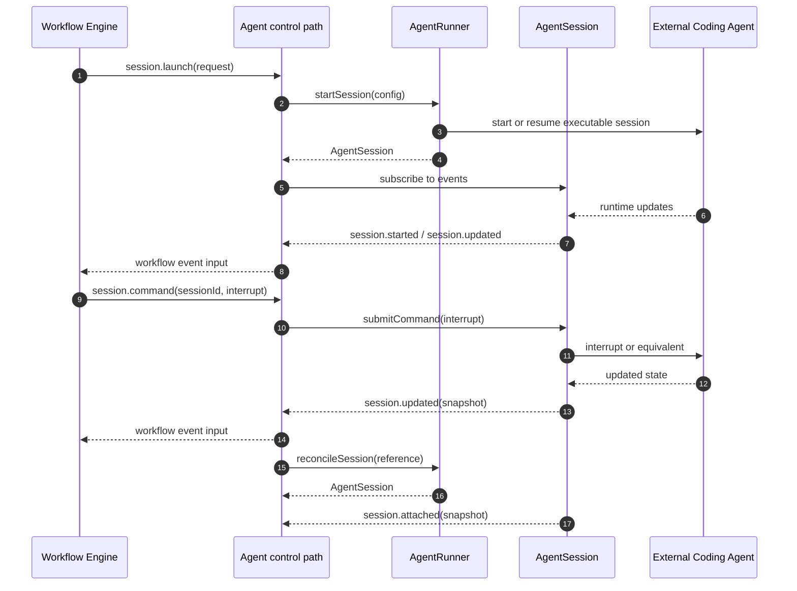

# Agent Runtime

The agent runtime is the provider-neutral execution boundary for Mission's external coding-agent processes.

Mission does not own model-provider protocol. It owns orchestration intent.

That means Mission decides when work starts, what instruction and context are sent, what lifecycle state is authoritative, and how human governance such as panic or interrupt is enforced.

Adapters decide how that intent maps onto a concrete executable or SDK.

## Core Boundary

The hard architectural split is:

- Mission core owns intent, lifecycle, normalized observations, and daemon-facing control routing.
- Adapters own executable translation, transport, parsing, and process control.

Mission must not own package installation, login, update flows, or provider-native concepts such as one vendor's private reasoning flags as first-class semantic fields.

## Execution Model

The runtime architecture has two first-class execution contracts:

1. `AgentRunner`
2. `AgentSession`

`AgentRunner` is the factory and capability boundary for one adapter family.

`AgentSession` is the live instance boundary for one running external session.

Mission may still use a daemon-owned coordination service internally to keep a session registry, reconcile restarts, and expose IPC methods. That service is operational glue, not the core abstraction exported by the architecture.

## Primary Components

| Component | Responsibility | Owned state | Runtime boundary |
| --- | --- | --- | --- |
| daemon-owned agent control path | resolve runners, hold live sessions, reconcile restarts, route workflow and external session control | live session registry, recovery, event fanout | Daemon/runtime |
| `AgentRunner` | Thin executable adapter contract implemented per agent family | executable-specific validation, launch, reconciliation, capabilities | Provider-specific |
| `AgentSession` | Live adapter-backed session instance | transport handle, process or SDK attachment, live snapshot | Provider-specific instance |
| `AgentSessionSnapshot` | Normalized session state exposed to the workflow engine and surfaces | no behavior, state only | Shared contract |
| `AgentSessionEvent` | Normalized runtime facts emitted by the runtime | append-only runtime observations | Shared contract |

Whenever possible, adapters should prefer semantic signaling over brittle stdout scraping.

That means a runner should use structured dual-channel communication such as a Mission MCP server exposed to the agent when the executable can support it, so the agent can explicitly signal state changes like awaiting input, checkpoint, or progress updates through tool calls instead of forcing Mission to infer them from free-form terminal text.

## Runner Contract

Each runner should implement only the small set of methods required to wrap an external coding agent:

1. report capabilities
2. report availability
3. validate a launch config
4. start a new or resumed session
5. reconcile a persisted session reference after daemon restart

This is intentionally narrow.

The runner is not responsible for:

- defining workflow policy
- defining mission task semantics
- inventing a second public orchestration layer of its own
- owning Runway pane layout or Airport projection
- exposing provider-native command sets as the public Mission contract

## Session Contract

Each `AgentSession` instance is responsible for:

1. returning its current normalized snapshot
2. emitting normalized runtime events
3. accepting Mission prompts
4. accepting Mission commands such as interrupt or checkpoint
5. cancelling gracefully when possible
6. terminating forcefully when required

That gives Mission a clean factory-instance split:

- the runner starts or reconciles a session
- the session performs the live interaction work

Interrupt must be non-destructive.

Mission's interrupt command should halt autonomous generation and return control without destroying the session process. For terminal-backed runtimes this normally means injecting the transport's standard interrupt signal such as `Ctrl+C` into the PTY input stream rather than killing the OS process.

## Opaque Metadata Rule

Runner-specific options belong in opaque metadata carried through Mission config and launch requests.

Mission persists that metadata and passes it through.

Only the concrete adapter interprets keys such as a proprietary effort or thinking flag.

## File Structure

The target structure has two layers:

### First-Class Public Runtime Contract

These are the files that define the architecture seen by the workflow engine and other callers:

- `AgentRunner.ts`
- `AgentSession.ts`
- `AgentRuntimeTypes.ts`

That means the first-class concepts are:

- `AgentRunner`
- `AgentSession`
- `AgentSessionSnapshot`
- `AgentSessionEvent`

### Internal Runtime Implementation

These may exist in code, but they are not first-class architecture:

- an in-memory session registry
- a daemon-side agent control service
- a persistence helper
- a terminal transport helper

These helpers must not become competing public runtime abstractions.

## Architectural Boundaries

The runtime architecture separates three concerns:

| Concern | Primary component | Description |
| --- | --- | --- |
| Mission-facing control path | daemon-owned agent control path | Shared control boundary used by workflow and external daemon clients |
| Provider integration | `AgentRunner` | Thin adapter that translates Mission launch and reconciliation into executable behavior |
| Live session instance | `AgentSession` | One running adapter-backed session object |
| Shared runtime facts | `AgentSessionSnapshot`, `AgentSessionEvent` | The normalized state and event contract used across runtime boundaries |

This separation keeps provider mechanics out of workflow logic and prevents internal execution details from becoming public architecture.

## Ownership Model

| Layer | Owns | Must not own |
| --- | --- | --- |
| Workflow engine | when work should start, be steered, stop, or recover; mission truth | provider protocol, terminal IO details |
| daemon-owned agent control | live session registry, reconciliation, persistence hooks, session routing | workflow truth, Airport layout semantics |
| Agent runner | executable translation and provider-specific process or SDK interaction | workflow policy, surface policy |
| Agent session | one live executable-backed interaction boundary | workflow policy, pane routing |

## Public Model

The public execution model is defined by four first-class concepts:

- `AgentRunner`
- `AgentSession`
- `AgentSessionSnapshot`
- `AgentSessionEvent`

The daemon-owned control path uses these contracts to serve workflow requests and external session commands.

### Component Semantics

| Component | Architectural meaning |
| --- | --- |
| daemon-owned agent control path | Shared daemon service that resolves runners, owns live session registry, and exposes runtime control to workflow and surfaces |
| `AgentRunner` | Thin executable adapter responsible for validation, start, capability reporting, and reconciliation |
| `AgentSession` | Live provider-backed session instance that accepts prompts and commands and emits normalized events |

If an implementation helper such as an orchestrator exists in code, it is internal plumbing for the daemon-owned control path.

## Runtime Sequence

This diagram shows the intended responsibility split.

The key point is that workflow requests and external daemon clients use the same daemon-owned control path.

Adapters remain behind that boundary.

## Responsibility Summary

| Component | Must do | Must not do |
| --- | --- | --- |
| daemon-owned agent control path | resolve runners, manage live sessions, own recovery, route workflow and external control | encode provider-specific flags as public Mission semantics |
| `AgentRunner` | validate config, start sessions, reconcile persisted references, report capabilities | own workflow policy, own mission truth |
| `AgentSession` | represent one live runtime-managed session and execute Mission prompts or commands | define workflow policy or surface behavior |

## Normalized Contract Addendum

The runtime contract is intentionally small, but it is not vague.

A contributor implementing a new runner should satisfy the following minimum contract.

### Required `AgentRunner` Methods

| Method | Required behavior |
| --- | --- |
| `getCapabilities()` | Return the runner feature surface used by daemon-owned control and surfaces to decide what controls are valid. |
| `isAvailable()` | Confirm the executable or backing runtime is actually usable on the current machine and report a reason when it is not. |
| `validateLaunchConfig(config)` | Reject invalid or unsupported launch configuration before any process or session is started. |
| `startSession(config)` | Start or resume one live external session and return an `AgentSession` instance. |
| `reconcileSession(reference)` | Reattach to a previously known session reference after daemon restart, or normalize the reference into a terminal session outcome when reattachment is impossible. |

### Required `AgentSession` Methods

| Method | Required behavior |
| --- | --- |
| `getSnapshot()` | Return the current normalized `AgentSessionSnapshot` without requiring callers to inspect provider-native state. |
| `onDidEvent(listener)` | Emit normalized `AgentSessionEvent` values for the lifetime of the live session. |
| `submitPrompt(prompt)` | Send one Mission prompt to the live session and return the updated normalized snapshot, or reject with a typed runtime error. |
| `submitCommand(command)` | Apply one normalized Mission command such as interrupt, checkpoint, nudge, or resume, and return the updated normalized snapshot, or reject with a typed runtime error. |
| `cancel(reason?)` | Attempt a graceful stop and normalize the resulting terminal state. |
| `terminate(reason?)` | Force termination when graceful control is insufficient and normalize the resulting terminal state. |

### Required Lifecycle Support

Every runner must normalize live session state into this lifecycle vocabulary:

- `starting`: launch accepted and bootstrapping has begun
- `running`: the session is alive and progressing autonomously
- `awaiting-input`: the session is alive but waiting for Mission or operator input
- `completed`: the session ended successfully
- `failed`: the session ended unsuccessfully
- `cancelled`: the session was intentionally cancelled
- `terminated`: the session was forcibly stopped or could not be recovered

If a provider exposes finer-grained internal states, the adapter must collapse them into this vocabulary before they leave the runtime boundary.

### Required Event Categories

Every runner and session implementation must be able to emit these normalized event categories:

| Event category | Required meaning |
| --- | --- |
| `session.started` | A live session has been created and has an initial normalized snapshot. |
| `session.attached` | A persisted session reference has been successfully reconciled into a live session view. |
| `session.updated` | Non-terminal session state changed and a fresh normalized snapshot is available. |
| `session.awaiting-input` | The session is alive and explicitly needs Mission or operator input. |
| `session.message` | Auditable runtime output is available on a normalized channel such as `stdout`, `stderr`, `system`, or `agent`. |
| `session.completed` | The session reached a successful terminal outcome. |
| `session.failed` | The session reached an unsuccessful terminal outcome. |
| `session.cancelled` | The session ended through graceful intentional cancellation. |
| `session.terminated` | The session ended through forceful termination or irrecoverable loss. |

These are the only event categories the rest of Mission should depend on.

## Lifecycle Contract

The runtime normalizes provider behavior into a consistent session lifecycle.

| Runtime phase | Meaning |
| --- | --- |
| `starting` | Session was requested and is booting |
| `running` | Session is alive and progressing autonomously |
| `awaiting-input` | Session is alive but waiting for operator or engine input |
| `completed` | Session reached a successful terminal state |
| `failed` | Session ended unsuccessfully |
| `cancelled` | Session was cancelled intentionally |
| `terminated` | Session was force-terminated or could not be reattached |

## Reconciliation Boundary

Recovery after daemon restart is owned by the daemon-owned control path using `AgentRunner.reconcileSession(...)`, not by the workflow engine.

## Contract Rules

1. `AgentLaunchConfig.requestedRunnerId` is advisory. The daemon-owned control path decides which runner actually launches the session.
2. `AgentRunner` must expose capabilities and preflight validation before spawn.
3. `AgentSession` is the event source for one live session instance.
4. Invalid prompt or command operations fail through typed runtime errors, not silent no-ops.
5. Adapters should prefer native executable start, continue, and resume flags over custom reimplementation of provider session management.

## Invariants

1. Mission core owns intent and lifecycle truth.
2. Runners translate provider protocol; they do not define workflow policy.
3. Session control uses normalized Mission prompts and commands, not provider-native slash commands as the core contract.
4. Runtime session state must be reconciled back through workflow events before it becomes mission truth.
5. Workflow and external session control must share one daemon-owned execution path.

## Adjacent Components

- See [workflow-engine.md](./workflow-engine.html) for how runtime events are ingested into mission state.
- See [contracts.md](./contracts.html) for session-related IPC methods.
- See [airport-control-plane.md](./airport-control-plane.html) for how agent sessions are projected into Runway.
