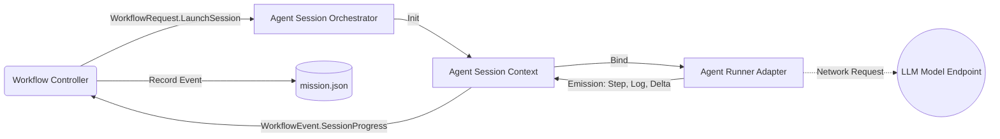

# Agent Runtime

The Agent Runtime acts as an orchestration, transport, and execution layer that sits exactly on the boundary between deterministic orchestration (the Workflow Engine) and non-deterministic text generation (the LLM capabilities/runners). It ensures the daemon does not become tightly coupled to specific providers.

## Component Overview

| Component | Responsibility | Boundary Context |
| :--- | :--- | :--- |
| **AgentSessionOrchestrator** | Coordinates all parallel/long-running session lifetimes | Daemon |
| **AgentSession** | Provides state, standard metrics, and capability mapping | Process / Runtime |
| **AgentRunner** | Interface implemented to plug in an execution model | Implementation / Provider |

## The Runtime Contract

The core architectural boundary of the runtime module is its isolation from domain-specific rules. The **Workflow Engine** evaluates what needs to happen and requests `AgentSession` invocations via `WorkflowRequest`.

## Isolation Invariants

1. **Pluggable Execution**: The `AgentRunner` implementation is never hard-coded into the workflow rules. A workflow shouldn't need logic specific to OpenAI or an external tool provider.
2. **Session Transients**: `AgentSession` IDs are transient. If the daemon restarts, active sessions drop; they are rebuilt based on the workflow state upon recovery.
3. **Capability Mapping**: Operations that rely on capabilities (e.g., File Write, Shell Execution) are mediated by the session context rather than arbitrary process access.
