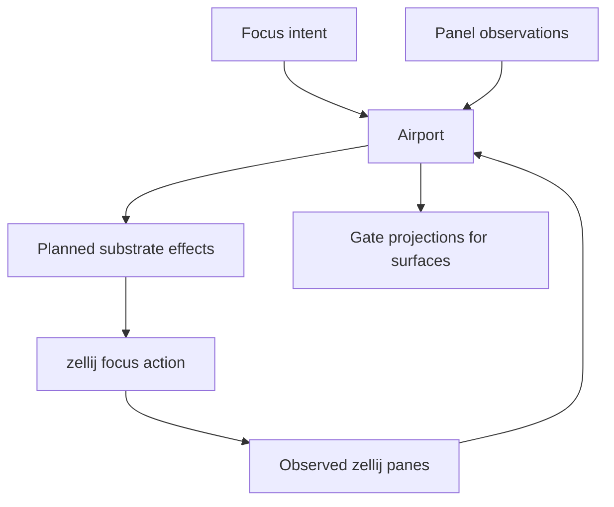

# Airport Control Plane

Airport is the repository-scoped layout authority for Mission surfaces. It decides what each gate means, which client is attached to which gate, and how focus intent should be reconciled against the observed terminal substrate.

## Primary Components

| Component | Responsibility | Owned state |
| --- | --- | --- |
| `AirportControl` | Pure repository-scoped layout controller | `AirportState` |
| `RepositoryAirportRegistry` | Multi-repository registry of airport controllers and substrate controllers | active repository id, airport records, client-to-repository index |
| `TerminalManagerSubstrateController` | Observe and drive the terminal substrate | observed zellij pane state |
| Projection helpers | Derive dashboard, editor, and agent session projections | pure projection output |

## Gate Model

The current airport implementation has three fixed gates:

| Gate id | Purpose |
| --- | --- |
| `dashboard` | Repository or mission control surface |
| `editor` | Artifact or mission view surface |
| `agentSession` | Live agent-session surface |

Each gate has a `GateBinding`:

| Binding field | Meaning |
| --- | --- |
| `targetKind` | `empty`, `repository`, `mission`, `task`, `artifact`, or `agentSession` |
| `targetId` | Selected semantic target |
| `mode` | `view` or `control` |

## Airport State

`AirportState` carries:

- repository-scoped gate bindings
- focus intent and observed focus
- connected client registrations
- substrate observations and pane mapping

It does not carry workflow execution truth.

## Focus And Substrate Reconciliation

`planAirportSubstrateEffects(...)` only emits a focus effect when:

1. a gate is the intended focus target
2. the observed focus does not already match
3. the bound pane exists in the current substrate observation

## Persistence Boundary

Airport intent is persisted inside repository daemon settings, not inside `mission.json`.

| Persisted field | Location |
| --- | --- |
| `airport.gates` | `.mission/settings.json` |
| `airport.focus.intentGateId` | `.mission/settings.json` |

If the current airport intent matches the default bindings, the registry omits it rather than persisting redundant state.

## Terminal Substrate Boundary

The current substrate controller targets `zellij` by default, using `list-panes --json --all` for observation and `focus-pane-id` for effect application. This makes the substrate boundary explicit:

- Airport owns intent.
- The substrate controller owns terminal-manager translation.
- zellij owns real pane existence and focus.

## Non-Responsibilities

Airport does not own mission execution. It does not own task generation. It does not decide whether a session should start. It only projects and reconciles layout state.

## Relationship To Other Pages

- See [daemon.md](./daemon.html) for the multi-repository registry and daemon integration.
- See [tower.md](./tower.html) for how Tower attaches to airport gates.
- See [semantic-model.md](./semantic-model.html) for the semantic targets referenced by gate bindings.
