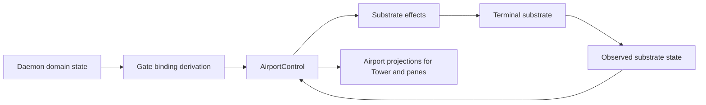

# Airport Control Plane

Mission's airport control plane is the daemon-owned layout authority for the terminal application. After the initial bootstrap handoff, Tower is a client of that control plane rather than the authority that decides where panels belong or which gate is focused.

That boundary is essential to Mission's safety model. Layout truth cannot live inside one surface process if the system is expected to survive detach, reconnect, daemon restarts, and multi-pane reconciliation.

## What Owns Layout Truth

The current implementation splits responsibilities cleanly:

- `AirportControl` owns repository-scoped airport state
- `MissionSystemController` composes airport state with daemon domain state
- `RepositoryAirportRegistry` tracks one airport record per repository
- Tower consumes airport projections after connecting a panel

Bootstrap still exists, but it is not the authority. The airport-layout command creates or resets the terminal-manager session and starts the initial panes. Once panes connect and call `airport.connectPanel(...)`, the daemon and airport control state become authoritative.

## The Current Gate Model

The implemented airport gate ids are:

- `dashboard`
- `editor`
- `agentSession`

Each gate has a `GateBinding` with:

- `targetKind`
- optional `targetId`
- optional `mode`

The target kinds are deliberately narrow: `empty`, `repository`, `mission`, `task`, `artifact`, and `agentSession`.

By default, a repository-scoped airport starts with:

- `dashboard` bound to the repository in `control` mode
- `editor` bound to the repository in `view` mode when a repository id is known
- `agentSession` empty

The daemon then reconciles those defaults against actual domain selection, artifact selection, and live agent-session selection.

## Focus Intent Versus Observed Focus

The airport model tracks two different kinds of focus:

| Concept | Meaning |
| --- | --- |
| Focus intent | Which gate the daemon wants to be focused |
| Observed focus | Which gate the substrate and connected clients report as focused |

This is the right model for a terminal application. Intent and observation are not always the same, especially across pane creation, reconnects, or delayed client updates.

`AirportControl` derives focus state from both client observations and substrate observations. Observed focus can come from the terminal substrate itself or from the most recent connected client reporting focus. The control plane therefore does not need to trust any single surface process as the sole source of focus truth.

## Repository-Scoped Airport State And Registry State

Mission keeps both:

- one active airport state in the daemon snapshot
- a registry of repository-scoped airport states across known repositories

The active airport lives at `MissionSystemState.airport`. The broader repository registry lives at `MissionSystemState.airports.repositories` and stores, for each repository:

- `repositoryId`
- `repositoryRootPath`
- `airport`
- `persistedIntent`

That registry matters because Mission is repository-aware at the daemon level. A surface may scope itself to one repository while the daemon still knows about other repository airports and their persisted intents.

## Workspace Synchronization And Gate Binding Reconciliation

`MissionSystemController` is the daemon-side coordinator. On workspace synchronization it:

1. resolves the repository from the surface path or workspace root
2. activates the repository airport
3. reads the current mission-control source from the workspace layer
4. synchronizes the daemon `ContextGraph`
5. derives default gate bindings from the current selection
6. plans airport substrate effects
7. applies those effects and samples substrate state again

This is the real control-plane loop. Domain selection feeds gate binding derivation. Gate binding derivation feeds substrate effect planning. Observed substrate state then feeds back into airport state.

## Terminal Substrate Observation

The airport control plane is aware of the terminal substrate without being owned by it. The current substrate state tracks:

- session name
- attached or detached status
- pane state by gate
- observed focused pane id
- layout intent timestamps

`RepositoryAirportRegistry` delegates effect application and observation to `TerminalManagerSubstrateController`, then feeds observed substrate state back into `AirportControl.observeSubstrate(...)`.

This is the key architectural loop:

## Control-Plane Boundary

For adopting teams, the critical boundary is simple:

- Tower is not the layout authority
- Airport and daemon projections are the layout authority

That boundary is what allows Mission to keep layout deterministic, reconnectable, and repository-scoped instead of collapsing into surface-local heuristics.