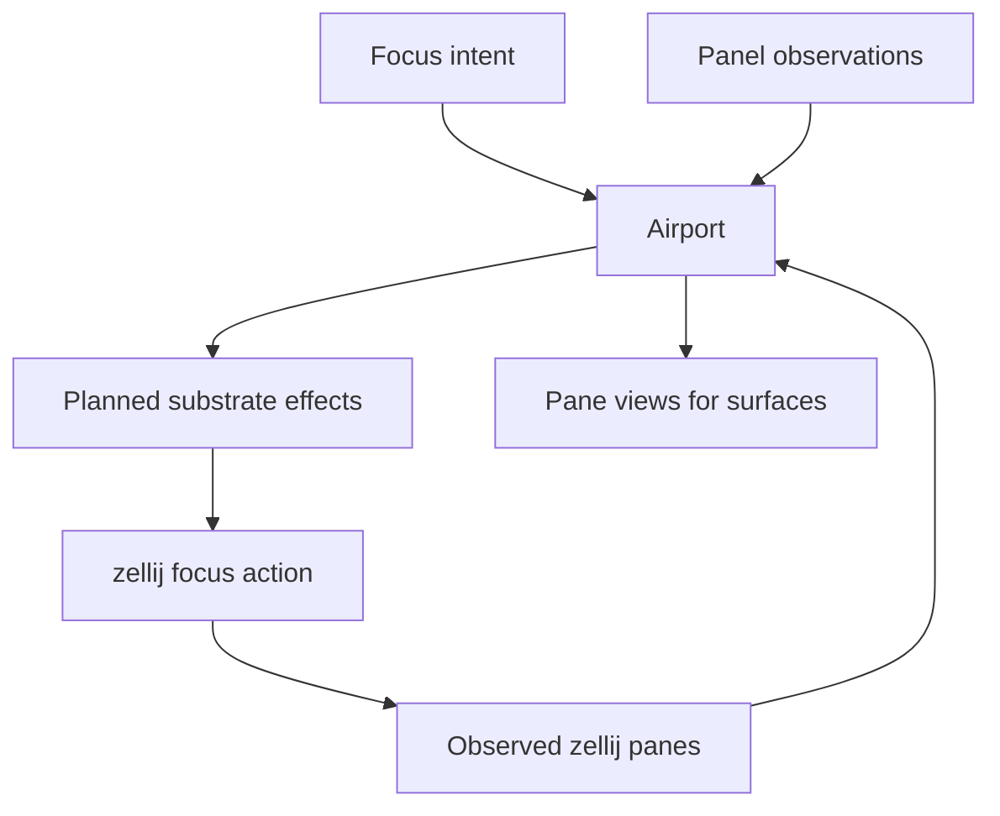

# Airport Control Plane

Airport is the repository-scoped layout authority for Mission surfaces. It decides what each pane means, which client is attached to which pane, and how focus intent should be reconciled against the observed terminal substrate.

## Primary Components

| Component | Responsibility | Owned state |
| --- | --- | --- |
| `AirportControl` | Pure repository-scoped layout controller | `AirportState` |
| `RepositoryAirportRegistry` | Multi-repository registry of airport controllers and substrate controllers | active repository id, airport records, client-to-repository index |
| `TerminalManagerSubstrateController` | Observe and drive the terminal substrate | observed zellij pane state |
| `AirportControl` view logic | Derive Tower, Briefing Room, and Runway views | pure view output |

## Pane Model

The current airport implementation has three fixed panes. Some internal types still use gate-style naming, but the documentation treats these as panes to avoid confusion with workflow gates:

| Pane id | Purpose |
| --- | --- |
| `tower` | Repository or mission control surface |
| `briefingRoom` | Artifact or mission view surface |
| `runway` | Live agent-session surface |

Each pane has a `PaneBinding`:

| Binding field | Meaning |
| --- | --- |
| `targetKind` | `empty`, `repository`, `mission`, `task`, `artifact`, or `agentSession` |
| `targetId` | Selected semantic target |
| `mode` | `view` or `control` |

## Airport State

`AirportState` carries:

- repository-scoped pane bindings
- focus intent and observed focus
- connected client registrations
- substrate observations and pane mapping

It does not carry workflow execution truth.

It may react to workflow truth for view purposes, but it must not feed pane-local state back into workflow decisions.

Examples:

- valid: project the currently selected `agentSession` into Runway
- valid: update Tower or Briefing Room when daemon status changes
- invalid: let focused pane, visible pane, or client-local cursor change whether a task may start or whether a session is considered alive

## Focus And Substrate Reconciliation

`planAirportSubstrateEffects(...)` only emits a focus effect when:

1. a pane is the intended focus target
2. the observed focus does not already match
3. the bound pane exists in the current substrate observation

Semantic selection is a separate concern from focus intent:

- mission or repository selection updates pane bindings and views
- mission-mode task selection should resolve the task's canonical instruction and preferred session before panes bind
- mission-mode stage selection should resolve the stage's canonical result artifact before panes bind
- explicit airport focus observations update observed focus state; they do not reassert stale intent
- selecting an artifact or agent session must not, by itself, move terminal focus away from Tower

If observed focus conflicts with previously recorded focus intent, the observed focus wins until a new explicit airport command asserts new intent.

## Persistence Boundary

Airport intent is persisted inside repository daemon settings, not inside `mission.json`.

| Persisted field | Location |
| --- | --- |
| `airport.panes` | `.mission/settings.json` |
| `airport.focus.intentPaneId` | `.mission/settings.json` |

If the current airport intent matches the default bindings, the registry omits it rather than persisting redundant state.

## Terminal Substrate Boundary

The current substrate controller targets `zellij` by default, using `list-panes --json --all` for observation and `focus-pane-id` for effect application. This makes the substrate boundary explicit:

- Airport owns intent.
- The substrate controller owns terminal-manager translation.
- zellij owns real pane existence and focus.

That boundary is operational only. Real pane existence can matter to Airport reconciliation and may be observed by runtime transport code, but pane focus or pane visibility must never become workflow input.

## Non-Responsibilities

Airport does not own mission execution. It does not own task generation. It does not decide whether a session should start. It only derives views and reconciles layout state.

Airport also does not arbitrate session truth. If a client and the daemon disagree about what is visible, the daemon wins. If Airport and workflow disagree about whether work is active, workflow plus normalized runtime facts win.

## Relationship To Other Pages

- See [daemon.md](./daemon.html) for the multi-repository registry and daemon integration.
- See [airport-terminal-surface.md](./airport-terminal-surface.html) for how the Airport terminal surfaces attach to airport panes.
- See [semantic-model.md](./semantic-model.html) for the semantic targets referenced by pane bindings.
