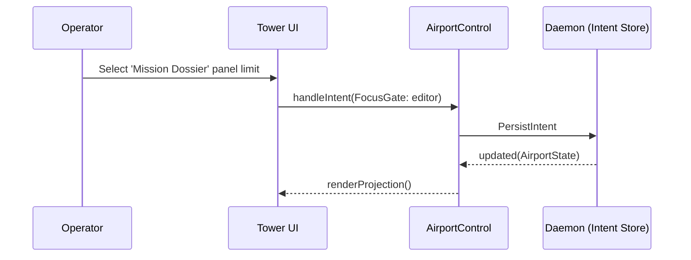

# Airport Control Plane

The Airport Control Plane is a central layout and visibility authority that manages the Tower terminal UI representation. By moving interaction intent to the Daemon, Tower acts purely as a "dumb terminal"—it draws projections and notifies the daemon of user clicks, rather than tracking its own routing state.

## Core Concepts

The system uses standard layout "Gates" to define the panels the operator occupies.

1. **Gates**: Known UI placement regions (`dashboard`, `editor`, `agentSession`).
2. **Bindings**: The connection defining what domain entity occupies a Gate and in what mode (Control vs. View).

| Component | Responsibility | Source of truth |
| :--- | :--- | :--- |
| **AirportControl** | State manager for the layout and terminal bindings | Daemon runtime |
| **Tower application** | Drawing UI via `ink`, receiving layout projections | Daemon / stdout |

## The Operator Loop

By owning layout state, the daemon ensures that terminal crashes, disconnects, or headless tasks do not lose their operator context.

## Invariants

1. **Dumb Tower**: The `apps/tower/terminal` package must not retain mission logic or complex UI routing loops. 
2. **Deterministic Focus/Blur**: Gates have an explicit active focus, giving exact contextual mapping when the user presses keyboard shortcuts.
