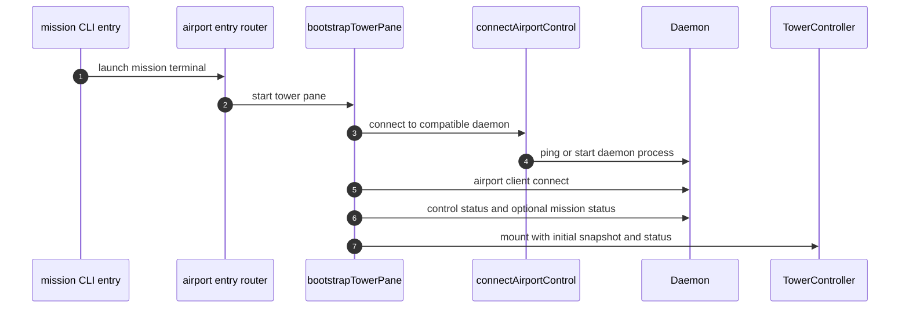

# Airport Terminal Surface

The Airport terminal app is the operator-facing terminal application. It is a client of the daemon, not a second authority.

Tower is one surface inside that app, not the whole terminal product. The current Airport layout can host:

- Tower as the left-side control surface
- Briefing Room as the artifact/editor surface
- Runway as the live agent-session surface

## Runtime Role

| Layer | Current implementation |
| --- | --- |
| Entry point | `packages/mission/src/mission.ts` -> `apps/airport/terminal/src/index.ts` |
| Entry routing | `routeMissionEntry.ts`, `bootstrapAirportLayout.ts` |
| Airport control connection | `connectAirportControl.ts` |
| Tower UI root | `mountTowerUi.tsx` |
| Tower controller | `TowerController.tsx` |
| Surface presentation | OpenTUI Solid components under `src/tower/components/`, plus runway and briefing-room bootstraps |

## Boot Sequence

## Local State Versus Daemon State

Tower keeps local state for interaction only:

- focus area within the UI
- selected theme
- selected header tab
- selected mission-control tree row
- stage highlight and command target derived from local tree navigation
- collapse and expansion state in the mission tree
- picker text, overlays, and command flow steps

Tower may use `command` language for its picker, command panel, and typed slash input, but those are UI interaction forms. The underlying business object should still be a daemon-provided operator action.

Tower must preserve daemon action order. It may narrow a visible list by local text query, but it must not re-rank actions, apply local availability policy, or invent a separate next-action heuristic.

The Airport terminal app does not own:

- repository registration
- mission runtime state
- airport bindings
- session lifecycle
- workflow gate state

It also must not define session liveness. A pane may be visible while the underlying session is already failed, or a session may still be running while a pane is temporarily unavailable. Tower consumes daemon truth; it does not manufacture it.

Those come from `OperatorStatus` and `MissionSystemSnapshot` returned by the daemon.

Tower may still ask the daemon to update shared pane bindings, but that is a layout command, not a transfer of UI ownership. The daemon should know which artifact Briefing Room is showing. It should not decide which tree row the user is currently on.

In mission mode, that means Tower may own the raw tree cursor while shared selection resolution owns the companion bundle:

- task selection resolves `activeInstruction` and preferred `activeAgentSession`
- stage selection resolves `activeStageResult`

That rule keeps Briefing Room and Runway coherent without turning pane components into separate routing authorities.

## Tower Feature Controllers

Tower is moving toward a feature-owned structure rather than a monolithic shell controller.

The intended split is:

- `TowerController.tsx` owns shell composition, daemon connection, top-level focus routing, and cross-feature coordination
- feature controller or domain modules own local UI projection and interaction logic
- render components stay mostly presentational

Naming should stay explicit:

- `*Panel.tsx`: render-only or mostly presentational surface
- `*Domain.ts`: the pure logic for that feature, including view-model shaping when it is still one coherent responsibility
- `*Controller.ts`: stateful interaction orchestration for that feature, but only when that controller is actually used

Avoid keeping extra feature files that do not express a real functional boundary. If a projection helper is only one part of the feature's pure logic, prefer keeping it in the feature domain file instead of splitting into a separate `ProjectionDomain` file.

That means feature-specific projection logic should live with the feature that owns the surface:

- command panel descriptors and picker semantics belong with the command feature
- mission tree, stage, and session projection belongs with the mission-control feature
- header tabs, badges, summaries, and tab activation flow should belong with the header feature

This is a UI architecture rule, not a business rule exception. The daemon still owns domain semantics. Tower feature controllers only adapt daemon-owned state into feature-local view models.

## Surface Contracts

| Surface concern | Daemon dependency |
| --- | --- |
| Repository view | `control.status`, `control.repositories.*`, `control.action.*` |
| Mission view | `mission.status`, `mission.action.*`, `mission.gate.evaluate` |
| Session control | `task.launch`, `session.*` |
| Layout projection | `airport.client.connect`, `airport.client.observe`, `airport.status` |

## Gate Attachment Model

Each terminal surface starts with an injected `AIRPORT_PANE_ID` and claims exactly one airport pane. The shared session is propagated through `AIRPORT_TERMINAL_SESSION`, and the daemon then uses that registration to associate the pane with the repository airport state.

## Runtime Constraint

The current Airport terminal implementation requires Bun at runtime because `@opentui/core` imports `bun:ffi`. That is a surface/runtime dependency, not a workflow dependency.

## Non-Responsibilities

No Airport terminal surface must become the source of truth for mission routing, task lifecycle, or pane ownership. If a surface and the daemon disagree, the daemon wins.

That rule also applies to available actions: ordering, filtering, and enablement are daemon-owned semantics, not UI policy.

The same rule applies to cross-client synchronization:

- Tower may immediately refresh actions when daemon revisions change
- Tower may react to mission or airport events to stay visually current
- Tower must not treat local selection, focus, or pane attachment as evidence that workflow state changed
