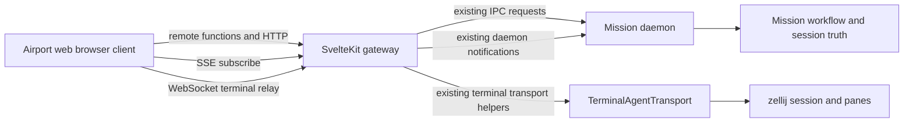

<!-- /docs/architecture/airport-web-surface-blueprint.md: Blueprint for the OO Airport web client using the existing daemon and terminal runtime without changing daemon contracts. -->

# Airport Web Surface Blueprint

This page defines the target implementation blueprint for `apps/airport/web`.

It is intentionally constrained by the current repository implementation:

- no new daemon IPC methods
- no daemon-side contract changes
- no daemon-side business entities for the web surface
- the web server acts as transport gateway and session relay, not as a second domain authority

The deprecated terminal surface remains the behavioral reference for operator capability. The web surface must preserve the same authority model while moving interaction into a browser-native client.

## Core Constraints

The web surface must satisfy all of the following at the same time:

1. Keep Mission daemon and its IPC contract as the single runtime authority.
2. Keep browser-side state object-oriented rather than page-procedural.
3. Support immediate mission, stage, task, and session updates in the browser.
4. Support a browser-hosted agent terminal attached to the spawned process.
5. Reuse the current terminal runtime and terminal-manager substrate already present in Mission.

This means the web surface is not a direct daemon client and not a second mission domain host. It is a browser application with an infrastructure gateway.

## Boundary Model

| Plane | Responsibility | Must not own |
| --- | --- | --- |
| browser client | object model, local interaction state, view composition, optimistic UI staging where safe | daemon truth, workflow truth, terminal runtime authority |
| SvelteKit server | auth forwarding, daemon request proxying, daemon event fanout, terminal relay infrastructure | mission or repository business semantics |
| daemon | mission state, airport state, action availability, session lifecycle, normalized runtime events | browser routing, browser component state |
| terminal runtime | live terminal pane hosting and pane control through existing transport | workflow truth, web-specific business rules |

The SvelteKit server is allowed to have infrastructure classes. It is not allowed to become a duplicate mission domain model.

## Client Object Model

The browser client should use a lightweight OO model in the style of the Flying Pillow entity system, but without copying the full server-side OGM pattern.

The intended classes are:

- `AirportClientRuntime`: root browser runtime, connection registry, event bus, and object cache
- `Repository`: repository-scoped airport and control-plane facade in the browser
- `Mission`: mission-scoped object with stage, task, action, and session accessors
- `Stage`: mission stage object with derived status and task collection behavior
- `Task`: task object with command methods such as start, complete, block, reopen, and launch session
- `AgentSession`: live session object that owns terminal attachment state, lifecycle view, and input commands

The object model rule is the same one used in Flying Pillow:

- transport payloads are raw DTOs
- browser objects hydrate from validated DTOs
- behaviors live on the objects, not in loose helper functions that know domain semantics

Unlike Flying Pillow, these browser classes do not own persistence. They wrap remote functions and event updates.

## Transport Split

The web surface should use three transport forms, each for one clear reason.

### 1. Snapshot And Command Transport

Use SvelteKit server routes or remote functions as thin request-response proxies for:

- `airport.status`
- `control.status`
- `control.action.*`
- `mission.status`
- `mission.action.*`
- `mission.gate.evaluate`
- `session.list`
- `session.console.state`
- `session.prompt`
- `session.command`
- `session.cancel`
- `session.terminate`

These endpoints return validated DTOs only. They do not contain mission-domain policy.

### 2. Live Daemon Event Transport

Use SSE for daemon notifications that are already emitted today:

- `airport.state`
- `mission.status`
- `mission.actions.changed`
- `session.console`
- `session.event`
- `session.lifecycle`

This keeps mission, stage, task, and AgentSession state current in the browser without introducing a second subscription contract inside the daemon.

### 3. Live Terminal Transport

Use a web-only WebSocket relay for the terminal surface.

This relay is not a daemon protocol change. It is a SvelteKit infrastructure adapter over the existing `TerminalAgentTransport` and terminal-manager substrate.

Under the current repository implementation, terminal attachment works by reusing these existing capabilities:

- resolve or reopen a session by `terminalSessionName` and `terminalPaneId`
- inject keys into the attached pane
- capture the pane screen
- observe whether the pane has exited

That means the first web terminal implementation must be modeled as a pane-backed attached terminal relay over the current terminal-manager capabilities. It must not claim a new daemon-owned PTY protocol that does not exist in the codebase today.

## Current-Code Terminal Attachment Plan

The browser terminal must attach through the current session and transport metadata already persisted by Mission.

### Attachment Flow

1. The browser selects an `AgentSession`.
2. The SvelteKit gateway resolves the session record through existing mission APIs.
3. The gateway requires terminal-backed transport metadata from the session record.
4. The gateway attaches to the existing pane through `TerminalAgentTransport.attachSession(...)`.
5. The gateway sends an initial screen snapshot to the browser.
6. The gateway keeps the browser current by reconciling pane captures and pane lifecycle state.
7. Browser keystrokes are forwarded back through `TerminalAgentTransport.sendKeys(...)`.

### Required Existing Inputs

The current repository already carries the required inputs for that relay:

- session identity from `session.list`
- `transportId === 'terminal'`
- `terminalSessionName`
- `terminalPaneId`

### Existing Runtime Primitives Used

The gateway should reuse the current terminal runtime primitives exactly as they exist:

- `TerminalAgentTransport.attachSession(...)`
- `TerminalAgentTransport.sendKeys(...)`
- `TerminalAgentTransport.capturePane(...)`
- `TerminalAgentTransport.readPaneState(...)`

No daemon method or event change is required for this relay.

## Browser Terminal Relay Contract

This contract is web-internal. It is not a daemon IPC contract.

If runtime schemas are defined for this relay, they must use `zod/v4`.

```ts
import { z } from 'zod/v4';

export const TerminalClientFrame = z.discriminatedUnion('type', [
    z.object({
        type: z.literal('attach'),
        missionId: z.string().min(1),
        sessionId: z.string().min(1)
    }),
    z.object({
        type: z.literal('input'),
        data: z.string()
    }),
    z.object({
        type: z.literal('enter')
    }),
    z.object({
        type: z.literal('interrupt')
    }),
    z.object({
        type: z.literal('detach')
    }),
    z.object({
        type: z.literal('ping')
    })
]);

export const TerminalServerFrame = z.discriminatedUnion('type', [
    z.object({
        type: z.literal('attached'),
        sessionId: z.string().min(1),
        paneId: z.string().min(1),
        transportMode: z.literal('terminal-manager-pane')
    }),
    z.object({
        type: z.literal('screen'),
        text: z.string()
    }),
    z.object({
        type: z.literal('state'),
        dead: z.boolean(),
        exitCode: z.number().int()
    }),
    z.object({
        type: z.literal('error'),
        message: z.string().min(1)
    }),
    z.object({
        type: z.literal('pong')
    })
]);
```

The contract above reflects the current repository behavior. It does not assume byte-stream PTY forwarding, resize negotiation, or a new daemon-side WebSocket protocol.

## Browser Entity Hydration Rules

The browser entity layer should follow these rules.

### DTO Boundary

All DTOs crossing from the SvelteKit server into the browser must be validated at the boundary.

If shared runtime schemas are extracted, they belong in a shared package and should derive TypeScript types from `zod/v4` schemas rather than keeping TypeScript-only declarations as the sole source of truth.

```ts
import { z } from 'zod/v4';

export const AgentSessionDto = z.object({
    sessionId: z.string().min(1),
    runnerId: z.string().min(1),
    runnerLabel: z.string().min(1),
    lifecycleState: z.enum([
        'starting',
        'running',
        'awaiting-input',
        'completed',
        'failed',
        'cancelled',
        'terminated'
    ]),
    terminalSessionName: z.string().min(1).optional(),
    terminalPaneId: z.string().min(1).optional(),
    workingDirectory: z.string().min(1).optional()
});

export type AgentSessionDto = z.infer<typeof AgentSessionDto>;
```

### Object Responsibility

- DTO schemas validate transport payloads.
- Browser classes own behavior and derived state.
- Svelte components consume browser objects and view models.
- Daemon responses remain the canonical source for workflow and airport truth.

## Intended Web Runtime Topology



## File And Module Blueprint

The target module split inside `apps/airport/web` should be:

- `src/lib/client/runtime/`: browser runtime, object cache, event bus, hydration registry
- `src/lib/client/entities/`: `Repository`, `Mission`, `Stage`, `Task`, `AgentSession`
- `src/lib/client/dto/`: browser-facing DTO schemas built with `zod/v4`
- `src/lib/server/gateway/`: daemon proxy and terminal relay infrastructure only
- `src/routes/api/runtime/events/+server.ts`: SSE fanout from daemon notifications
- `src/routes/api/runtime/terminal/+server.ts`: terminal relay endpoint or upgrade handler
- `src/routes/api/runtime/*.remote.ts` or `+server.ts`: thin request-response proxies for commands and snapshots

The deprecated terminal surface remains the behavioral reference for Tower, Briefing Room, and Runway UX decomposition, but not the implementation stack.

## Compatibility Review Against Current Code

This blueprint was checked against the current repository code and is intentionally limited to what the code already supports.

| Requirement | Current code support | Blueprint decision |
| --- | --- | --- |
| daemon remains authority | yes | preserved |
| live mission and airport updates | yes, through daemon notifications | forward through SSE |
| live session lifecycle updates | yes, through daemon notifications | forward through SSE |
| session control commands | yes, through existing `session.*` methods | proxy unchanged |
| terminal-backed agent hosting | yes, through `TerminalAgentTransport` and shared session panes | relay through SvelteKit infrastructure |
| daemon contract changes | not required for this blueprint | none introduced |

## Explicit Non-Goals

This blueprint does not introduce:

- new daemon WebSocket endpoints
- a new daemon PTY contract
- browser-owned workflow semantics
- server-side mission entity classes inside `apps/airport/web`
- a second action or session authority parallel to the daemon

If the repository later adds a byte-native terminal streaming contract, that should be documented as a separate architecture change. It is not part of this blueprint because it is not part of the current codebase.
