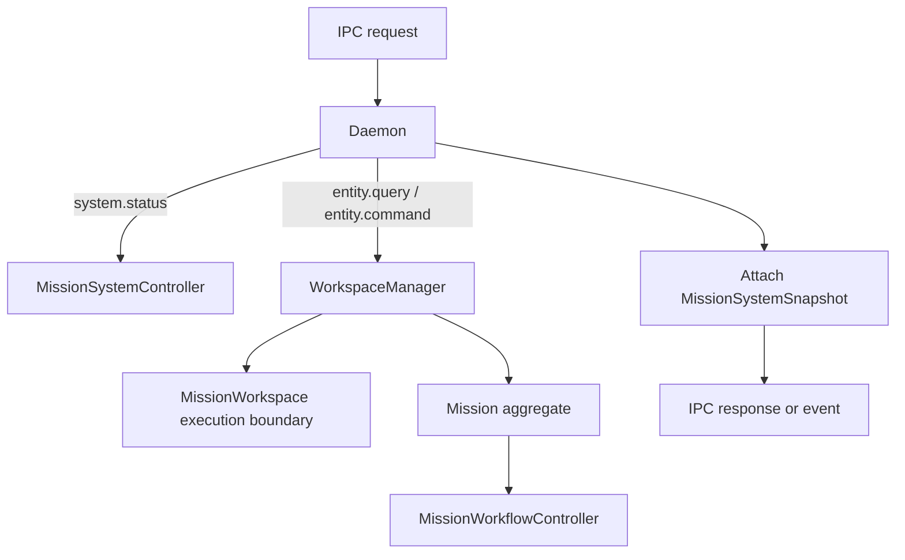

# Daemon And System Control Plane

The daemon is the root runtime authority for Mission's live system behavior. It owns the IPC server, repository scoping, mission routing, airport registry, and composite system snapshot that surfaces consume.

## Primary Components

| Component | Responsibility | Owned state | Downstream consumers |
| --- | --- | --- | --- |
| `Daemon` | IPC server, request dispatch, event broadcast | sockets, connected clients, runner registry, system controller | Tower and any daemon clients |
| `WorkspaceManager` | Repository discovery, workspace instantiation, mission routing | `MissionWorkspace` map, mission-to-workspace index, registered roots | `Daemon`, `MissionSystemController` |
| `MissionWorkspace` | Repository-scoped mission execution boundary | repository-local mission loading and execution operations | `WorkspaceManager` |
| `runMissionDaemon(...)` | IPC server, request routing, and event broadcast | sockets, subscriptions, terminal observers | daemon clients |
| `MissionRegistry` | Loaded-mission registry and daemon hydration | mission handles, mission load promises | `runMissionDaemon(...)` |
| `SystemStatus` | Cached GitHub-oriented daemon status reads | current GitHub CLI auth state | `runMissionDaemon(...)`, clients |
| Entity remote handlers | Route entity queries and commands into daemon-owned entities | entity execution results | `runMissionDaemon(...)` |

## Request Routing Model

## Boundary Responsibilities

### `Daemon`

- Accepts newline-delimited JSON IPC messages.
- Routes `system.status` through `MissionSystemController`.
- Routes Entity queries and commands through `WorkspaceManager`.
- Broadcasts stateful notifications to all connected clients.
- Decorates mission status responses with a fresh `MissionSystemSnapshot` when a workspace can be resolved.

### `WorkspaceManager`

- Resolves the control root from `surfacePath` or `missionId`.
- Resolves real repositories from configured repository roots and filesystem state.
- Creates one `MissionWorkspace` per repository root.
- Maintains the mission-to-workspace index used to route Mission-tree Entity queries and commands.

### `MissionSystemController`

- Synchronizes semantic domain state and airport state.
- Plans airport substrate effects and applies them through the airport registry.
- Samples observed substrate state and folds it back into airport state.
- Increments the daemon system version when the composite control-plane state changes.

## Persisted And Non-Persisted State

| State | Persisted | Where |
| --- | --- | --- |
| Mission roots and managed tool paths | Yes | Mission config under `~/.config/mission/config.json` or `$XDG_CONFIG_HOME/mission/config.json` |
| Repository airport intent | Yes | `.mission/settings.json` under the `airport` field |
| Composite daemon snapshot | No | Rebuilt in memory from workspace, mission, and airport state |
| Client connections | No | `Daemon` runtime only |

## Non-Responsibilities

The daemon does not make Tower the source of truth. It does not let zellij define mission state. It does not store mission execution truth inside daemon-only memory.

## Relationship To Other Pages

- See [workflow-engine.md](./workflow-engine.html) for mission execution truth.
- See [airport-control-plane.md](./airport-control-plane.html) for repository-scoped layout authority.
- See [contracts.md](./contracts.html) for IPC namespaces.
