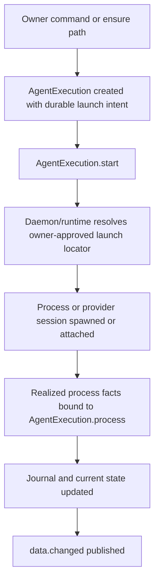
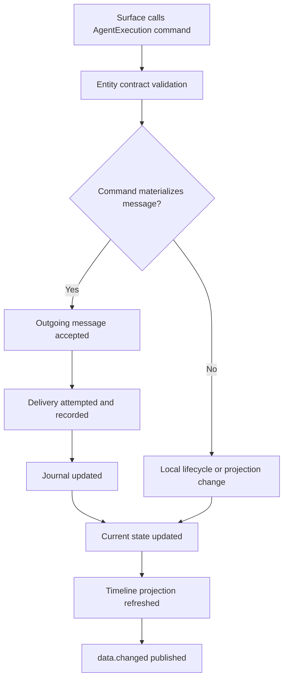
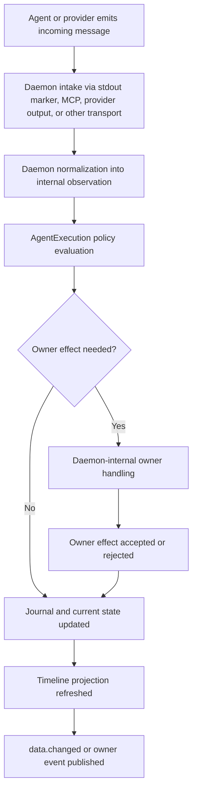
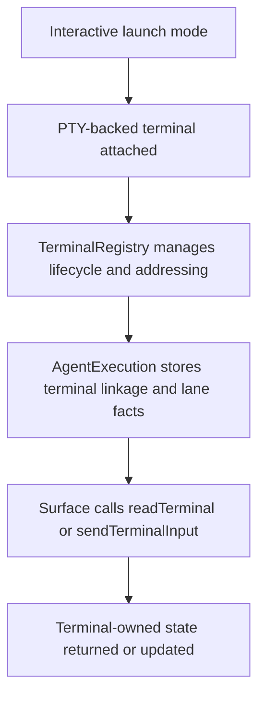
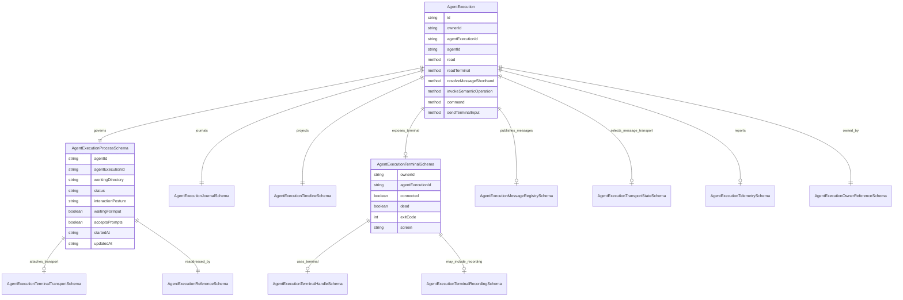

`AgentExecution` is the Entity for one execution of one Agent. Its center is the `AgentExecutionProcess`: the OS child process or provider process-like session that is doing the work. The Entity gives that process a stable Mission address, records the journal and timeline around it, exposes safe operator controls, and publishes state to surfaces.

`AgentExecution` is not a Mission child record, a Task-specific wrapper, or a terminal session. Mission, Task, Repository, Artifact, and System can own an AgentExecution, but they do not get their own execution model. Terminal support is an optional transport attached to the process.

## Plain-English Model

An `AgentExecution` is the system's official record for one active or recoverable attempt by an Agent to do work. If an operator starts Copilot, Claude, Codex, or another Agent on a task, repository, mission, artifact, or system job, the daemon creates one AgentExecution to govern that attempt. One AgentExecution equals one managed attempt. `attach` reconnects to an existing attempt, `resume` starts a new turn on an existing attempt, and `retry` creates a new AgentExecution rather than mutating an old attempt into a new one.

The simplest way to understand it is: AgentExecution is the desk clerk for one working Agent process. It knows which Agent was started, what the Agent was asked to work on, where the Agent is working, how to talk to it, what it has reported, whether it still seems alive, and what the operator is allowed to do next.

The process is the center. That process may be a normal operating-system child process, or a provider session that behaves like one. The process has a working directory, a lifecycle such as starting, running, completed, failed, cancelled, or terminated, and a current ability to receive prompts or commands. AgentExecution owns this process-level truth. A Terminal can be attached when the Agent runs through a PTY, and interactive launch may require that attachment, but the Terminal is only a communication lane. The Terminal owns screen text, keyboard input, and terminal-specific capabilities; it does not decide whether the AgentExecution is running, finished, cancelled, or failed.

Construction is side-effect free. `AgentExecution.start()` is the explicit owning launch method. Before `start()` runs, the execution already holds its pre-launch intent durably on AgentExecution: owner reference, selected Agent, an owner-resolved launch locator, launch mode, optional owner-composed `initialPrompt`, requested terminal mode, and requested MCP mode. Prompt composition is not an AgentExecution concern; the owner path, optionally with Agent/AgentAdapter help, prepares the exact plain text input before launch when one is needed. Launch location selection is also not a separate global AgentExecution taxonomy: `ownerEntity` stays the only kind discriminator, and each owner path supplies its own launch-locator shape behind a common boundary. The launch locator remains durable on AgentExecution for replay, audit, and reattachment semantics; daemon/runtime validates and resolves that owner-approved locator into the concrete sandbox path and process working directory before spawn. AgentExecution stores the exact `initialPrompt` because it is essential when launch includes initial text, and the same content is also journaled as the first accepted outbound message when delivery is accepted. `initialPrompt` is optional so an execution may launch and remain waiting without sending text immediately. `start()` realizes that intent through daemon/runtime launch capabilities and binds the resulting process back into the AgentExecution. If launch fails, the AgentExecution remains durable with journaled failure state. Durable launch intent and realized process truth stay separate: the original approved locator and launch choices remain part of audit/replay truth, while concrete working directory, session identity, and runtime transport posture live on the governed process side.

The owner reference says what the execution is attached to. An owner can be system, repository, mission, task, or artifact. This does not create five kinds of Agent execution. It only says why this one execution exists and where its effects should be routed. A task-owned execution may affect task workflow. A repository-owned execution may work outside a Mission. An artifact-owned execution may focus on one file-backed Artifact. All of them still use the same AgentExecution model.

Surfaces communicate with AgentExecution in three main ways. First, they can read it, which gives the current operator-facing state. Second, they can attach to it, which reconnects a surface to live transport and state but does not begin a turn. Third, they can call Entity commands on AgentExecution. Some of those commands only change local lifecycle or projection state. Some accept and materialize runtime-boundary messages such as sending a prompt, sending `resume`, or replying to a pending input request. If the execution has a Terminal transport, surfaces can also send raw terminal input or resize information through the explicit terminal input channel. Entity commands, runtime-boundary messages, and raw terminal input are deliberately separate because they answer different modeling questions.

Current available command and message descriptors belong directly to the AgentExecution Entity data. They are not a second nested contract object. `AgentExecutionContract.ts` remains the stable boundary definition for methods, events, and payload schemas; the hydrated `AgentExecutionSchema` exposes the currently available commands, message descriptors, and transport lanes that are realized from that stable boundary plus current execution state. Command availability answers which Entity-level mutations are legal now. Message availability answers which runtime-boundary interactions are legal now. The contract owns the broader static universe; the hydrated execution owns the current available subset. Each live message descriptor should stay lean: direction, kind, payload schema, and delivery modes are core, while broader execution state stays on the execution itself.

MCP itself is not an AgentExecution responsibility. Base MCP capability comes from the selected Agent and adapter through the Agent registry; daemon/runtime then determines whether MCP is actually provisioned and currently available for this execution. AgentExecution reflects the resulting effective availability rather than owning MCP authority or bridge lifecycle.

`transportState` should stay equally narrow. It is the operator-facing summary of whether the selected structured transport is attached, degraded, unavailable, or recovering enough for the current surface behavior. It should not expose daemon-private lease mechanics, backend choice, protocol-debug values, or reconciliation internals on the canonical AgentExecution surface.

Agents communicate back by producing incoming messages and raw transport evidence. Some incoming messages are structured, such as progress, blocked, needs input, ready for verification, or completed claim. Some intake is raw transport evidence, such as terminal output or provider output. Inside daemon processing, these can normalize into observations used for policy and owner routing. AgentExecution records the difference: raw output is evidence, while accepted incoming messages and daemon-observed facts can update the semantic journal, timeline, activity state, and owner effects.

The timeline is not a throwaway convenience. It is the basis of the Open Mission agent-chat interface, so it must retain the full human-facing projection surface needed to present work as a readable conversation and activity stream. That includes progress, status, blocked state, needs-input prompts, permission requests, verification readiness, completion or failure claims, and agent-authored messages.

Accepted runtime-boundary messages always go through one AgentExecution-owned delivery or intake path before any transport-specific handling. Entity commands are the separate contract layer that may accept, reject, or materialize those messages. Structured inbound material always goes through one AgentExecution-owned daemon-normalization path before any state change, owner effect, or publication occurs. Raw terminal input remains a separate transport lane. It is replayable as terminal recording, but it is not semantic truth by default.

If the process runs inside a sandbox, that does not create a second AgentExecution interaction model. Stdout and provider output still cross the sandbox boundary and enter the same observation intake path. MCP, however, should not assume ambient host reachability from inside the sandbox. The canonical sandbox design is a daemon-external MCP bridge: the daemon-owned MCP authority stays outside the sandbox, and the sandboxed process reaches it through an execution-scoped, policy-controlled bridge. When that bridge is unavailable, stdout-only structured observation remains a valid degraded mode.

That sandbox model is part of the target runtime direction, but it does not have to be fully implemented in the first clean-sheet rebuild. The first rebuild should remain sandbox-ready by design, while allowing an unsandboxed launch backend temporarily if that is the fastest way to recover the canonical AgentExecution model without reintroducing host-path or transport drift.

Whether the daemon launched the process through a sandboxed or unsandboxed backend is not part of the canonical AgentExecution user surface. That substrate choice belongs to daemon/runtime internals. AgentExecution may surface the resulting capabilities or degraded behavior, but not the backend choice itself. If later system monitoring needs that detail, it should live on daemon/system monitoring surfaces instead of AgentExecution.

For MCP specifically, that means the hydrated execution should expose both an explicit first-class top-level current-state indication of effective MCP availability and the indirect evidence of that availability through current semantic operation descriptors and degraded behavior. For the first rebuild, that explicit indication should stay simple as `available | unavailable` rather than growing into a richer MCP status object. Users see whether the execution can currently use semantic operations; they do not see MCP substrate ownership or provisioning mechanics.

Typed interaction should stay typed on both sides. A `needs_input` incoming message is answered by a dedicated typed AgentExecution message on the same canonical message path, carrying the input-request id and either a fixed choice value or manual text.

Permission requests remain distinct from `needs_input`. `needs_input` means the Agent needs collaboration input to continue the work. A permission request means runtime or provider policy needs approval before a guarded action may proceed. Both can surface operator attention, but they should not collapse into one UI or one reply shape. This keeps room for policies like auto-approve on permission requests while still waiting for explicit operator input on `needs_input`.

Rich execution happenings should usually follow the same three-surface rule: journal for audit/replay, current state for what is true now, and timeline for human-facing narration. They should not automatically become separate public Entity events. Permission requests follow that rule: they change current state, appear in timeline, and are journaled, but they do not require a dedicated public AgentExecution event.

Timeline projection should preserve artifact-bearing observations. When a progress or message observation includes artifact references, the projected timeline item should carry those references forward so the agent-chat surface can show what artifact or file the Agent investigated, edited, or produced.

Timeline current attention is also not a naive last-write-wins field. An active `needs_input` request should remain the current attention item until it is answered, cancelled, or superseded by a stronger terminal condition or an explicit replacement request. Later idle or progress updates may add timeline items without erasing the unresolved question.

The durable journal is the memory of what happened. The hydrated Entity view is the current readable summary. Storage keeps the recoverable facts needed to rebuild or reattach the execution, including the durable launch locator and other launch-intent material that must survive restart. Live UI conveniences, terminal screen material, command descriptors, telemetry, timeline overlays, supported-message lists, MCP bridge handles, and duplicated process mirrors are hydrated read material, not storage truth.

My modeling opinion: the intended domain model is right, but its vocabulary needs tightening. AgentExecution should remain a single process-centered Entity, with helper modules named after concrete responsibilities rather than generic layers. The stable core is `process`, owner reference, journal, message registry, and lifecycle. The term `context` should be reserved for the Agent's context window, not for AgentExecution-owned state. Terminal state, timeline state, telemetry, message availability projections, and duplicated top-level process fields are derived or explicitly cached read material.

## Modeling Assessment Against ADR-0001

- Strong alignment: the live `AgentExecution` class is thick and owns process lifecycle operations, incoming-message application, timeline refresh, prompt submission, command submission, cancellation, termination, and terminal update interpretation.
- Strong alignment: the contract is mostly declarative and binds named schemas to class methods instead of owning behavior.
- Strong alignment: the model distinguishes AgentExecution, Agent, AgentAdapter, AgentExecutionRegistry, AgentExecutionProcess, and Terminal.
- Storage alignment: `AgentExecutionStorageSchema` is intentionally narrower than `AgentExecutionSchema`. Storage contains identity, the governed process, journal state or journal references, interaction/transport selection, log references, lifecycle fields, and timestamps. Hydrated-only fields such as `timeline`, `supportedMessages`, `journalRecords`, `telemetry`, terminal handles, and duplicated process projections do not define storage truth.
- Identity alignment: the class `id` and schema `id` both refer to the canonical Entity id in `table:uniqueId` form. `agentExecutionId` remains the execution-local id inside the owner address.
- Ownership alignment: AgentExecution remote reads, commands, semantic operations, shorthand resolution, and terminal input resolve through the owner-agnostic `AgentExecutionRegistry`. AgentExecution no longer loads Mission or MissionWorkflow state as a fallback.
- Remaining design pressure: top-level fields such as `lifecycleState`, `progress`, `waitingForInput`, `acceptsPrompts`, `acceptedCommands`, `interactionPosture`, `transport`, `reference`, `workingDirectory`, and `taskId` mirror `process`. They are useful for surfaces, but `process` remains the source and these fields must remain documented as projections.

## Internal Responsibility Split

The Entity class stays authoritative for lifecycle and behavior, but support code now follows the domain vocabulary:

- `owner` owns owner-aware addressing and fresh execution ids.
- `process` owns process cloning, recovery from launch records, and patch merging.
- `input` owns supported operator messages, message shorthand, built-in AgentExecution commands, semantic operation schemas, and the communication descriptor constructor.
- `observations` owns daemon-internal normalization of incoming messages, validation/promotion rules, message parsing, and observation-to-activity material.
- `activity` owns timeline schemas, timeline items, current activity/attention state, and activity-state derivation.
- `terminal` owns terminal attachment, terminal read/input state, and terminal schemas.

The split is intentionally not named `builder`, `projection`, `runtime`, `transport`, `policy`, `semantics`, `timeline`, or `protocol` for these responsibilities. Those names either hide the domain action, describe an implementation layer instead of a domain responsibility, or imply ownership that AgentExecution does not have. `messageRegistry` is the canonical top-level field name for the current communication catalog; it is not a module boundary.

Repository-owned executions intentionally keep `repositoryRootPath` as the owner identity value. Repository is filesystem-backed in the current system model: configured filesystem discovery is the Repository table, so the Repository root is identity rather than an incidental location field. AgentExecution owner/address code must still avoid importing the Repository Entity for generic formatting; shared identity segment formatting belongs to the Entity boundary.

## Mission And Workflow Boundary

Mission may list AgentExecutions that participate in a Mission workflow, but those entries are Mission workflow references and compact runtime history. Mission reconstructs mission-owned AgentExecution views from MissionWorkflow state when building a Mission read model. That reconstruction belongs in Mission/MissionWorkflow because it uses Mission dossier paths, task records, workflow runtime events, and Mission artifact context.

AgentExecution itself does not know how to find a Mission. It does not load Mission dossiers, infer that `ownerId` is a `missionId`, or call Mission methods for prompt, cancel, complete, or terminal behavior. After launch, an operator addresses AgentExecution through `ownerId` plus `agentExecutionId`; the daemon resolves that address through the owner-agnostic AgentExecutionRegistry. If a Mission wants to expose historical mission-owned execution state, Mission must project that state into its own read model instead of making AgentExecution depend on Mission.

## Naming Note

Keep `Agent` and `AgentExecution`.

Renaming `Agent` to `AgentProvider` would make the model less accurate. An Agent is the registered work capability the operator chooses, such as Copilot CLI or Claude Code. It owns display name, availability, diagnostics, capabilities, and exactly one private adapter. A provider is the external company, tool family, or backend behind that capability; it is not the same thing as the configured Agent Entity.

Renaming `AgentExecution` to `Agent` would collapse type and instance. The Agent is the capability; AgentExecution is one attempt by that capability to do work.

Renaming `AgentExecution` to `AgentSession` would improve casual readability but weaken the model. `Session` sounds like a chat or UI conversation. This Entity is stricter: it owns a process or process-like provider session, lifecycle, owner reference, commands, daemon-internal intake normalization, journal, and recoverability. `AgentExecution` is a heavier name, but it is the more honest name for the authority it carries.

Use plain UI copy when needed. The code and contracts should keep `AgentExecution`; operator-facing surfaces may label it as an Agent run, active Agent, or session where that reads better.

## Sources Of Truth

The canonical AgentExecution implementation roots are currently empty during the clean-sheet rebuild. This page is therefore doctrine-first and cross-controlled against ADRs plus the quarantined pre-reset implementation that remains in the workspace for reference.

- Vocabulary decision: [docs/adr/0006.01-agent-execution-and-agent-adapter-vocabulary.md](../../adr/0006.01-agent-execution-and-agent-adapter-vocabulary.md)
- Structured interaction doctrine: [docs/adr/0006.05-agent-execution-structured-interaction-vocabulary.md](../../adr/0006.05-agent-execution-structured-interaction-vocabulary.md)
- Journal doctrine: [docs/adr/0006.08-agent-execution-interaction-journal.md](../../adr/0006.08-agent-execution-interaction-journal.md)
- Quarantined reference class: [/.backup/agentexecution-clean-sweep-20260514-111918/packages/core/src/entities/AgentExecution/AgentExecution.ts](/open-mission/.backup/agentexecution-clean-sweep-20260514-111918/packages/core/src/entities/AgentExecution/AgentExecution.ts)
- Quarantined reference schema: [/.backup/agentexecution-clean-sweep-20260514-111918/packages/core/src/entities/AgentExecution/AgentExecutionSchema.ts](/open-mission/.backup/agentexecution-clean-sweep-20260514-111918/packages/core/src/entities/AgentExecution/AgentExecutionSchema.ts)
- Quarantined reference contract: [/.backup/agentexecution-clean-sweep-20260514-111918/packages/core/src/entities/AgentExecution/AgentExecutionContract.ts](/open-mission/.backup/agentexecution-clean-sweep-20260514-111918/packages/core/src/entities/AgentExecution/AgentExecutionContract.ts)
- Quarantined reference communication schemas: [/.backup/agentexecution-clean-sweep-20260514-111918/packages/core/src/entities/AgentExecution/AgentExecutionCommunicationSchema.ts](/open-mission/.backup/agentexecution-clean-sweep-20260514-111918/packages/core/src/entities/AgentExecution/AgentExecutionCommunicationSchema.ts)
- Quarantined reference timeline schemas: [/.backup/agentexecution-clean-sweep-20260514-111918/packages/core/src/entities/AgentExecution/activity/AgentExecutionActivityTimelineSchema.ts](/open-mission/.backup/agentexecution-clean-sweep-20260514-111918/packages/core/src/entities/AgentExecution/activity/AgentExecutionActivityTimelineSchema.ts)
- Quarantined reference observation module: [/.backup/agentexecution-clean-sweep-20260514-111918/packages/core/src/entities/AgentExecution/observations](/open-mission/.backup/agentexecution-clean-sweep-20260514-111918/packages/core/src/entities/AgentExecution/observations)
- Quarantined reference terminal schemas: [/.backup/agentexecution-clean-sweep-20260514-111918/packages/core/src/entities/AgentExecution/terminal/AgentExecutionTerminalSchema.ts](/open-mission/.backup/agentexecution-clean-sweep-20260514-111918/packages/core/src/entities/AgentExecution/terminal/AgentExecutionTerminalSchema.ts)

## Responsibilities

`AgentExecution` owns execution identity, owner-independent addressing, the governed process, process-derived lifecycle state, structured prompts and commands, semantic operation invocation, terminal input relay, currently available command/message descriptors, the message registry, timeline projection, journal references, and audit-facing state.

It does not own Agent registration, AgentAdapter configuration, Terminal screen substrate behavior, Mission workflow law, Task status transitions, or repository setup. Those are delegated to their own Entities or daemon collaborators.

## Seams And Surfaces

- Owner seam: AgentExecution resolves owner meaning through `ownerEntity` plus `ownerId`, then delegates owner-specific effects through daemon-internal owner handling. Ownership semantics stay on the owner Entity; AgentExecution does not absorb Mission, Task, Repository, or Artifact workflow law.
- Message seam: Entity commands are the public contract-level mutation surface. Runtime-boundary `message`s are the canonical interaction units crossing into or out of the live execution. Only some commands materialize messages.
- Daemon normalization seam: inbound runtime material is normalized inside daemon/AgentExecution logic before any policy, owner effect, state mutation, or publication. `Observation` names that internal form only.
- Journal/state/timeline surface split: rich happenings are recorded in the journal for replay, reflected in current state when they change present truth, and projected into timeline for human-facing narration. They do not automatically become public Entity events.
- Terminal seam: interactive execution can require a PTY-backed terminal lane, but terminal state remains Terminal-owned and daemon-managed. AgentExecution keeps terminal linkage and execution-facing lane facts only.
- Transport and capability surface: `transportState`, `mcpAvailability`, commands, and `messageRegistry` describe what is usable now. They remain lean, current-state-facing surfaces rather than debug dumps.

## Runtime Flows

Launch and realization:

Command to message to state:

Incoming message and owner routing:

Terminal lane:

## Contract Methods

| Method | Kind | Input schema | Result schema | Behavior | Known callers |
| --- | --- | --- | --- | --- | --- |
| `read` | query | `AgentExecutionLocatorSchema` | `AgentExecutionSchema` | Reads the canonical Entity data for an addressed AgentExecution. | Entity runtime stores and daemon query surfaces. |
| `readTerminal` | query | `AgentExecutionLocatorSchema` | `AgentExecutionTerminalSchema` | Reads terminal-facing state for terminal-backed executions. This is a terminal view of the process, not the process itself. | Web terminal route, terminal websocket bootstrap. |
| `resolveMessageShorthand` | query | `AgentExecutionResolveMessageShorthandInputSchema` | `AgentExecutionMessageShorthandResolutionSchema` | Resolves operator slash-style shorthand into a structured AgentExecution invocation. | AgentExecution UI composer. |
| `invokeSemanticOperation` | mutation | `AgentExecutionInvokeSemanticOperationInputSchema` | `AgentExecutionSemanticOperationResultSchema` | Runs a Mission-owned semantic operation against the live execution. | AgentExecution UI and daemon command surfaces. |
| `command` | mutation | `AgentExecutionCommandInputSchema` | `AgentExecutionCommandAcknowledgementSchema` | Applies an AgentExecution command such as cancel, interrupt, checkpoint, nudge, resume, or model-specific continuation. | Mission command list, AgentExecution command bar, daemon Entity command dispatch. |
| `sendTerminalInput` | mutation | `AgentExecutionSendTerminalInputSchema` | `AgentExecutionTerminalSchema` | Sends input or resize data to the Terminal transport attached to the process and returns terminal state. | Web terminal HTTP route and websocket input relay. |

## Contract Events

| Event | Payload schema | Publisher | Meaning |
| --- | --- | --- | --- |
| `data.changed` | `AgentExecutionChangedSchema` | AgentExecution class and daemon runtime coordination | Canonical Entity data changed. Surfaces should refresh their AgentExecution model. |
| `terminal` | `AgentExecutionTerminalSchema` | Terminal-backed AgentExecution runtime path | Terminal-facing state changed for the execution. Surfaces may update terminal screen/output. |

## Top-Level State Model

The rebuild should treat AgentExecution current state as a small number of top-level truth groups rather than as a flat grab bag of fields:

- Identity and ownership: Entity id, owner reference, execution id, and retry lineage.
- Launch intent and process: selected Agent, durable launch intent, launch locator, and the governed process/session truth. These remain distinct so realized runtime facts do not overwrite replayable launch intent.
- Current interaction state: lifecycle, attention, activity, pending input or permission requests, and awaiting-response linkage.
- Current command and message availability: available Entity commands plus the live available-only `messageRegistry`.
- Current transport and capability state: minimal `transportState`, current MCP availability, and other current capability facts.
- Timeline projection: the first-class human-facing conversation and activity projection.
- Journal linkage and audit references: journal identity, hydrated journal rows when present, and recording references.
- Terminal linkage when present: terminal handle and terminal-facing linkage for PTY-backed execution lanes. Terminal state itself remains Terminal-owned.

This grouping is the intended mental model for the rebuild. The detailed property list below refines these groups; it should not replace them as the primary shape of the Entity.

## Properties

| Role | Property | Schema or type | Meaning |
| --- | --- | --- | --- |
| Entity identity | `id` | `EntitySchema.id` | Canonical Entity id, built from `agent_execution:<ownerId>/<agentExecutionId>`. |
| Entity identity | `ownerEntity` | closed enum | The kind of owning Entity for this execution. It is a closed set of currently sanctioned owner kinds. |
| Entity identity | `ownerId` | string | Owner-derived address segment for this execution. It is not Mission-only. |
| Entity identity | `agentExecutionId` | string | Stable execution id inside the owner address. |
| Entity identity | `retryOfAgentExecutionId` | string or null | Optional lineage pointer to the prior execution when this execution is an explicit retry. |
| Agent identity | `agentId` | string | Registered Agent capability used for this execution. |
| Governed process | `process` | `AgentExecutionProcessSchema` | The central child model: process or provider session, lifecycle, interaction posture, progress, transport, reference, and timestamps. |
| Adapter/process label | `adapterLabel` | string | Human label for the AgentAdapter that launched or reattached the process. |
| Optional transport address | `transportId` | string | Projection used by older runtime surfaces to identify the selected transport. Prefer `process.transport` for process-centered meaning. |
| Journal and recording | `journalId` | string | Durable identifier for the execution journal rows stored separately from current execution state. |
| Journal and recording | `journalRecords` | array | Recent or hydrated journal records for audit/replay surfaces. |
| Journal and recording | `terminalRecordingId` | string | Durable identifier for raw terminal replay data when a terminal-backed lane exists. |
| Lifecycle projection | `lifecycleState` | `AgentExecutionLifecycleStateSchema` | Entity-level lifecycle projected from the process and journal state. |
| Lifecycle projection | `attention` | `AgentExecutionAttentionStateSchema` | Whether the execution needs operator attention, is autonomous, blocked, or done. |
| Lifecycle projection | `activityState` | `AgentExecutionActivityStateSchema` | UI/audit activity projection such as idle, executing, communicating, or failed. |
| Interaction projection | `currentInputRequestId` | string or null | Current semantic input request, if the execution is waiting for structured operator input. |
| Interaction projection | `awaitingResponseToMessageId` | string or null | Operator message that is awaiting an Agent response. |
| Terminal projection | `terminalHandle` | `AgentExecutionTerminalHandleSchema` | Terminal Entity handle when the process has a PTY transport. This is linkage, not duplicated terminal state. |
| Assignment projection | `assignmentLabel` | string | Human label for the assigned task or work item. |
| Assignment projection | `workingDirectory` | string | Realized working directory projected from the process for quick reading. It does not replace the durable launch-intent locator. |
| Assignment projection | `currentTurnTitle` | string | Human title for the current turn. |
| Assignment projection | `taskId` | string | Task id when the owner is task-oriented or when task adjacency is explicitly carried. |
| Interaction projection | `mcpAvailability` | `available \| unavailable` | Simple first-class top-level indication of whether MCP-backed semantic operations are currently available. |
| Interaction contract | `interactionCapabilities` | `AgentExecutionInteractionCapabilitiesSchema` | What the operator can do now: terminal input, structured prompt, structured command. |
| Interaction contract | `commands` | array of Entity command descriptors | The currently available Entity commands exposed directly on the AgentExecution data, derived from the stable `AgentExecutionContract` and current execution state. |
| Journal | `journal` | `AgentExecutionJournalSchema` | The canonical ordered journal for the execution, including inputs, references, instructions, daemon-normalized observations, decisions, and effects. |
| Timeline | `timeline` | `AgentExecutionTimelineSchema` | Human/audit timeline derived from prompts, messages, observations, and journal records. |
| Communication | `supportedMessages` | array of `AgentExecutionMessageDescriptorSchema` | Operator-facing supported messages for the current lifecycle and transport. |
| Communication | `messageRegistry` | `AgentExecutionMessageRegistrySchema` | Real-time available-only catalog for incoming and outgoing messages, owner address, and delivery expectations. |
| Communication | `transportState` | `AgentExecutionTransportStateSchema` | Selected message transport and degradation state. |
| Owner reference projection | `ownerEntity` and `ownerId` | closed enum and string | Canonical owner reference for this execution. The process may carry launch-adjacent routing data, but ownership lives on the Entity. |
| Process projection | `progress` | `AgentExecutionProgressSchema` | Process progress projected for compatibility and quick UI consumption. |
| Process projection | `waitingForInput` | boolean | Whether the process is waiting for operator input. |
| Process projection | `acceptsPrompts` | boolean | Whether the process can accept structured prompts. |
| Process projection | `acceptedCommands` | array of `AgentExecutionSupportedCommandTypeSchema` | Commands currently accepted by the process. |
| Process projection | `interactionPosture` | `AgentExecutionInteractionPostureSchema` | Whether interaction is terminal escape hatch, structured headless, or structured interactive. |
| Process projection | `transport` | `AgentExecutionTerminalTransportSchema` | Process-attached terminal transport, when present. |
| Process projection | `reference` | `AgentExecutionReferenceSchema` | Provider-neutral reference used to readdress the execution. |
| Live status | `liveActivity` | `AgentExecutionLiveActivitySchema` | Current activity detail derived from process progress or journal replay. |
| Live status | `awaitingPermission` | `AgentExecutionPermissionRequestSchema` | Provider permission request requiring operator attention. |
| Live status | `telemetry` | `AgentExecutionTelemetrySchema` | Usage/cost/tool telemetry projected from adapter output or journal records. |
| Failure and time | `failureMessage` | string | Human-readable failure reason. |
| Failure and time | `createdAt` | string | Entity creation or launch timestamp. |
| Failure and time | `lastUpdatedAt` | string | Last canonical Entity update timestamp. |
| Failure and time | `endedAt` | string | Completion, cancellation, termination, or failure timestamp. |

## Major Schemas

`AgentExecutionProcessSchema` is the center. It is the process/process-like session state: Agent id, execution id, working directory, lifecycle, attention, progress, input posture, accepted commands, optional terminal transport, reference, and timestamps.

`AgentExecutionProcessSchema` should contain process/session-operational truth only: launch status, PID or provider session identity when available, concrete working directory, realized launch mode, terminal attachment posture, MCP posture, health, exit status, and timestamps. Owner reference, durable launch intent, journal state, command/message descriptors, owner effects, and workflow effects belong to AgentExecution, not to `process`.

`AgentExecutionTerminalSchema` is the terminal-facing read model for a terminal-backed process. It carries screen, output chunk, dimensions, connection/dead status, optional recording, and terminal handle. It replaces AgentExecution-specific terminal snapshot naming; the word snapshot remains valid only in the generic Terminal/Mission terminal substrate where that contract still uses it. Terminal state and lifecycle remain Terminal-owned and daemon-managed through terminal infrastructure; AgentExecution keeps only the linkage and execution-facing lane facts needed to expose terminal interaction.

`AgentExecutionJournalSchema` describes the canonical ordered journal for the execution, including inputs, artifact references, instructions, daemon-normalized observations, decisions, and effects.

`AgentExecutionTimelineSchema` describes the human/audit timeline projected from prompts, messages, daemon-normalized observations, state changes, and journal replay. It is the primary projection for the Open Mission agent-chat interface, so its schema and projection rules must preserve the full range of human-meaningful interaction states rather than only a minimal audit subset.

`AgentExecutionMessageRegistrySchema` describes the provider-neutral message catalog across both directions for the current execution state. The schema lives with AgentExecution communication schemas rather than in a generic protocol folder. It lets callers talk to the execution without knowing provider-specific adapter details. Its entries should stay intentionally lean rather than duplicating execution-wide state or timeline semantics.

Current command and message availability are part of the hydrated AgentExecution data, not a nested contract snapshot. The stable Entity contract defines the possible surface; the AgentExecution instance publishes the currently available subset directly through its data shape. Unavailable-but-known message kinds are not part of the default live `messageRegistry`.

Public AgentExecution events should stay small. In most cases, external consumers observe rich execution happenings through `data.changed` plus the current execution snapshot, while journal and timeline preserve the richer narrative and audit detail.

Owner handling for normalized incoming-message observations remains daemon-internal by default. It should not appear as a normal public Entity contract method unless a concrete client-facing need later requires promoting a specific owner-handling path into the public contract.

For the first clean-sheet implementation, current AgentExecution state and journal rows persist in separate SurrealDB tables. Journal rows carry full owner-qualified identity and a per-AgentExecution monotonic `sequence` as canonical replay order. Subscriber publication, such as SSE updates, fans out from the same accepted write path that appends journal rows and updates current state.

Semantic messages and observations also carry daemon-level idempotency or correlation ids. Duplicate-handled attempts are journaled for audit, but they do not publish outward unless canonical current state changes.

## ERD Pressure Gauge

This graph is intentionally smaller than a generated schema dump. It shows the ownership center and the main read/projection surfaces. If future changes make this diagram sprawl again, that is a modeling warning: either a supporting concept has become an Entity, or the Entity is carrying too many projections at the same level as the process.

## Cross-Control Notes

- Canonical implementation roots under [packages/core/src/entities/AgentExecution](/open-mission/packages/core/src/entities/AgentExecution) are currently empty during the clean-sheet rebuild. This page therefore documents the agreed architecture and cross-controls it against the quarantined reference implementation rather than against live canonical code.
- Class, schema, and contract now agree that `AgentExecution` has a required `process` property and that the process is the center of lifecycle and interaction state.
- The contract exposes `AgentExecutionTerminalSchema` for `readTerminal`, `sendTerminalInput`, and the `terminal` event. AgentExecution-specific terminal naming no longer uses `Snapshot`.
- Several top-level properties intentionally duplicate process fields as projections for existing surfaces: `lifecycleState`, `progress`, `waitingForInput`, `acceptsPrompts`, `acceptedCommands`, `interactionPosture`, `transport`, and `reference`. Their source is the governed process unless journal replay or durable state explicitly overrides them for audit/recovery.
- `supportedMessages` remains a legacy compatibility projection from the quarantined schema surface. `messageRegistry` is the clearer canonical catalog term in the current doctrine.
- `observation` is documented here as daemon-internal normalization vocabulary only. `message` remains the public runtime-boundary term.
- Naming pressure remains around broad inferred TypeScript suffixes such as `Data` when they appear as generated type names. They are TypeScript export conventions, not separate domain models, and should not become new concepts.
- `readTerminal` is still a method name because callers read the terminal-facing state of the execution. It should not be interpreted as process ownership by Terminal.
