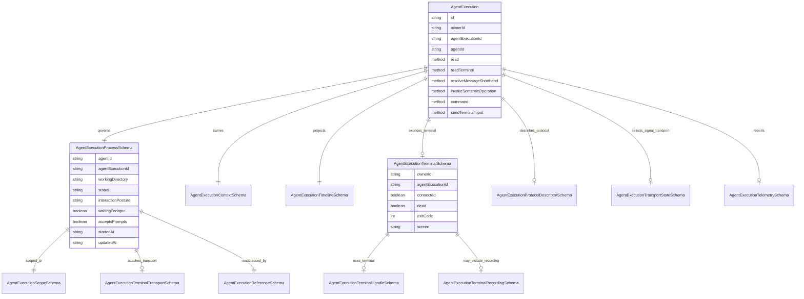

`AgentExecution` is the Entity for one execution of one Agent. Its center is the `AgentExecutionProcess`: the OS child process or provider process-like session that is doing the work. The Entity gives that process a stable Mission address, records the context and timeline around it, exposes safe operator controls, and publishes state to surfaces.

`AgentExecution` is not a Mission child record, a Task-specific wrapper, or a terminal session. Mission, Task, Repository, Artifact, and System can scope an AgentExecution, but they do not get their own execution model. Terminal support is an optional transport attached to the process.

## Plain-English Model

An `AgentExecution` is the system's official record for one active or recoverable attempt by an Agent to do work. If an operator starts Copilot, Claude, Codex, or another Agent on a task, repository, mission, artifact, or system job, the daemon creates one AgentExecution to govern that attempt.

The simplest way to understand it is: AgentExecution is the desk clerk for one working Agent process. It knows which Agent was started, what the Agent was asked to work on, where the Agent is working, how to talk to it, what it has reported, whether it still seems alive, and what the operator is allowed to do next.

The process is the center. That process may be a normal operating-system child process, or a provider session that behaves like one. The process has a working directory, a lifecycle such as starting, running, completed, failed, cancelled, or terminated, and a current ability to receive prompts or commands. AgentExecution owns this process-level truth. A Terminal can be attached when the Agent runs through a PTY, but the Terminal is only a communication lane. The Terminal owns screen text and keyboard input; it does not decide whether the AgentExecution is running, finished, cancelled, or failed.

The scope says what the execution is attached to. A scope can be system, repository, mission, task, or artifact. This does not create five kinds of Agent execution. It only says why this one execution exists and where its effects should be routed. A task-scoped execution may affect task workflow. A repository-scoped execution may work outside a Mission. An artifact-scoped execution may focus on one file-backed Artifact. All of them still use the same AgentExecution model.

Surfaces communicate with AgentExecution in three main ways. First, they can read it, which gives the current operator-facing state. Second, they can send structured AgentExecution commands, such as cancel, complete, send a prompt, or send a supported Agent message. Third, if the execution has a Terminal transport, they can send raw terminal input or resize information through the explicit terminal input channel. Structured messages and raw terminal input are deliberately separate because a reliable Agent command is not the same thing as typing text into a terminal.

Agents communicate back by producing observations. Some observations are structured signals, such as progress, blocked, needs input, ready for verification, or completed claim. Some observations are raw transport evidence, such as terminal output or provider output. AgentExecution records the difference: raw output is evidence, while accepted signals and daemon-observed facts can update the semantic journal, timeline, activity state, and owner effects.

The durable journal is the memory of what happened. The hydrated Entity view is the current readable summary. Storage keeps only the recoverable facts needed to rebuild or reattach the execution. Live UI conveniences, terminal screen material, command descriptors, telemetry, timeline overlays, supported-message lists, and duplicated process mirrors are hydrated read material, not storage truth.

My modeling opinion: the intended domain model is right, but the current implementation is still carrying convergence debt. AgentExecution should remain a single process-centered Entity. The main design risk is not that AgentExecution is too ambitious; it is that supporting views are currently too close to the same level as the process. The clearest next simplification is to make `process`, `scope`, durable context, journal references, protocol choice, and lifecycle the stable core, then treat terminal state, timeline state, telemetry, supported messages, and duplicated top-level process fields as derived or explicitly cached read material.

## Modeling Assessment Against ADR-0001

- Strong alignment: the live `AgentExecution` class is thick and owns process lifecycle operations, signal application, timeline refresh, prompt submission, command submission, cancellation, termination, and terminal update interpretation.
- Strong alignment: the contract is mostly declarative and binds named schemas to class methods instead of owning behavior.
- Strong alignment: the model distinguishes AgentExecution, Agent, AgentAdapter, AgentExecutionRegistry, AgentExecutionProcess, and Terminal.
- Storage alignment: `AgentExecutionStorageSchema` is intentionally narrower than `AgentExecutionSchema`. Storage contains identity, the governed process, durable context, protocol/transport selection, log references, lifecycle fields, and timestamps. Hydrated-only fields such as `timeline`, `supportedMessages`, `journalRecords`, `telemetry`, terminal handles, and duplicated process projections do not define storage truth.
- Identity alignment: the class `id` and schema `id` both refer to the canonical Entity id in `table:uniqueId` form. `agentExecutionId` remains the execution-local id inside the owner address.
- Ownership alignment: AgentExecution remote reads, commands, semantic operations, shorthand resolution, and terminal input resolve through the owner-agnostic `AgentExecutionRegistry`. AgentExecution no longer loads Mission or MissionWorkflow state as a fallback.
- Remaining design pressure: top-level fields such as `lifecycleState`, `progress`, `waitingForInput`, `acceptsPrompts`, `acceptedCommands`, `interactionPosture`, `transport`, `reference`, `workingDirectory`, and `taskId` mirror `process`. They are useful for surfaces, but `process` remains the source and these fields must remain documented as projections.

## Mission And Workflow Boundary

Mission may list AgentExecutions that participate in a Mission workflow, but those entries are Mission workflow references and compact runtime history. Mission reconstructs mission-scoped AgentExecution views from MissionWorkflow state when building a Mission read model. That reconstruction belongs in Mission/MissionWorkflow because it uses Mission dossier paths, task records, workflow runtime events, and Mission artifact context.

AgentExecution itself does not know how to find a Mission. It does not load Mission dossiers, infer that `ownerId` is a `missionId`, or call Mission methods for prompt, cancel, complete, or terminal behavior. After launch, an operator addresses AgentExecution through `ownerId` plus `agentExecutionId`; the daemon resolves that address through the owner-agnostic AgentExecutionRegistry. If a Mission wants to expose historical mission-scoped execution state, Mission must project that state into its own read model instead of making AgentExecution depend on Mission.

## Naming Note

Keep `Agent` and `AgentExecution`.

Renaming `Agent` to `AgentProvider` would make the model less accurate. An Agent is the registered work capability the operator chooses, such as Copilot CLI or Claude Code. It owns display name, availability, diagnostics, capabilities, and exactly one private adapter. A provider is the external company, tool family, or backend behind that capability; it is not the same thing as the configured Agent Entity.

Renaming `AgentExecution` to `Agent` would collapse type and instance. The Agent is the capability; AgentExecution is one attempt by that capability to do work.

Renaming `AgentExecution` to `AgentSession` would improve casual readability but weaken the model. `Session` sounds like a chat or UI conversation. This Entity is stricter: it owns a process or process-like provider session, lifecycle, scope, commands, observations, journal, and recoverability. `AgentExecution` is a heavier name, but it is the more honest name for the authority it carries.

Use plain UI copy when needed. The code and contracts should keep `AgentExecution`; operator-facing surfaces may label it as an Agent run, active Agent, or session where that reads better.

## Sources Of Truth

- Class behavior: [packages/core/src/entities/AgentExecution/AgentExecution.ts](../../../packages/core/src/entities/AgentExecution/AgentExecution.ts)
- Entity schema: [packages/core/src/entities/AgentExecution/AgentExecutionSchema.ts](../../../packages/core/src/entities/AgentExecution/AgentExecutionSchema.ts)
- Entity contract: [packages/core/src/entities/AgentExecution/AgentExecutionContract.ts](../../../packages/core/src/entities/AgentExecution/AgentExecutionContract.ts)
- Terminal transport schemas: [packages/core/src/entities/AgentExecution/transport/AgentExecutionTerminalSchema.ts](../../../packages/core/src/entities/AgentExecution/transport/AgentExecutionTerminalSchema.ts)
- Protocol schemas: [packages/core/src/entities/AgentExecution/protocol/AgentExecutionProtocolSchema.ts](../../../packages/core/src/entities/AgentExecution/protocol/AgentExecutionProtocolSchema.ts)
- Vocabulary decision: [docs/adr/0006.01-agent-execution-and-agent-adapter-vocabulary.md](../../adr/0006.01-agent-execution-and-agent-adapter-vocabulary.md)

## Responsibilities

`AgentExecution` owns execution identity, owner-independent addressing, the governed process, process-derived lifecycle state, structured prompts and commands, semantic operation invocation, terminal input relay, protocol descriptors, timeline projection, journal references, and audit-facing state.

It does not own Agent registration, AgentAdapter configuration, Terminal screen substrate behavior, Mission workflow law, Task status transitions, or repository setup. Those are delegated to their own Entities or daemon collaborators.

## Contract Methods

| Method | Kind | Input schema | Result schema | Behavior | Known callers |
| --- | --- | --- | --- | --- | --- |
| `read` | query | `AgentExecutionLocatorSchema` | `AgentExecutionSchema` | Reads the canonical Entity data for an addressed AgentExecution. | Entity runtime stores and daemon query surfaces. |
| `readTerminal` | query | `AgentExecutionLocatorSchema` | `AgentExecutionTerminalSchema` | Reads terminal-facing state for terminal-backed executions. This is a terminal view of the process, not the process itself. | Web terminal route, terminal websocket bootstrap. |
| `resolveMessageShorthand` | query | `AgentExecutionResolveMessageShorthandInputSchema` | `AgentExecutionMessageShorthandResolutionSchema` | Resolves operator slash-style shorthand into a structured AgentExecution invocation. | AgentExecution UI composer. |
| `invokeSemanticOperation` | mutation | `AgentExecutionInvokeSemanticOperationInputSchema` | `AgentExecutionSemanticOperationResultSchema` | Runs a Mission-owned semantic operation against the live execution. | AgentExecution UI and daemon command surfaces. |
| `command` | mutation | `AgentExecutionCommandInputSchema` | `AgentExecutionCommandAcknowledgementSchema` | Applies an AgentExecution command such as cancel, interrupt, checkpoint, nudge, resume, or model-specific continuation. | Mission command list, AgentExecution command bar, daemon Entity command dispatch. |
| `sendTerminalInput` | mutation | `AgentExecutionSendTerminalInputSchema` | `AgentExecutionTerminalSchema` | Sends input or resize data to the Terminal transport attached to the process and returns terminal state. | Web terminal HTTP route and websocket input relay. |

## Contract Events

| Event | Payload schema | Publisher | Meaning |
| --- | --- | --- | --- |
| `data.changed` | `AgentExecutionChangedSchema` | AgentExecution class and daemon runtime coordination | Canonical Entity data changed. Surfaces should refresh their AgentExecution model. |
| `terminal` | `AgentExecutionTerminalSchema` | Terminal-backed AgentExecution runtime path | Terminal-facing state changed for the execution. Surfaces may update terminal screen/output. |

## Properties

| Role | Property | Schema or type | Meaning |
| --- | --- | --- | --- |
| Entity identity | `id` | `EntitySchema.id` | Canonical Entity id, built from `agent_execution:<ownerId>/<agentExecutionId>`. |
| Entity identity | `ownerId` | string | Owner-derived address segment for this execution. It is not Mission-only. |
| Entity identity | `agentExecutionId` | string | Stable execution id inside the owner address. |
| Agent identity | `agentId` | string | Registered Agent capability used for this execution. |
| Governed process | `process` | `AgentExecutionProcessSchema` | The central child model: process or provider session, lifecycle, interaction posture, progress, transport, reference, and timestamps. |
| Adapter/process label | `adapterLabel` | string | Human label for the AgentAdapter that launched or reattached the process. |
| Optional transport address | `transportId` | string | Projection used by older runtime surfaces to identify the selected transport. Prefer `process.transport` for process-centered meaning. |
| Journal and recording | `agentJournalPath` | `AgentExecutionJournalPathSchema` | Path to the semantic interaction journal. |
| Journal and recording | `journalRecords` | array | Recent or hydrated journal records for audit/replay surfaces. |
| Journal and recording | `terminalRecordingPath` | `AgentExecutionTerminalRecordingPathSchema` | Path to raw terminal recording for terminal-backed executions. |
| Lifecycle projection | `lifecycleState` | `AgentExecutionLifecycleStateSchema` | Entity-level lifecycle projected from the process and journal state. |
| Lifecycle projection | `attention` | `AgentExecutionAttentionStateSchema` | Whether the execution needs operator attention, is autonomous, blocked, or done. |
| Lifecycle projection | `activityState` | `AgentExecutionActivityStateSchema` | UI/audit activity projection such as idle, executing, communicating, or failed. |
| Interaction projection | `currentInputRequestId` | string or null | Current semantic input request, if the execution is waiting for structured operator input. |
| Interaction projection | `awaitingResponseToMessageId` | string or null | Operator message that is awaiting an Agent response. |
| Terminal projection | `terminalHandle` | `AgentExecutionTerminalHandleSchema` | Terminal Entity handle when the process has a PTY transport. |
| Assignment projection | `assignmentLabel` | string | Human label for the assigned task or work item. |
| Assignment projection | `workingDirectory` | string | Launch location projected from the process for quick reading. |
| Assignment projection | `currentTurnTitle` | string | Human title for the current turn. |
| Assignment projection | `taskId` | string | Task id when the scope is task-oriented. |
| Interaction contract | `interactionCapabilities` | `AgentExecutionInteractionCapabilitiesSchema` | What the operator can do now: terminal input, structured prompt, structured command. |
| Context | `context` | `AgentExecutionContextSchema` | Artifacts and instructions supplied to the execution. |
| Timeline | `timeline` | `AgentExecutionTimelineSchema` | Human/audit timeline derived from prompts, signals, observations, and journal records. |
| Protocol | `supportedMessages` | array of `AgentExecutionMessageDescriptorSchema` | Operator-facing supported messages for the current lifecycle and transport. |
| Protocol | `protocolDescriptor` | `AgentExecutionProtocolDescriptorSchema` | Provider-neutral protocol shape for messages, signals, owner address, and delivery expectations. |
| Protocol | `transportState` | `AgentExecutionTransportStateSchema` | Selected signal transport and degradation state. |
| Scope projection | `scope` | `AgentExecutionScopeSchema` | Domain attachment: system, repository, mission, task, or artifact. The process also carries this. |
| Process projection | `progress` | `AgentExecutionProgressSchema` | Process progress projected for compatibility and quick UI consumption. |
| Process projection | `waitingForInput` | boolean | Whether the process is waiting for operator input. |
| Process projection | `acceptsPrompts` | boolean | Whether the process can accept structured prompts. |
| Process projection | `acceptedCommands` | array of `AgentExecutionSupportedCommandTypeSchema` | Commands currently accepted by the process. |
| Process projection | `interactionPosture` | `AgentExecutionInteractionPostureSchema` | Whether interaction is terminal escape hatch, structured headless, or structured interactive. |
| Process projection | `transport` | `AgentExecutionTerminalTransportSchema` | Process-attached terminal transport, when present. |
| Process projection | `reference` | `AgentExecutionReferenceSchema` | Provider-neutral reference used to readdress the execution. |
| Live status | `liveActivity` | `AgentExecutionLiveActivitySchema` | Current activity detail derived from process progress or journal replay. |
| Live status | `awaitingPermission` | `AgentExecutionPermissionRequestSchema` | Provider permission request requiring operator attention. |
| Live status | `telemetry` | `AgentExecutionTelemetrySchema` | Usage/cost/tool telemetry projected from adapter output or journal records. |
| Failure and time | `failureMessage` | string | Human-readable failure reason. |
| Failure and time | `createdAt` | string | Entity creation or launch timestamp. |
| Failure and time | `lastUpdatedAt` | string | Last canonical Entity update timestamp. |
| Failure and time | `endedAt` | string | Completion, cancellation, termination, or failure timestamp. |

## Major Schemas

`AgentExecutionProcessSchema` is the center. It is the process/process-like session state: Agent id, execution id, scope, working directory, lifecycle, attention, progress, input posture, accepted commands, optional terminal transport, reference, and timestamps.

`AgentExecutionTerminalSchema` is the terminal-facing read model for a terminal-backed process. It carries screen, output chunk, dimensions, connection/dead status, optional recording, and terminal handle. It replaces AgentExecution-specific terminal snapshot naming; the word snapshot remains valid only in the generic Terminal/Mission terminal substrate where that contract still uses it.

`AgentExecutionContextSchema` describes the ordered artifacts and instructions given to the execution.

`AgentExecutionTimelineSchema` describes the human/audit timeline projected from prompts, signals, observations, state changes, and journal replay.

`AgentExecutionProtocolDescriptorSchema` describes the provider-neutral message and signal contract. It lets callers talk to the execution without knowing provider-specific adapter details.

## ERD Pressure Gauge

This graph is intentionally smaller than a generated schema dump. It shows the ownership center and the main read/projection surfaces. If future changes make this diagram sprawl again, that is a modeling warning: either a supporting concept has become an Entity, or the Entity is carrying too many projections at the same level as the process.

## Cross-Control Notes

- Class, schema, and contract now agree that `AgentExecution` has a required `process` property and that the process is the center of lifecycle and interaction state.
- The contract exposes `AgentExecutionTerminalSchema` for `readTerminal`, `sendTerminalInput`, and the `terminal` event. AgentExecution-specific terminal naming no longer uses `Snapshot`.
- Several top-level properties intentionally duplicate process fields as projections for existing surfaces: `lifecycleState`, `progress`, `waitingForInput`, `acceptsPrompts`, `acceptedCommands`, `interactionPosture`, `transport`, and `reference`. Their source is the governed process unless journal replay or durable state explicitly overrides them for audit/recovery.
- Naming pressure remains around the broad suffix `Data` in inferred TypeScript names such as `AgentExecutionDataType`. That is a TypeScript export convention rather than a separate domain model, but it should not become a new concept.
- `readTerminal` is still a method name because callers read the terminal-facing state of the execution. It should not be interpreted as process ownership by Terminal.
