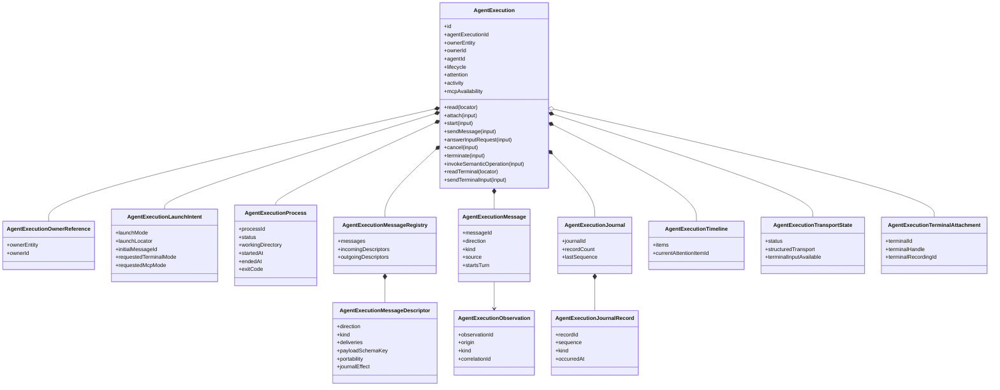
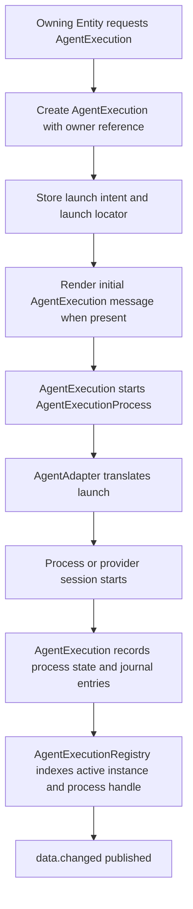
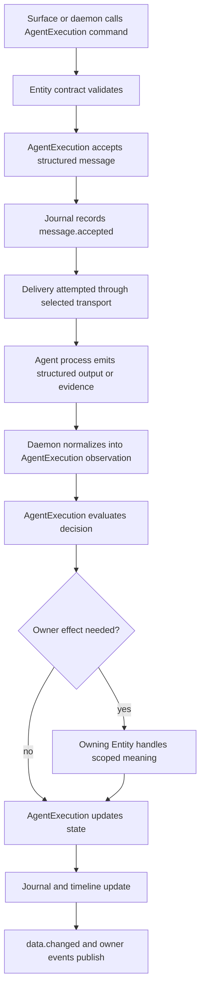
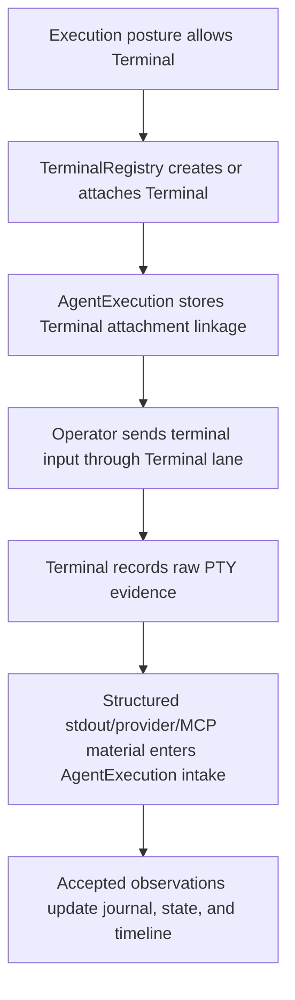

`AgentExecution` is the canonical Entity for one running or recoverable execution of one Agent under an explicit owning Entity reference. It owns the Agent execution process, execution lifecycle, structured interaction state, message registry, journal, timeline projection, effective MCP availability, and optional Terminal linkage.

This page documents the target model from `CONTEXT.md` and accepted ADRs. The current TypeScript implementation is convergence evidence only; when it diverges from this page, the docs and ADRs are the authority for the next implementation pass.

## Authority

- Vocabulary: [docs/adr/0006.01-agent-execution-and-agent-adapter-vocabulary.md](../../adr/0006.01-agent-execution-and-agent-adapter-vocabulary.md)
- Structured interaction: [docs/adr/0006.05-agent-execution-structured-interaction-vocabulary.md](../../adr/0006.05-agent-execution-structured-interaction-vocabulary.md)
- Journal persistence: [docs/adr/0006.08-agent-execution-interaction-journal.md](../../adr/0006.08-agent-execution-interaction-journal.md)
- Semantic operations: [docs/adr/0006.09-mission-mcp-agent-execution-semantic-operations.md](../../adr/0006.09-mission-mcp-agent-execution-semantic-operations.md)
- Structured-first terminal-capable interaction: [docs/adr/0006.10-structured-first-agent-interaction-with-terminal-capability.md](../../adr/0006.10-structured-first-agent-interaction-with-terminal-capability.md)
- Journal vocabulary: [docs/adr/0006.13-typed-agent-execution-journal-ledger.md](../../adr/0006.13-typed-agent-execution-journal-ledger.md)
- Current implementation checkpoint: [packages/core/src/entities/AgentExecution](../../../packages/core/src/entities/AgentExecution)

## Definition

An `AgentExecution` governs one attempt by a selected `Agent` to do work. The attempt may be owned by System, Repository, Mission, Task, or Artifact, and the execution model stays the same for every owner. Owner references route scope-specific effects through the owning Entity path.

The process is the center. `AgentExecutionProcess` is the OS child process or process-like provider session that does the work. Terminal support is optional transport for that process. Terminal owns PTY screen state, terminal input, resize, exit observation, and terminal recordings; AgentExecution owns the process lifecycle and the semantic interaction model around that process.

## Responsibilities

| Area | AgentExecution owns |
| --- | --- |
| Identity | Entity id, owner reference, `agentExecutionId`, retry lineage, selected Agent reference. |
| Launch | Durable launch intent, owner-approved launch locator, selected interaction posture, initial message acceptance, and realized process state. |
| Process | `AgentExecutionProcess` lifecycle, current process health, start/stop/cancel/terminate semantics, and process-owned activity state. |
| Interaction | Entity commands, structured AgentExecution messages, message acceptance, message delivery attempts, incoming message intake, and daemon-normalized observation handling. |
| Registry | Live `messageRegistry` of currently available incoming/outgoing message descriptors. |
| Journal | Ordered AgentExecution journal identity and accepted journal records for replay, audit, and recovery. |
| State | Lifecycle, attention, activity, current input request, permission request, awaiting-response linkage, and current capabilities. |
| Timeline | Human-facing activity/chat projection derived from accepted messages, observations, decisions, state changes, and journal replay. |
| Transport | Minimal `transportState`, effective `mcpAvailability`, and optional Terminal attachment linkage. |
| Owner effects | Routing accepted observations to the owning Entity path and applying accepted owner effects back to AgentExecution state and journal. |

## Boundary Split

| Neighbor | Boundary |
| --- | --- |
| `Agent` | Registered capability selected for the execution. Agent owns identity, availability, diagnostics, and one AgentAdapter. |
| `AgentAdapter` | Provider-specific translation: command/args/env, parser hooks, transport capability declaration, MCP provisioning, and adapter-scoped messages. |
| `AgentExecutionRegistry` | Daemon-internal active lookup and process-handle plumbing for active AgentExecution instances. |
| `Terminal` / `TerminalRegistry` | Optional PTY transport, screen state, input, resize, exit observation, terminal snapshots, and terminal recordings. |
| Owning Entity | System, Repository, Mission, Task, or Artifact behavior that accepts scoped meaning and owner effects. |
| Mission workflow runtime | Workflow orchestration, task legality, gate transitions, and Mission workflow events. |
| Open Mission surfaces | Rendering, local selection, command affordances, timeline layout, and terminal panes. |

## Target Contract Methods

These methods are the target Entity contract surface implied by the accepted docs. Current implementation may expose only a subset while convergence is in progress.

| Method | Kind | Input schema | Result schema | Behavior | Likely callers | Side effects |
| --- | --- | --- | --- | --- | --- | --- |
| `read` | query | `AgentExecutionLocatorSchema` | `AgentExecutionSchema` | Reads current AgentExecution Entity data by `id` or owner-qualified locator. | Entity API, Mission read model, Open Mission surfaces. | None. |
| `attach` | command | `AgentExecutionAttachInputSchema` | `AgentExecutionSchema` | Reconnects a surface or daemon path to an existing active/recoverable execution. Attach is not a turn. | Open Mission panes, daemon recovery, workflow resume surfaces. | May refresh live transport linkage and publish `data.changed` when current state changes. |
| `start` | command | `AgentExecutionStartInputSchema` | `AgentExecutionSchema` | Realizes stored launch intent into an AgentExecutionProcess and records launch state. | Owner Entity commands, daemon launch coordinator. | Starts process or provider session, appends journal records, updates lifecycle/activity, publishes `data.changed`. |
| `sendMessage` | command | `AgentExecutionSendMessageInputSchema` | `AgentExecutionSendMessageAcknowledgementSchema` | Accepts a structured AgentExecution message, optionally starts a turn, and attempts delivery through selected transport. | Mission UI prompt, slash command resolver, owner/daemon automation. | Appends accepted message and delivery records, updates activity/attention, publishes `data.changed`. |
| `answerInputRequest` | command | `AgentExecutionAnswerInputRequestInputSchema` | `AgentExecutionSendMessageAcknowledgementSchema` | Answers the current `needs_input` request with a fixed choice or manual text on the normal message path. | Operator UI, automation with explicit operator policy. | Clears or advances current input-request state after acceptance and delivery. |
| `cancel` | command | `AgentExecutionCancelInputSchema` | `AgentExecutionSchema` | Cancels the execution through AgentExecution lifecycle rules. | Operator UI, owner workflow cancellation. | Updates lifecycle, records decision/state change, stops or signals process when active. |
| `terminate` | command | `AgentExecutionTerminateInputSchema` | `AgentExecutionSchema` | Terminates the governed process or provider session. | Operator UI, daemon cleanup, runtime supervision. | Signals process/session, records termination, updates lifecycle/activity. |
| `invokeSemanticOperation` | command | `AgentExecutionInvokeSemanticOperationInputSchema` | `AgentExecutionSemanticOperationResultSchema` | Runs a scoped read-only semantic operation through AgentExecution authority and records bounded observation. | `open-mission-mcp`, agent-chat tools, daemon semantic operation path. | Appends bounded observation/activity records; no Entity storage mutation outside accepted owner effects. |
| `readTerminal` | query | `AgentExecutionTerminalLocatorSchema` | `AgentExecutionTerminalSchema` | Reads terminal-facing state for an attached Terminal lane. | Terminal panes and terminal replay surfaces. | None; Terminal remains source for screen state. |
| `sendTerminalInput` | command | `AgentExecutionSendTerminalInputSchema` | `AgentExecutionTerminalSchema` | Sends raw terminal input or resize data to the attached Terminal lane. | Focused Terminal UI only. | Updates Terminal-owned state and terminal recording; semantic state changes only through later structured intake. |

## Target Events

Public events stay intentionally small. Rich execution happenings normally surface through journal, current state, timeline, and `data.changed`.

| Event | Payload schema | Publisher | Meaning | Subscribers |
| --- | --- | --- | --- | --- |
| `data.changed` | `AgentExecutionDataChangedEventSchema` | AgentExecution accepted write path | Current AgentExecution Entity data changed. | Open Mission surfaces, Mission read model, daemon subscribers. |
| `terminal` | `AgentExecutionTerminalEventSchema` | Terminal-backed AgentExecution lane | Terminal-facing state changed for an attached Terminal lane. | Terminal panes, terminal replay/update subscribers. |
| Owner Entity events | Owner-specific event schemas | Owning Entity | Accepted owner effect changed owner state. | Mission/Task/Repository/Artifact surfaces and workflow subscribers. |

## Property Groups

The target schema should keep durable storage, hydrated read data, and live transport data visibly separate.

| Group | Property | Type / subtype | Role |
| --- | --- | --- | --- |
| Identity | `id` | Entity id | Canonical Entity id for the AgentExecution. |
| Identity | `agentExecutionId` | id | Stable execution id within the owner address. |
| Ownership | `ownerEntity` | `System / Repository / Mission / Task / Artifact` | Closed owner kind. |
| Ownership | `ownerId` | id | Owner-derived address segment. |
| Ownership | `ownerReference` | `AgentExecutionOwnerReference` | Owner kind plus owner id as a value object when represented together. |
| Agent | `agentId` | id | Selected Agent capability. |
| Agent | `adapterLabel` | string | Optional human label for selected adapter in read models. |
| Lineage | `lineage` | `AgentExecutionRetryLineage` | Retry relationship and attempt number. |
| Launch | `launchIntent` | `AgentExecutionLaunchIntent` | Durable owner-approved launch choices, initial prompt/message, posture, requested terminal/MCP modes, and launch locator. |
| Process | `process` | `AgentExecutionProcess` | Governed process/session truth: lifecycle, working directory, process identity, exit state, and realized transport posture. |
| State | `lifecycle` | `AgentExecutionLifecycleState` | Orchestration lifecycle: starting, running, paused, completed, failed, cancelled, terminated. |
| State | `attention` | `AgentExecutionAttentionState` | Collaboration attention: none, autonomous, awaiting-operator, awaiting-system, blocked. |
| State | `activity` | `AgentExecutionActivityState` | Current semantic work posture: idle, awaiting-agent-response, planning, reasoning, communicating, editing, executing, testing, reviewing. |
| State | `currentInputRequest` | `AgentExecutionInputRequest` | Active `needs_input` request until answered, cancelled, superseded, or terminal condition. |
| State | `currentPermissionRequest` | `AgentExecutionPermissionRequest` | Active permission/approval request, distinct from collaboration input. |
| State | `awaitingResponseToMessageId` | id | Turn-starting message currently awaiting a meaningful Agent observation. |
| Interaction | `commands` | `AgentExecutionCommandDescriptor[]` | Available Entity-level commands derived from contract and current state. |
| Interaction | `messageRegistry` | `AgentExecutionMessageRegistry` | Available incoming and outgoing runtime-boundary messages. |
| Interaction | `supportedMessages` | `AgentExecutionMessageDescriptor[]` | Read-model shorthand or compatibility projection of available messages. |
| Transport | `transportState` | `AgentExecutionTransportState` | Minimal operator-facing structured transport health. |
| Transport | `mcpAvailability` | `available / unavailable` | Effective semantic-operation availability for this execution. |
| Transport | `terminalAttachment` | `AgentExecutionTerminalAttachment` | Linkage to Terminal when a PTY lane is attached. |
| Journal | `journal` | `AgentExecutionJournal` | Journal identity, owner address, sequence state, and storage reference. |
| Journal | `journalRecords` | `AgentExecutionJournalRecord[]` | Hydrated records for audit/replay views when present. |
| Evidence | `terminalRecordingId` | id | Reference to raw Terminal recording when terminal-backed. |
| Timeline | `timeline` | `AgentExecutionTimeline` | Human-facing projection for agent-chat and review surfaces. |
| Telemetry | `telemetry` | `AgentExecutionTelemetry` | Compressible activity/usage/readiness data when promoted to current state. |
| Timestamps | `createdAt` | timestamp | Creation time. |
| Timestamps | `updatedAt` | timestamp | Last accepted current-state update. |

## Subtype Map

| Subtype | Purpose | Owner |
| --- | --- | --- |
| `AgentExecutionOwnerReference` | Owner kind plus owner id for routing. | AgentExecution stores it; owning Entity gives it meaning. |
| `AgentExecutionLaunchIntent` | Durable launch choices before process realization. | AgentExecution. |
| `AgentExecutionLaunchLocator` | Owner-approved launch location descriptor. | Owning Entity creates; AgentExecution stores; daemon resolves. |
| `AgentExecutionProcess` | Governed OS/process-like session. | AgentExecution. |
| `AgentExecutionMessageRegistry` | Available incoming/outgoing message descriptors. | AgentExecution. |
| `AgentExecutionMessageDescriptor` | One available runtime-boundary message kind. | AgentExecution plus AgentAdapter/owner contributions. |
| `AgentExecutionMessage` | Accepted incoming or outgoing structured message. | AgentExecution. |
| `AgentExecutionObservation` | Daemon-internal normalized observed material. | AgentExecution processing path. |
| `AgentExecutionDecision` | Accepted policy result for message/observation handling. | AgentExecution. |
| `AgentExecutionJournal` | Ordered journal identity and sequence state. | AgentExecution. |
| `AgentExecutionJournalRecord` | One ordered accepted record. | AgentExecution journal storage. |
| `AgentExecutionTimeline` | Human-facing projection over accepted records and state. | AgentExecution. |
| `AgentExecutionTimelineItem` | One rendered conversation/activity item. | AgentExecution projection. |
| `AgentExecutionTransportState` | Minimal current transport health. | AgentExecution. |
| `AgentExecutionTerminalAttachment` | Terminal linkage for PTY-backed lane. | AgentExecution stores linkage; Terminal owns terminal state. |
| `AgentExecutionInputRequest` | Active collaboration request from Agent to operator. | AgentExecution current state and journal. |
| `AgentExecutionPermissionRequest` | Active runtime/provider approval request. | AgentExecution current state and journal. |
| `AgentExecutionSemanticOperation` | Scoped read-only operation exposed to a registered execution. | AgentExecutionSemanticOperations behind AgentExecution. |
| `AgentExecutionTelemetry` | Compressible activity and usage material. | AgentExecution current state/journal when promoted. |

## Implementation Contract Freeze

This section freezes the first implementation pass. Implementation agents should use these names and shapes directly. New AgentExecution vocabulary belongs in `CONTEXT.md` or an accepted ADR before code uses it.

### Canonical Files

| File | Owns |
| --- | --- |
| `packages/core/src/entities/AgentExecution/AgentExecution.ts` | AgentExecution behavior, lifecycle rules, accepted write path, process ownership facade, journal/write coordination, and command handlers. |
| `packages/core/src/entities/AgentExecution/AgentExecutionSchema.ts` | Zod schemas, inferred types, schema descriptions, storage metadata, hydrated read shape, method input schemas, result schemas, events, and subtypes. |
| `packages/core/src/entities/AgentExecution/AgentExecutionContract.ts` | Declarative Entity contract metadata for methods and events only. |
| `packages/core/src/entities/AgentExecution/AgentExecutionJournalSchema.ts` | Journal record schemas and inferred types if the journal family becomes too large for `AgentExecutionSchema.ts`. |
| `packages/core/src/entities/AgentExecution/AgentExecutionJournalStore.ts` | Shared journal append/read/replay storage contract if separated from the Entity class. |
| `packages/core/src/entities/AgentExecution/AgentExecutionJournalReplayer.ts` | Deterministic replay from journal records into AgentExecution read state and timeline projection. |
| `packages/core/src/daemon/runtime/agent-execution/AgentExecutionRegistry.ts` | Daemon-internal active AgentExecution lookup and process-handle registration only. |
| `packages/core/src/entities/Terminal` | Terminal Entity, TerminalRegistry, PTY input, screen state, resize, exit observation, snapshots, and terminal recordings. |

### Canonical Names

| Concept | Frozen name | Rule |
| --- | --- | --- |
| Owner address | `AgentExecutionOwnerReference` | Value object containing `ownerEntity` and `ownerId`. |
| Owner kind | `AgentExecutionOwnerEntity` | Closed enum: `System`, `Repository`, `Mission`, `Task`, `Artifact`. |
| Execution id | `agentExecutionId` | Stable execution id inside the owner address. |
| Entity id | `id` | Canonical Entity id in `table:uniqueId` form. |
| Launch intent | `AgentExecutionLaunchIntent` | Durable pre-launch choices. |
| Launch locator | `AgentExecutionLaunchLocator` | Owner-approved launch location descriptor stored inside launch intent. |
| Process | `AgentExecutionProcess` | Governed OS process or process-like provider session. |
| Process health | `AgentExecutionProcessHealth` | Attached, detached, degraded, orphaned, reconciling, or unrecoverable process assessment. |
| Message registry | `AgentExecutionMessageRegistry` | Live available-only message catalog. |
| Message descriptor | `AgentExecutionMessageDescriptor` | One currently available runtime-boundary message kind. |
| Message | `AgentExecutionMessage` | Structured incoming or outgoing runtime-boundary interaction unit. |
| Observation | `AgentExecutionObservation` | Daemon-internal normalized observed material. |
| Decision | `AgentExecutionDecision` | Durable policy result for accepted message or observation handling. |
| Journal | `AgentExecutionJournal` | Journal identity, owner address, sequence state, and storage reference. |
| Journal record | `AgentExecutionJournalRecord` | One ordered accepted semantic record. |
| Input request | `AgentExecutionInputRequest` | Active collaboration request from Agent to operator. |
| Permission request | `AgentExecutionPermissionRequest` | Active runtime/provider approval request. |
| Transport state | `AgentExecutionTransportState` | Minimal operator-facing structured transport health. |
| Terminal attachment | `AgentExecutionTerminalAttachment` | Link from AgentExecution to Terminal-owned PTY lane. |
| Timeline | `AgentExecutionTimeline` | Human-facing projection derived from journal/current state. |
| Timeline item | `AgentExecutionTimelineItem` | One projected conversation, activity, workflow, runtime, terminal, or artifact item. |
| Semantic operation | `AgentExecutionSemanticOperation` | Scoped read-only operation exposed to a registered execution. |
| Telemetry | `AgentExecutionTelemetry` | Compressible activity and usage material when promoted. |

`AgentExecutionScope`, `AgentExecutionRuntime`, `ManagedAgentExecution`, `AgentExecutor`, and owner-specific execution class names are outside the frozen contract. If later work needs one of those concepts, doctrine must change before code introduces it.

### Canonical Method Surface

| Method | Input schema | Result schema | Contract rule |
| --- | --- | --- | --- |
| `read` | `AgentExecutionLocatorSchema` | `AgentExecutionSchema` | Query current hydrated AgentExecution read state. |
| `attach` | `AgentExecutionAttachInputSchema` | `AgentExecutionSchema` | Reconnect a surface or daemon path to an existing active or recoverable execution. |
| `start` | `AgentExecutionStartInputSchema` | `AgentExecutionSchema` | Realize stored launch intent into an AgentExecutionProcess. |
| `sendMessage` | `AgentExecutionSendMessageInputSchema` | `AgentExecutionSendMessageAcknowledgementSchema` | Accept a structured AgentExecution message and attempt delivery when delivery is required. |
| `answerInputRequest` | `AgentExecutionAnswerInputRequestInputSchema` | `AgentExecutionSendMessageAcknowledgementSchema` | Answer the active `AgentExecutionInputRequest` through the normal message path. |
| `cancel` | `AgentExecutionCancelInputSchema` | `AgentExecutionSchema` | Cancel execution through AgentExecution lifecycle rules. |
| `terminate` | `AgentExecutionTerminateInputSchema` | `AgentExecutionSchema` | Terminate the governed process or provider session. |
| `invokeSemanticOperation` | `AgentExecutionInvokeSemanticOperationInputSchema` | `AgentExecutionSemanticOperationResultSchema` | Invoke a scoped read-only semantic operation and record a bounded observation. |
| `readTerminal` | `AgentExecutionTerminalLocatorSchema` | `AgentExecutionTerminalSchema` | Read terminal-facing state for the attached Terminal lane through Terminal-owned data. |
| `sendTerminalInput` | `AgentExecutionSendTerminalInputSchema` | `AgentExecutionTerminalSchema` | Send raw input or resize data to the attached Terminal lane. |

These method names are the implementation target. Owner Entities may expose start/select convenience commands, but ongoing execution interaction stays AgentExecution-addressed through this surface.

### Required First-Slice Storage Fields

`AgentExecutionStorageSchema` should contain only durable fields needed to reconstruct or recover the execution:

| Field | Type / schema | Storage role |
| --- | --- | --- |
| `id` | `EntityIdSchema` | Canonical Entity id. |
| `agentExecutionId` | `IdSchema` | Stable execution id under the owner address. |
| `ownerReference` | `AgentExecutionOwnerReferenceSchema` | Owner kind and owner id as the execution address. |
| `agentId` | `IdSchema` | Selected Agent. |
| `lineage` | `AgentExecutionRetryLineageSchema.optional()` | Retry relationship and attempt metadata. |
| `launchIntent` | `AgentExecutionLaunchIntentSchema` | Durable pre-launch choices and owner-approved launch locator. |
| `process` | `AgentExecutionProcessSchema.optional()` | Durable process identity and exit facts only when recovery or audit needs them. |
| `lifecycle` | `AgentExecutionLifecycleStateSchema` | Durable orchestration lifecycle. |
| `attention` | `AgentExecutionAttentionStateSchema` | Durable operator/system attention state. |
| `activity` | `AgentExecutionActivityStateSchema` | Latest durable semantic activity state. |
| `currentInputRequest` | `AgentExecutionInputRequestSchema.optional()` | Active collaboration request. |
| `currentPermissionRequest` | `AgentExecutionPermissionRequestSchema.optional()` | Active permission request. |
| `awaitingResponseToMessageId` | `IdSchema.optional()` | Turn-starting message awaiting a meaningful Agent observation. |
| `messageRegistry` | `AgentExecutionMessageRegistrySchema` | Current available message catalog persisted when needed for recovery and prompt regeneration. |
| `transportState` | `AgentExecutionTransportStateSchema` | Minimal structured transport health. |
| `mcpAvailability` | `AgentExecutionMcpAvailabilitySchema` | Effective semantic-operation availability: `available` or `unavailable`. |
| `terminalAttachment` | `AgentExecutionTerminalAttachmentSchema.optional()` | Linkage to Terminal-owned lane. |
| `journal` | `AgentExecutionJournalSchema` | Journal identity, owner address, sequence state, and storage reference. |
| `terminalRecordingId` | `IdSchema.optional()` | Reference to raw Terminal recording when terminal-backed. |
| `telemetry` | `AgentExecutionTelemetrySchema.optional()` | Latest retained telemetry summary when promoted. |
| `createdAt` | timestamp schema | Creation time. |
| `updatedAt` | timestamp schema | Last accepted current-state update. |

Hydrated `AgentExecutionSchema` may add derived `commands`, `journalRecords`, `timeline`, Agent/adapter display labels, and live overlays. Those hydrated fields are read material, not storage authority unless they also appear above.

### Required First-Slice Events

| Event | Payload schema | Rule |
| --- | --- | --- |
| `data.changed` | `AgentExecutionDataChangedEventSchema` | Published after accepted AgentExecution current-state changes. |
| `terminal` | `AgentExecutionTerminalEventSchema` | Published for terminal-facing updates linked to an attached Terminal lane. |

Additional public AgentExecution events require a concrete subscriber need and a documentation update before implementation.

### Schema Description Rule

Every AgentExecution Zod schema and every field declared in `AgentExecutionSchema.ts` must be generated with `.meta({ description: "..." })`. This includes storage schemas, hydrated read schemas, method input schemas, method result schemas, event payload schemas, subschemas, enum schemas, object fields, array fields, nested object fields, optional fields, and nullable fields.

Storage schemas and fields that participate in SurrealDB provisioning must also carry `@flying-pillow/zod-surreal` table or field registry metadata with an equivalent `description`. The Zod `.meta` description is the schema/documentation source in `AgentExecutionSchema.ts`; the zod-surreal metadata is the storage-facing DDL/provisioning source.

Descriptions must explain domain role and ownership, not restate the property name. Example: `ownerReference` is "Owner kind and owner id that route AgentExecution effects through the owning Entity path," not "The owner reference."

## ERD

```mermaid
erDiagram
  AGENT_EXECUTION {
    string id PK
    string agentExecutionId
    string ownerEntity
    string ownerId
    string agentId
    string lifecycle
    string attention
    string activity
    string mcpAvailability
    string createdAt
    string updatedAt
  }

  AGENT {
    string id PK
    string displayName
    string adapterId
  }

  AGENT_ADAPTER {
    string adapterId PK
    string provider
    string capabilityProfile
  }

  OWNER_ENTITY {
    string ownerEntity PK
    string ownerId PK
  }

  AGENT_EXECUTION_OWNER_REFERENCE {
    string ownerEntity
    string ownerId
  }

  AGENT_EXECUTION_LAUNCH_INTENT {
    string launchMode
    string launchLocator
    string initialMessageId
    string requestedTerminalMode
    string requestedMcpMode
  }

  AGENT_EXECUTION_PROCESS {
    string processId
    string status
    string workingDirectory
    string startedAt
    string endedAt
    string exitCode
  }

  AGENT_EXECUTION_MESSAGE_REGISTRY {
    string registryId PK
    string ownerEntity
    string agentExecutionId
  }

  AGENT_EXECUTION_MESSAGE_DESCRIPTOR {
    string direction
    string kind
    string deliveries
    string payloadSchemaKey
    string portability
    string journalEffect
  }

  AGENT_EXECUTION_MESSAGE {
    string messageId PK
    string direction
    string kind
    string source
    boolean startsTurn
  }

  AGENT_EXECUTION_OBSERVATION {
    string observationId PK
    string origin
    string kind
    string correlationId
  }

  AGENT_EXECUTION_DECISION {
    string decisionId PK
    string action
    string reason
  }

  AGENT_EXECUTION_JOURNAL {
    string journalId PK
    string ownerEntity
    string ownerId
    string agentExecutionId
    int lastSequence
  }

  AGENT_EXECUTION_JOURNAL_RECORD {
    string recordId PK
    int sequence
    string kind
    string occurredAt
  }

  AGENT_EXECUTION_TIMELINE {
    string timelineId PK
    string currentAttentionItemId
  }

  AGENT_EXECUTION_TIMELINE_ITEM {
    string itemId PK
    string kind
    string occurredAt
    string severity
  }

  AGENT_EXECUTION_TRANSPORT_STATE {
    string status
    string structuredTransport
    boolean terminalInputAvailable
  }

  AGENT_EXECUTION_TERMINAL_ATTACHMENT {
    string terminalId
    string terminalHandle
    string terminalRecordingId
  }

  TERMINAL {
    string terminalId PK
    string terminalName
    string connected
  }

  AGENT_EXECUTION_INPUT_REQUEST {
    string requestId PK
    string question
    string status
  }

  AGENT_EXECUTION_PERMISSION_REQUEST {
    string requestId PK
    string capability
    string status
  }

  AGENT_EXECUTION_SEMANTIC_OPERATION {
    string operationName PK
    string scopeRequirement
    string resultSchemaKey
  }

  AGENT_EXECUTION_TELEMETRY {
    string telemetryId PK
    string activeTarget
    string tokenUsage
    string progressSummary
  }

  AGENT ||--|| AGENT_ADAPTER : owns
  OWNER_ENTITY ||--o{ AGENT_EXECUTION : owns-by-reference
  AGENT_EXECUTION ||--|| AGENT_EXECUTION_OWNER_REFERENCE : carries
  AGENT_EXECUTION }o--|| AGENT : selects
  AGENT_EXECUTION ||--|| AGENT_EXECUTION_LAUNCH_INTENT : stores
  AGENT_EXECUTION ||--|| AGENT_EXECUTION_PROCESS : governs
  AGENT_EXECUTION ||--|| AGENT_EXECUTION_MESSAGE_REGISTRY : publishes
  AGENT_EXECUTION_MESSAGE_REGISTRY ||--o{ AGENT_EXECUTION_MESSAGE_DESCRIPTOR : contains
  AGENT_EXECUTION ||--o{ AGENT_EXECUTION_MESSAGE : accepts
  AGENT_EXECUTION_MESSAGE ||--o{ AGENT_EXECUTION_OBSERVATION : normalizes-to
  AGENT_EXECUTION_OBSERVATION ||--|| AGENT_EXECUTION_DECISION : evaluated-by
  AGENT_EXECUTION ||--|| AGENT_EXECUTION_JOURNAL : owns
  AGENT_EXECUTION_JOURNAL ||--o{ AGENT_EXECUTION_JOURNAL_RECORD : orders
  AGENT_EXECUTION ||--|| AGENT_EXECUTION_TIMELINE : projects
  AGENT_EXECUTION_TIMELINE ||--o{ AGENT_EXECUTION_TIMELINE_ITEM : contains
  AGENT_EXECUTION ||--|| AGENT_EXECUTION_TRANSPORT_STATE : reports
  AGENT_EXECUTION ||--o| AGENT_EXECUTION_TERMINAL_ATTACHMENT : links
  AGENT_EXECUTION_TERMINAL_ATTACHMENT }o--|| TERMINAL : addresses
  AGENT_EXECUTION ||--o| AGENT_EXECUTION_INPUT_REQUEST : awaits
  AGENT_EXECUTION ||--o| AGENT_EXECUTION_PERMISSION_REQUEST : awaits
  AGENT_EXECUTION ||--o{ AGENT_EXECUTION_SEMANTIC_OPERATION : exposes
  AGENT_EXECUTION ||--o| AGENT_EXECUTION_TELEMETRY : summarizes
```

## Method And Property Diagram

## Runtime Flow: Launch

## Runtime Flow: Message And Observation

## Runtime Flow: Terminal Lane

## Cross-Control Checklist

| Surface | Status against target docs |
| --- | --- |
| `CONTEXT.md` | Aligns: Agent execution owns process lifecycle, structured messages, accepted signals, journal state, and serializable Entity state. |
| ADR-0006.01 | Aligns: AgentExecution is the authoritative in-memory Entity instance; registry is lookup and process-handle plumbing. |
| ADR-0006.05 | Aligns: commands, messages, observations, decisions, logs, timeline, permission requests, and message registry are separate concepts. |
| ADR-0006.08 | Aligns: journal is durable semantic interaction history separate from terminal recordings and Mission workflow events. |
| ADR-0006.09 | Aligns: semantic operations are scoped through active AgentExecution and record bounded observations. |
| ADR-0006.10 | Aligns: structured-first interaction is canonical, with Terminal as optional capability surface. |
| Current implementation | Convergence gap: current code exposes a narrower contract and still contains runtime-shaped compatibility surfaces elsewhere. It should be adjusted toward this document and the accepted ADRs. |

## Open Documentation Questions

- The journal record family should stay compact; new families should be added only when the existing accepted message, delivery, observation, state, owner-effect, or evidence-reference shapes cannot represent the behavior clearly.
