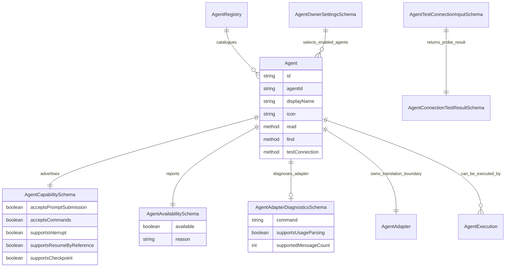

`Agent` is the registered Mission capability that can perform work through exactly one `AgentAdapter`. It is the operator-facing catalogue entry for a provider such as Copilot CLI, Claude Code, Codex, Pi, or OpenCode.

`Agent` does not execute work itself. It owns identity, display metadata, availability, capability and diagnostic metadata, and the relationship to its adapter. `AgentExecution` owns long-lived execution state and process lifecycle. `AgentAdapter` owns provider-specific launch translation and diagnostics behind the Agent boundary.

## Sources Of Truth

- Class behavior: [packages/core/src/entities/Agent/Agent.ts](../../../packages/core/src/entities/Agent/Agent.ts)
- Entity schema: [packages/core/src/entities/Agent/AgentSchema.ts](../../../packages/core/src/entities/Agent/AgentSchema.ts)
- Entity contract: [packages/core/src/entities/Agent/AgentContract.ts](../../../packages/core/src/entities/Agent/AgentContract.ts)
- Agent registry: [packages/core/src/entities/Agent/AgentRegistry.ts](../../../packages/core/src/entities/Agent/AgentRegistry.ts)
- Vocabulary decision: [docs/adr/0006.01-agent-execution-and-agent-adapter-vocabulary.md](../../adr/0006.01-agent-execution-and-agent-adapter-vocabulary.md)
- Connection test decision: [docs/adr/0006.12-agent-connection-tests-as-agent-entity-commands.md](../../adr/0006.12-agent-connection-tests-as-agent-entity-commands.md)

## Responsibilities

`Agent` owns the registered capability surface: stable Agent id, display name, icon, availability, capability flags, adapter diagnostics, and repository-scoped adapter resolution through `AgentRegistry`.

It does not own AgentExecution lifecycle truth, provider process state, Terminal state, Mission workflow law, Task state, or raw provider protocol details. Those belong to `AgentExecution`, `AgentExecutionProcess`, `Terminal`, Mission/Task Entities, and `AgentAdapter` respectively.

## Contract Methods

| Method | Kind | Input schema | Result schema | Behavior | Known callers |
| --- | --- | --- | --- | --- | --- |
| `read` | query | `AgentLocatorSchema` | `AgentSchema` | Reads one registered Agent by id for a repository context. Loads the configured `AgentRegistry`, resolves the Agent, and returns canonical Agent data. | Entity remote query dispatch, Agent-facing app models. |
| `find` | query | `AgentFindSchema` | `AgentFindResultSchema` | Lists all configured Agents for a repository context. It is the catalogue read used by settings and selection surfaces. | Agent settings UI, Repository app model, Entity remote query dispatch. |
| `testConnection` | mutation | `AgentTestConnectionInputSchema` | `AgentConnectionTestResultSchema` | Runs a bounded one-shot adapter readiness probe. It delegates to the daemon-owned Agent connection tester and does not create a managed AgentExecution. | Agent settings UI through the Entity command surface. |

## Contract Events

`AgentContract` currently declares no events. Agent catalogue reads are query-driven, and one-shot connection test results return directly to the caller rather than publishing Agent events.

## Properties

| Role | Property | Schema or type | Meaning |
| --- | --- | --- | --- |
| Entity identity | `id` | `EntitySchema.id` | Canonical Entity id, built from `agent:<agentId>`. |
| Agent identity | `agentId` | `AgentIdSchema` | Stable registered Agent id. This is the lookup key used by `AgentRegistry` and launch settings. |
| Display metadata | `displayName` | string | Human-readable Agent name shown to operators. |
| Display metadata | `icon` | string | Icon identifier for the Agent catalogue and settings UI. |
| Capability metadata | `capabilities` | `AgentCapabilitySchema` | Provider-neutral capability flags: prompt submission, commands, interrupt, resume by reference, checkpoint, and optional export/share modes. |
| Availability metadata | `availability` | `AgentAvailabilitySchema` | Whether the Agent can be used now and, when unavailable, a human-readable reason. |
| Adapter diagnostics | `diagnostics` | `AgentAdapterDiagnosticsSchema` | Optional adapter-readiness metadata such as command, usage parsing support, supported message count, and transport capability diagnostics. |

## Major Schemas

`AgentPrimaryDataSchema` is the minimum registered Agent identity shape: Entity id, Agent id, display name, and icon.

`AgentCapabilitySchema` is the provider-neutral capability summary surfaces use before launching or continuing an AgentExecution. It is not the same thing as an AgentExecution message descriptor; it describes the Agent broadly, not one live execution.

`AgentAvailabilitySchema` tells operators whether the adapter is currently usable. Availability is resolved by the adapter when the configured registry is built.

`AgentAdapterDiagnosticsSchema` describes adapter-level launch and transport capabilities. This is diagnostic metadata about the adapter, not a process record and not AgentExecution state.

`AgentOwnerSettingsSchema` is repository/operator preference data for choosing default and enabled Agent adapters plus default launch settings. It supports Agent selection but is not part of `AgentSchema`.

`AgentTestConnectionInputSchema` and `AgentConnectionTestResultSchema` form the one-shot connection test contract. The result is a typed diagnostic, not an AgentExecution event or journal record.

## ERD Pressure Gauge

The Agent graph should stay small. If Agent documentation starts needing process, terminal, journal, or timeline boxes, that is a modeling warning: those concepts belong to `AgentExecution`, `AgentExecutionProcess`, `Terminal`, or the AgentExecution journal, not to Agent.

## Cross-Control Notes

- Class, schema, and contract agree that `Agent` is a catalogue Entity backed by configured adapters, not an execution owner.
- `AgentRegistry` is the first-class catalogue and lookup boundary. There is no separate AgentAdapter registry or independently registered adapter set.
- `testConnection` is intentionally a class-level Agent mutation, but it is a probe only. It must not allocate AgentExecution ids, create managed AgentExecution records, publish AgentExecution events, or write AgentExecution journal material.
- `diagnostics` is adapter diagnostic metadata. It should not be treated as a runtime health model or process status.
- Naming pressure: `AgentPrimaryDataSchema` and inferred `AgentType`/`AgentStorageType` are schema/type conventions, not separate domain concepts. The domain concept remains `Agent`.
