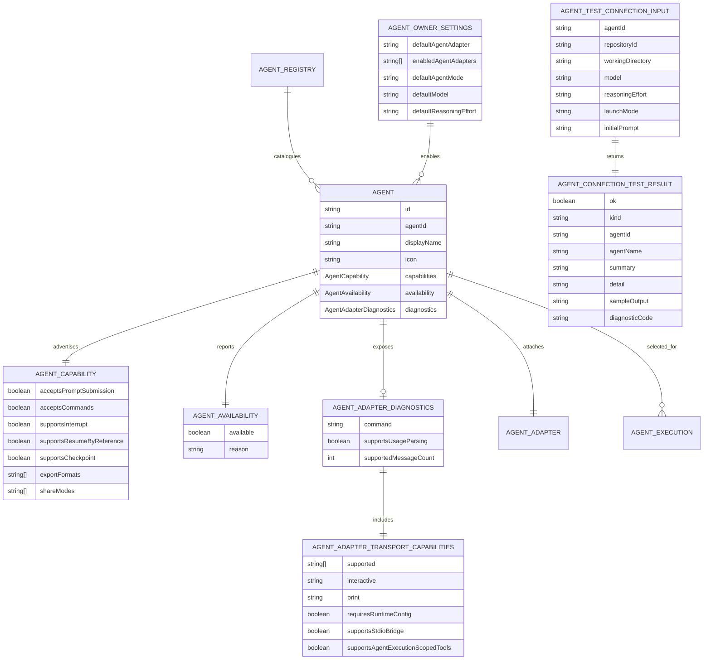
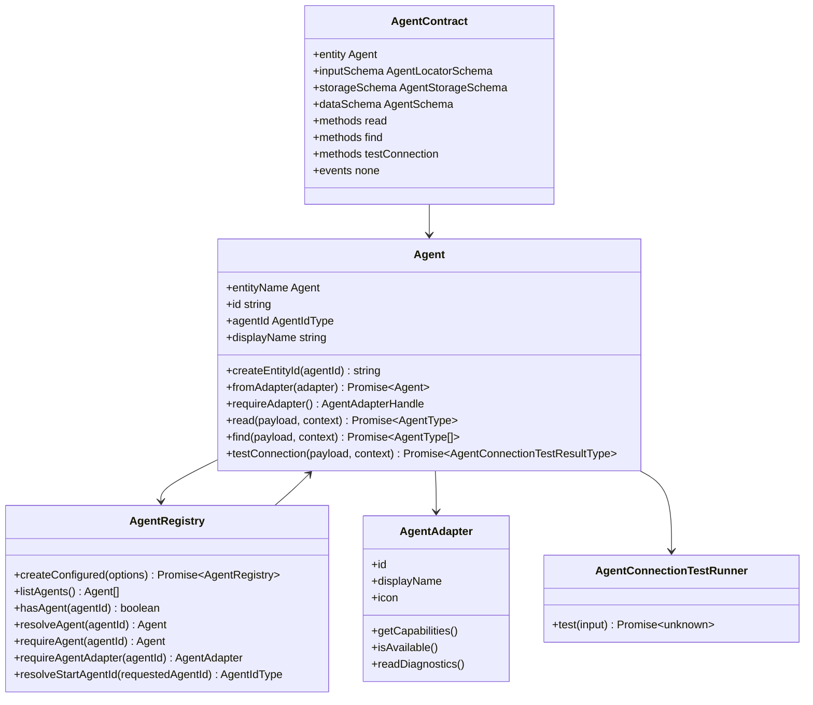
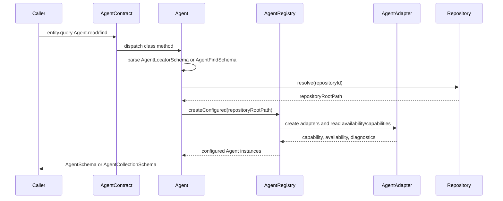
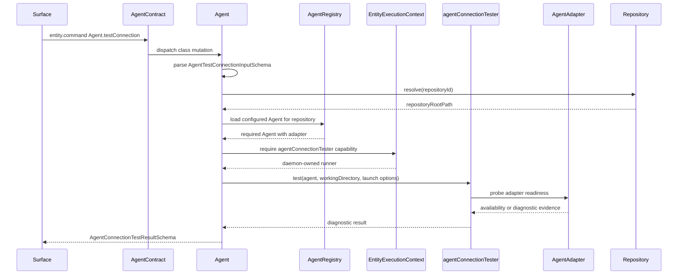

`Agent` is the registered Mission capability that can perform work through exactly one `AgentAdapter`. It is the catalogue Entity operators and owning Entities use to select a provider capability such as Copilot CLI, Claude Code, Codex, Pi, or OpenCode before an `AgentExecution` is created.

`Agent` owns capability identity, display metadata, adapter availability, broad provider-neutral capability flags, adapter diagnostics, and repository-scoped Agent lookup through `AgentRegistry`. `AgentExecution` owns long-lived execution state and process lifecycle. `AgentAdapter` owns provider-specific launch translation and diagnostics behind the Agent boundary.

## Sources Of Truth

| Source | Role |
| --- | --- |
| [packages/core/src/entities/Agent/Agent.ts](../../../packages/core/src/entities/Agent/Agent.ts) | Entity behavior, static method implementations, adapter attachment, and class-level command handling. |
| [packages/core/src/entities/Agent/AgentSchema.ts](../../../packages/core/src/entities/Agent/AgentSchema.ts) | Agent schemas, inferred types, method payloads, result schemas, owner settings shape, diagnostics shape, and capability shape. |
| [packages/core/src/entities/Agent/AgentContract.ts](../../../packages/core/src/entities/Agent/AgentContract.ts) | Remote Entity contract for `read`, `find`, and `testConnection`. |
| [packages/core/src/entities/Agent/AgentRegistry.ts](../../../packages/core/src/entities/Agent/AgentRegistry.ts) | Repository-scoped Agent catalogue and adapter lookup boundary. |
| [docs/adr/0001.02-entity-class-schema-and-contract-architecture.md](../../adr/0001.02-entity-class-schema-and-contract-architecture.md) | Entity class/schema/contract architecture and `entity-specification` workflow. |
| [docs/adr/0001.04-entity-schema-and-type-naming-convention.md](../../adr/0001.04-entity-schema-and-type-naming-convention.md) | Schema naming, inferred type naming, and mandatory schema/field descriptions. |
| [docs/adr/0001.05-entity-commands-as-canonical-operator-surface.md](../../adr/0001.05-entity-commands-as-canonical-operator-surface.md) | Entity command surface rules. |
| [docs/adr/0006.01-agent-execution-and-agent-adapter-vocabulary.md](../../adr/0006.01-agent-execution-and-agent-adapter-vocabulary.md) | Agent, AgentAdapter, AgentExecution, AgentExecutionRegistry, and Terminal vocabulary split. |
| [docs/adr/0006.12-agent-connection-tests-as-agent-entity-commands.md](../../adr/0006.12-agent-connection-tests-as-agent-entity-commands.md) | `Agent.testConnection` as a class-level Agent Entity command. |

## Responsibilities

| Responsibility | Agent rule |
| --- | --- |
| Identity | Owns canonical Agent Entity id in `agent:<agentId>` form and the stable `agentId` used by settings, registry lookup, and launch selection. Repository scoping crosses the Agent boundary as canonical `repositoryId`, not as a repository root path. |
| Catalogue entry | Exposes display name, icon, availability, capabilities, and diagnostics for one configured AgentAdapter. |
| Adapter ownership boundary | Holds exactly one attached `AgentAdapter` when materialized from configured adapter input. |
| Repository-scoped lookup | Resolves `repositoryId` through the Repository Entity, then uses `AgentRegistry.createConfigured({ repositoryRootPath })` internally to resolve configured Agents for that repository. |
| Connection probe command | Implements `testConnection` as a bounded class-level Entity mutation that delegates one-shot runtime probing to daemon-owned connection-test machinery. |
| Provider-neutral capability view | Presents broad capability flags without exposing raw provider protocol or AgentExecution message descriptors as Agent truth. |

## Non-Responsibilities

| Surface | Owner | Agent boundary rule |
| --- | --- | --- |
| Provider launch translation | `AgentAdapter` | Agent exposes adapter-derived catalogue data but does not translate launch configs, provider args, env, MCP provisioning, or provider protocol. |
| Managed execution lifecycle | `AgentExecution` | Agent can be selected for execution but does not own process lifecycle, structured messages, journal state, terminal attachment, or execution mutation. |
| Active execution lookup | `AgentExecutionRegistry` | AgentRegistry is the configured Agent catalogue only; it does not index live AgentExecutions or process handles. |
| Terminal state | `Terminal` and `TerminalRegistry` | Agent does not own PTY state, terminal input, terminal snapshots, resize, exit observation, or raw terminal recordings. |
| Repository settings persistence | `Repository` | AgentRegistry reads Repository settings to configure Agents; Agent does not own `.open-mission/settings.json`. |
| Connection probe mechanics | Daemon-provided `agentConnectionTester` capability | `Agent.testConnection` owns the Entity command seam and typed result parsing, while daemon runtime owns the one-shot probe implementation. |

## Boundary Split

| Collaborator | Owns | Agent relationship |
| --- | --- | --- |
| `AgentRegistry` | Repository-scoped configured Agent catalogue, duplicate detection, default Agent resolution, and adapter lookup. | Agent class methods load the registry to read, list, or test configured Agents. |
| `AgentAdapter` | Provider/tool translation, launch preparation, adapter-specific diagnostics, and supported execution-message descriptions. | One adapter is attached to one Agent instance; Agent exposes adapter-derived availability/capability/diagnostic summaries. |
| `AgentConnectionTester` | Daemon-owned one-shot connection-test implementation and result classification. | `Agent.testConnection` delegates probe mechanics to the context-provided runner and parses the typed result. |
| `AgentExecution` | One running or recoverable execution of one Agent under an owner reference. | Agent can be selected for execution, but Agent does not own execution state. |
| `Terminal` | PTY transport, screen state, input, resize, exit observation, snapshots, and terminal recordings. | Terminal is optional execution transport and is not part of Agent catalogue state. |
| `Repository` | Repository settings document and repository-scoped Agent preferences. | AgentRegistry reads settings to configure available Agents and defaults. |

## Boundary Crossing Rules

| Boundary | Crosses | Must not cross |
| --- | --- | --- |
| Entity query/command transport | `AgentLocatorSchema`, `AgentFindSchema`, `AgentTestConnectionInputSchema`, `AgentSchema`, `AgentCollectionSchema`, and `AgentConnectionTestResultSchema`. | Repository root path as identity, raw provider protocol, daemon adapter input, process handles, Terminal state, or ad hoc result wrappers. |
| Agent class to daemon runtime | The `agentConnectionTester` execution-context capability and the Agent-owned `AgentAdapterHandle` structural seam. | Direct imports of daemon tester classes, concrete daemon adapter classes, or provider implementations from `Agent.ts`. |
| Storage provisioning | `AgentStorageSchema` plus zod-surreal table, field, and index metadata. | Hydrated command descriptors, AgentExecution process state, adapter construction input, or presentation-only view state. |
| Operator presentation | `commands` from `EntitySchema` and method UI metadata from `AgentContract`. | `Projection`-named shapes, duplicate command schemas, or UI-owned Agent truth. |

## Implementation Contract Freeze

This section freezes the current Agent Entity specification for implementation and documentation convergence.

### Canonical Files

| File | Owns |
| --- | --- |
| `packages/core/src/entities/Agent/Agent.ts` | Agent Entity class, `createEntityId`, adapter attachment, `read`, `find`, and `testConnection`. |
| `packages/core/src/entities/Agent/AgentSchema.ts` | Agent Zod schemas, inferred types, method input/result schemas, settings shape, capability shape, availability shape, diagnostics shape, and mandatory schema/field descriptions. |
| `packages/core/src/entities/Agent/AgentContract.ts` | Declarative method metadata for `read`, `find`, and `testConnection`; no behavior. |
| `packages/core/src/entities/Agent/AgentRegistry.ts` | Configured Agent catalogue and adapter lookup. |

### Canonical Names

| Concept | Frozen name | Rule |
| --- | --- | --- |
| Entity name | `Agent` | Contract `entity` value and Entity class name. |
| Entity id factory | `Agent.createEntityId(agentId)` | Produces `agent:<agentId>`; `AgentStorageSchema.id` validates it with `IdSchema`. |
| Agent id | `agentId` / `AgentIdSchema` | Stable configured adapter id and registry lookup key. |
| Repository scope | `repositoryId` | Canonical Repository Entity id validated with `IdSchema` and used by Agent class methods to resolve repository-scoped settings. |
| Hydrated Entity schema | `AgentSchema` | Complete Agent data exposed by the Entity boundary. |
| Storage schema | `AgentStorageSchema` | Persistable Agent catalogue data if Agent records are stored. |
| Locator | `AgentLocatorSchema` | Payload for resolving one Agent. |
| Catalogue query input | `AgentFindSchema` | Payload for listing configured Agents. |
| Catalogue query result | `AgentCollectionSchema` | Array of `AgentSchema`. |
| Connection-test input | `AgentTestConnectionInputSchema` | Payload for one-shot readiness probe. |
| Connection-test result | `AgentConnectionTestResultSchema` | Typed diagnostic result returned by `testConnection`. |
| Owner settings | `AgentOwnerSettingsSchema` | Repository/System settings for default and enabled Agent adapters. |
| Launch mode | `AgentLaunchModeSchema` | Connection-test launch mode enum, currently `interactive` or `print`. |

### Public Method Surface

| Method | Kind | Input schema | Result schema | Execution | Behavior | Known callers | Side effects |
| --- | --- | --- | --- | --- | --- | --- | --- |
| `read` | query | `AgentLocatorSchema` | `AgentSchema` | class | Resolves the Repository by `repositoryId`, then reads one configured Agent from `AgentRegistry`. | Daemon Entity query dispatch through `DaemonEntityDispatcher`; Agent tests. | Loads configured adapter catalogue; does not mutate Agent state. |
| `find` | query | `AgentFindSchema` | `AgentCollectionSchema` | class | Resolves the Repository by `repositoryId`, then lists configured Agents from `AgentRegistry`. | Daemon Entity query dispatch through `DaemonEntityDispatcher`; Agent catalogue and settings surfaces. | Loads configured adapter catalogue; does not mutate Agent state. |
| `testConnection` | mutation | `AgentTestConnectionInputSchema` | `AgentConnectionTestResultSchema` | class | Runs a bounded readiness probe for one Agent adapter using optional launch parameters. | Daemon Entity command dispatch through `DaemonEntityDispatcher`; Agent tests; Agent settings surfaces are the ADR-defined operator caller. | Delegates to the daemon-provided `agentConnectionTester` execution-context capability; does not create AgentExecution state. |

### Events

| Event | Payload schema | Publisher | Subscribers/surfaces | Meaning |
| --- | --- | --- | --- | --- |
| None | None | None | None | `AgentContract.events` is empty. Agent catalogue state is read through queries, and `testConnection` returns its diagnostic result directly to the caller. |

## Property Specification

| Role | Property | Schema or type | Authority | Meaning |
| --- | --- | --- | --- | --- |
| Entity identity | `id` | `IdSchema` in `AgentStorageSchema` and `AgentSchema` | Agent schema and `Agent.createEntityId` | Canonical Agent Entity id in `agent:<agentId>` form. |
| Agent identity | `agentId` | `AgentIdSchema` | Agent schema and AgentRegistry | Stable id of the configured AgentAdapter. |
| Repository scope | `repositoryId` | `IdSchema` in method payload schemas | Agent class methods and Repository Entity | Canonical Repository Entity id used to resolve the repository root needed for settings-backed Agent catalogue loading. |
| Display metadata | `displayName` | string field in `AgentStorageSchema` and `AgentSchema` | AgentAdapter input | Operator-facing Agent name. |
| Display metadata | `icon` | string field in `AgentStorageSchema` and `AgentSchema` | AgentAdapter input | Icon identifier used by Agent catalogue surfaces. |
| Capability metadata | `capabilities` | `AgentCapabilitySchema` | AgentAdapter capability report parsed by Agent | Broad provider-neutral capability flags for selection and affordance decisions. |
| Availability metadata | `availability` | `AgentAvailabilitySchema` | AgentAdapter availability report normalized by Agent | Whether this Agent can be used in the current environment, with optional reason when unavailable. |
| Adapter diagnostics | `diagnostics` | `AgentAdapterDiagnosticsSchema.optional()` | AgentAdapter diagnostics cloned by Agent | Adapter-readiness metadata, including command, usage parsing support, supported message count, and transport capabilities. |
| Hydrated command descriptors | `commands` | inherited from `EntitySchema` | Generic Entity contract command generation | Operator command descriptors derived from `AgentContract`; not Agent storage data. |

## Schema And Subschema Map

| Schema | Role | Included in |
| --- | --- | --- |
| `AgentIdSchema` | Non-empty configured Agent id. | Agent identity, locators, owner settings, connection-test result. |
| `AgentCapabilitySchema` | Broad provider-neutral capability summary. | `AgentStorageSchema`, `AgentSchema`. |
| `AgentAvailabilitySchema` | Current adapter availability and optional reason. | `AgentStorageSchema`, `AgentSchema`. |
| `AgentAdapterTransportCapabilitiesSchema` | Adapter transport support and provisioning capability summary. | `AgentAdapterDiagnosticsSchema`. |
| `AgentAdapterDiagnosticsSchema` | Adapter diagnostic summary for catalogue and troubleshooting surfaces. | Optional `diagnostics` field. |
| `AgentOwnerSettingsSchema` | Repository/System preferences for enabled Agents and defaults. | Repository and System settings schemas. |
| `AgentLocatorSchema` | Resolve-one Agent payload carrying `agentId` and canonical `repositoryId`. | Contract input and `read` payload. |
| `AgentFindSchema` | List Agents payload carrying canonical `repositoryId`. | `find` payload. |
| `AgentLaunchModeSchema` | Connection-test launch mode. | `AgentTestConnectionInputSchema`. |
| `AgentTestConnectionInputSchema` | One-shot readiness probe input. | `testConnection` payload. |
| `AgentConnectionTestKindSchema` | Bounded connection-test result classifier. | `AgentConnectionTestResultSchema`. |
| `AgentConnectionTestResultSchema` | Typed readiness probe result. | `testConnection` result. |
| `AgentStorageSchema` | Persistable Agent catalogue record shape. | Contract storage schema. |
| `AgentSchema` | Hydrated Agent Entity data returned by Agent boundary. | Contract data schema, `read`, `find`. |
| `AgentCollectionSchema` | Repository-scoped Agent catalogue collection. | `find` result. |

## Schema Metadata Audit

`AgentSchema.ts` carries Agent-local descriptions for declared schemas and fields, and `AgentStorageSchema` carries zod-surreal table and field metadata for the canonical Agent catalogue record.

| Finding | Evidence | Status |
| --- | --- | --- |
| Schema descriptions | `AgentSchema.ts` declares descriptions for Agent-owned schemas, fields, nested objects, and collection members. | Aligned for the Agent slice. |
| Storage metadata | `AgentStorageSchema` registers the `agent` table and Agent-owned fields with zod-surreal descriptions and the `agent_agent_id_idx` unique index. | Aligned for the Agent slice. |
| Adapter construction input | Non-serializable adapter construction input is owned by the daemon runtime adapter module, not exported from `AgentSchema.ts`. | Aligned; no schema alias or hand-written schema-module type remains. |
| Partial composition schemas | Identity, display, and metadata fields are declared directly on `AgentStorageSchema`; no primary-data field bundle is exported. | Aligned with ADR-0001.02 and ADR-0001.04. |

## ERD

## Class And Contract Diagram

## Runtime Flows

### Read Or Find Agents

### Test Connection

## Cross-Control Checklist

| Surface | Status | Notes |
| --- | --- | --- |
| Class vs contract | Aligned | `AgentContract` declares `read`, `find`, and `testConnection`; `Agent.ts` implements all three as static class methods. |
| Contract vs schema | Aligned | Contract payload/result schemas are imported from `AgentSchema.ts`; no ad hoc contract-local Zod objects are present. |
| Class vs schema | Aligned | `Agent` parses data with `AgentSchema`, parses method inputs, and parses the connection-test result. |
| Repository identity | Aligned | Agent method payloads carry canonical `repositoryId`; `repositoryRootPath` is resolved internally from the Repository Entity before loading repository settings. |
| Registry boundary | Aligned | `AgentRegistry` is the configured catalogue; there is no separate AgentAdapter registry. |
| AgentExecution boundary | Aligned | `testConnection` delegates to one-shot tester and does not create AgentExecution state. |
| Event contract | Aligned | `AgentContract.events` is empty and no Agent event schemas are declared. |
| Schema descriptions | Aligned | Agent-owned schemas and fields declare domain descriptions. |
| Storage metadata | Aligned | `AgentStorageSchema` registers the `agent` table, Agent-owned fields, and unique Agent id index metadata. |
| Type inference discipline | Aligned | `AgentSchema.ts` exports schema-inferred types only; daemon-only adapter construction input lives in the daemon adapter module. |
| Partial schema discipline | Aligned | Agent identity and display fields live directly on `AgentStorageSchema`; no exported composition schema duplicates them. |
| Daemon dependency direction | Improved | `Agent.ts` depends on an Agent-owned `AgentAdapterHandle` shape and the `agentConnectionTester` context capability instead of importing daemon runtime adapter/tester classes. `AgentRegistry` still composes daemon adapter inputs and remains the next boundary to split if the registry is moved out of the Entity folder. |

## Specification Assessment

The Agent Entity model is small and well bounded: Agent is a catalogue and diagnostics Entity, AgentAdapter is provider translation, AgentRegistry is repository-scoped lookup, and AgentExecution is the execution owner. The implementation keeps the current method surface while aligning the Agent class with schema metadata, collection naming, and daemon dependency direction.

The remaining convergence decision is the `AgentRegistry` placement: it currently composes daemon adapter inputs from inside the Agent entity folder. That broader split should be handled as a separate adapter-registry relocation slice so runtime launch behavior remains stable.
