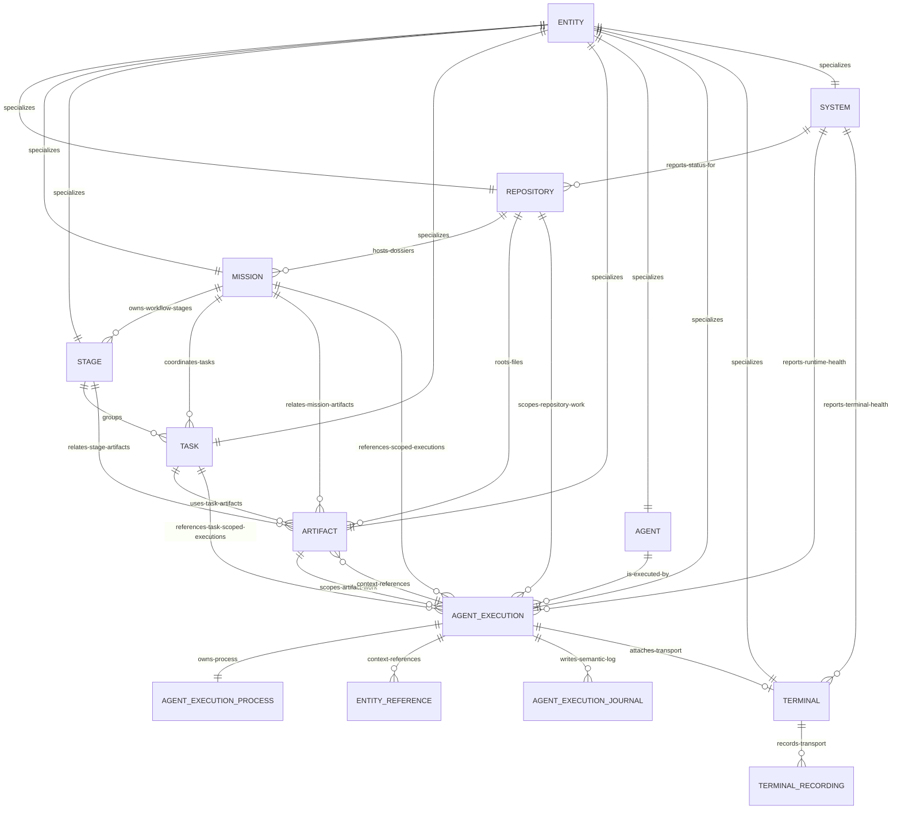

# Entity Reference

Mission uses thick Entity classes with one schema boundary and one contract boundary per first-class Entity. This section is the reference map for explaining every Entity schema, function, and module. If a shape or module cannot be placed in this ERD or in the owning Entity document, the name or ownership is suspect.

## Entity Documents

- [Entity](entity.md)
- [Repository](repository.md)
- [Mission](mission.md)
- [Stage](stage.md)
- [Task](task.md)
- [Artifact](artifact.md)
- [Agent](agent.md)
- [AgentExecution](agent-execution.md)
- [Terminal](terminal.md)
- [System](system.md)

## Complete ERD

## Reading Rules

- `<Entity>.ts` owns behavior, invariants, lifecycle, and remote method implementations.
- `<Entity>Schema.ts` owns serializable shapes for that Entity boundary.
- `<Entity>Contract.ts` owns declarative method, event, and schema binding metadata.
- `AgentExecutionSchema` is the complete hydrated AgentExecution Entity data contract.
- `AgentExecutionStorageSchema` is the narrower persisted/recoverable shape.
- AgentExecution owner routing is expressed by `AgentExecutionScope`, `ownerId`, and Entity events. There is no separate owner-specific AgentExecution view or record model.
