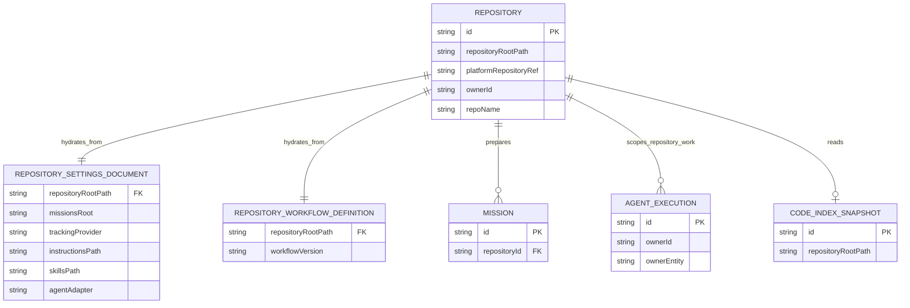
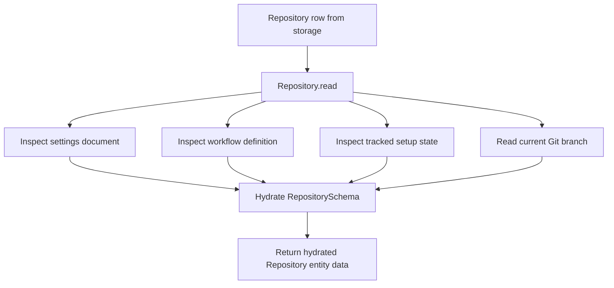
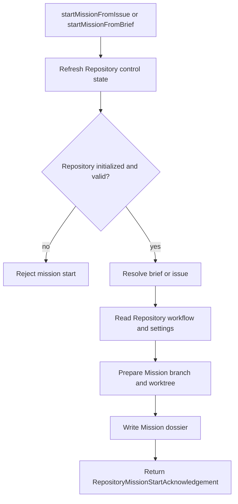
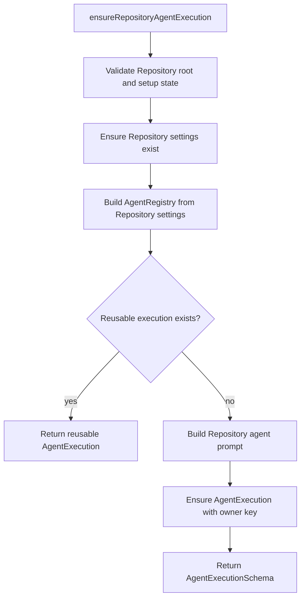

`Repository` is the authoritative Entity for one local checked-out Repository used by the Open Mission system. It owns Repository identity, Repository control state discovery under `.open-mission/`, Repository setup and initialization, Repository-scoped sync and code-index reads, and the Repository entry points that prepare Missions and Repository-scoped Agent executions.

## Authority

- Vocabulary: [CONTEXT.md](../../../CONTEXT.md)
- Constitution: [.agents/constitution.md](../../../.agents/constitution.md)
- Canonical entity identity: [docs/adr/0001.01-canonical-entity-identity-and-metadata.md](../../adr/0001.01-canonical-entity-identity-and-metadata.md)
- Entity class/schema/contract architecture: [docs/adr/0001.02-entity-class-schema-and-contract-architecture.md](../../adr/0001.02-entity-class-schema-and-contract-architecture.md)
- Entity dependency direction: [docs/adr/0001.07-entity-dependency-direction-and-infrastructure-independence.md](../../adr/0001.07-entity-dependency-direction-and-infrastructure-independence.md)
- OGM-anchored storage and hydrated view: [docs/adr/0001.08-ogm-anchored-entity-storage-and-hydrated-view-model.md](../../adr/0001.08-ogm-anchored-entity-storage-and-hydrated-view-model.md)
- Class: [packages/core/src/entities/Repository/Repository.ts](../../../packages/core/src/entities/Repository/Repository.ts)
- Schema: [packages/core/src/entities/Repository/RepositorySchema.ts](../../../packages/core/src/entities/Repository/RepositorySchema.ts)
- Contract: [packages/core/src/entities/Repository/RepositoryContract.ts](../../../packages/core/src/entities/Repository/RepositoryContract.ts)

## Definition

`Repository` represents the local checked-out Git Repository that Open Mission uses as the base for Repository control state and Mission worktrees. The Entity boundary exposes a hydrated `RepositorySchema` view, but the durable Repository row is intentionally narrow: canonical `id`, `repositoryRootPath`, optional `platformRepositoryRef`, `ownerId`, and `repoName`.

Repository control state remains repo-native. `Repository` reads and writes `.open-mission/settings.json`, reads the Repository workflow definition, resolves whether setup is tracked locally and remotely, and hydrates its `settings`, `workflowConfiguration`, `isInitialized`, `operationalMode`, `invalidState`, and `currentBranch` fields from that control surface.

## Current Doctrine Audit

| Check | Status | Notes |
| --- | --- | --- |
| ADR 0001.01 canonical self-identity | Aligned | `Repository` uses canonical `id` and keeps `repositoryRootPath` as Repository root, not as a duplicate self-id. |
| ADR 0001.02 class/schema/contract split | Aligned | `Repository.ts`, `RepositorySchema.ts`, and `RepositoryContract.ts` are the owning files. |
| ADR 0001.02 canonical hydrated/storage naming | Aligned | `RepositorySchema` is the hydrated boundary; `RepositoryStorageSchema` is the persisted row. |
| ADR 0001.08 narrow storage versus hydrated read | Aligned | Settings, workflow, init state, invalid state, and current branch are hydrated read material, not persisted row fields. |
| ADR 0001.08 instance targeting by transport `id` | Aligned | Entity instance methods use top-level transport `id`; method payloads are method-specific. |
| Entity-specification schema metadata discipline | Aligned | `RepositorySchema.ts` now carries `.meta({ description })` coverage across the Repository schema surface and registers canonical storage metadata on `RepositoryStorageSchema`. |
| ADR 0001.07 dependency direction | Mostly aligned | `Repository.ts` no longer imports or dynamically constructs daemon runtime services; Repository runtime behavior now depends on explicit execution-context capabilities for Agent execution and code intelligence. |
| Contract/event cross-control | Aligned | Repository mission-start flows currently expose acknowledgements, not a Repository-owned public event. |

## Responsibilities

| Area | Repository owns |
| --- | --- |
| Identity | Canonical Repository Entity id, Repository root path, platform repository ref, owner name, and repo name. |
| Control state | Reading and writing Repository settings, reading Repository workflow definition, determining whether Repository setup is missing, valid, invalid, or tracked. |
| Hydration | Turning a narrow stored row into a hydrated `RepositorySchema` view by resolving settings, workflow configuration, initialization state, invalid state, and current branch from the Repository root. |
| Setup and initialization | Initial Repository scaffolding, Repository setup proposal branch/worktree creation, pull-request creation, and first initialization of repo-native control state. |
| Repository operations | Sync status, external fetch, fast-forward pull, removal summary, Repository removal, and code-index initiation/read paths. |
| Mission entry | Starting a Mission from a GitHub issue or an operator-written brief after Repository setup is valid. |
| Repository-scoped Agent execution entry | Ensuring and refreshing one Repository-scoped AgentExecution, plus one system-scoped repositories manager AgentExecution. |

## Non-Responsibilities

| Neighbor | Repository does not own |
| --- | --- |
| Mission | Mission workflow runtime behavior after Mission creation, Mission lifecycle progression, or child Mission Entity behavior. |
| AgentExecution | Ongoing AgentExecution lifecycle semantics after launch or replacement. |
| Terminal | PTY screen state, terminal input, terminal resize, or terminal recordings. |
| Platform adapters | Provider protocol translation details for GitHub or local Git operations. |
| Open Mission surfaces | UI composition, host-specific state, or presentation concerns. |

## Major Seams And Boundaries

| Boundary | What crosses the Repository boundary | What stays outside |
| --- | --- | --- |
| Entity transport | Canonical `id` plus method-specific payloads validated by Repository schemas. | Route handlers, daemon dispatch wiring, and surface-specific command mapping. |
| Repository control state | Settings and workflow definitions are read from `.open-mission/` and rehydrated into `RepositorySchema`. | UI-local state and editor-local state. |
| Mission preparation | `startMissionFromIssue` and `startMissionFromBrief` convert Repository-owned intent into Mission preparation. | Mission-owned workflow execution after the Mission exists. |
| Agent execution | Repository owns the entry points and prompt/specification shaping for Repository-scoped and repositories-surface Agent executions. | AgentExecution process lifecycle and structured interaction after launch. |
| Code intelligence | Repository exposes code-index commands and read models through explicit execution-context capabilities. | The concrete runtime implementation behind the code-intelligence capability. |

## Contract Methods

| Method | Kind | Input schema | Result schema | Behavior | Likely callers | Side effects |
| --- | --- | --- | --- | --- | --- | --- |
| `find` | query | `RepositoryFindSchema` | `RepositorySchema[]` | Discovers configured local repositories and hydrates each Repository through `read`. | Open Mission app model, Repository list views. | None beyond Repository reads. |
| `findAvailable` | query | `RepositoryFindAvailableSchema` | `RepositoryPlatformRepositorySchema[]` | Lists available hosted repositories through the platform adapter. | Repository provisioning UI. | External adapter read only. |
| `findAvailableOwners` | query | `RepositoryFindAvailableOwnersSchema` | `RepositoryPlatformOwnerSchema[]` | Lists available hosted owners through the platform adapter. | Repository provisioning UI. | External adapter read only. |
| `ensureSystemAgentExecution` | mutation | `RepositoryEnsureSystemAgentExecutionSchema` | `AgentExecutionSchema` | Ensures the system-scoped repositories manager AgentExecution for the repositories root. | Repository/system surfaces. | Creates or reuses AgentExecution runtime state. |
| `classCommands` | query | `RepositoryClassCommandsSchema` | `EntityClassCommandViewSchema` | Builds class-level command descriptors from the Repository contract. | Open Mission command rendering. | None. |
| `read` | query | `RepositoryInstanceInputSchema` | `RepositorySchema` | Rehydrates the Repository from stored row plus repo-native control state and Repository status. | Open Mission Repository wrapper, application bootstrap, entity proxy reads. | Mutates in-memory Repository hydration only. |
| `commands` | query | `RepositoryInstanceInputSchema` | `EntityCommandViewSchema` | Builds instance command descriptors after refreshing current Repository state. | Open Mission Repository wrapper. | None beyond current-state hydration. |
| `syncStatus` | query | `RepositoryInstanceInputSchema` | `RepositorySyncStatusSchema` | Computes local worktree and external tracking status for the Repository. | Repository detail UI. | None. |
| `listIssues` | query | `RepositoryInstanceInputSchema` | `TrackedIssueSummarySchema[]` | Lists recent open GitHub issues for the Repository platform ref. | Repository issue picker UI. | External adapter read only. |
| `getIssue` | query | `RepositoryGetIssueSchema` | `RepositoryIssueDetailSchema` | Reads one GitHub issue detail by issue number. | Mission-from-issue UI. | External adapter read only. |
| `readRemovalSummary` | query | `RepositoryReadRemovalSummarySchema` | `RepositoryRemovalSummarySchema` | Builds a Repository removal inventory including Mission worktrees and active AgentExecution counts. | Removal confirmation UI. | Filesystem and Mission dossier reads only. |
| `readCodeIntelligenceIndex` | query | `RepositoryReadCodeIntelligenceIndexSchema` | `RepositoryCodeIntelligenceIndexSchema` | Reads the active code-intelligence index snapshot if present. | Repository code intelligence UI. | Reads derived runtime/index state only. |
| `add` | mutation | `RepositoryAddSchema` | `RepositorySchema` | Adds a local Repository or checks out a hosted Repository, then initializes Repository control state. | Repository provisioning UI. | Filesystem clone/add, Repository persistence, initialization. |
| `createPlatformRepository` | mutation | `RepositoryCreateSchema` | `RepositorySchema` | Creates a hosted Repository, checks it out locally, and initializes Repository control state. | Repository provisioning UI. | External repository creation, filesystem clone, Repository persistence, initialization. |
| `remove` | mutation | `RepositoryInstanceInputSchema` | `RepositoryRemoveAcknowledgementSchema` | Removes Mission worktrees, deletes the Repository root from disk, and deletes the persisted Repository row. | Repository removal UI. | Filesystem deletion and Entity storage deletion. |
| `setup` | mutation | `RepositorySetupSchema` | `RepositorySetupResultSchema` | Materializes Repository setup scaffolding in a linked worktree, opens a pull request, and optionally requests auto-merge. | Repository setup UI. | Filesystem writes, Git operations, pull-request creation, optional base-branch pull. |
| `configureAgents` | mutation | `RepositoryConfigureAgentsSchema` | `RepositorySchema` | Delegates to `configureAgent` to update Repository-owned agent defaults and enabled adapters. | Repository settings UI. | Settings write and optional AgentExecution replacement. |
| `configureAgent` | mutation | `RepositoryConfigureAgentSchema` | `RepositorySchema` | Validates available agents, writes Repository settings, persists the Repository row, and replaces the active Repository AgentExecution when needed. | Repository settings UI. | Settings write, Repository persistence, possible AgentExecution replacement. |
| `configureDisplay` | mutation | `RepositoryConfigureDisplaySchema` | `RepositorySchema` | Updates Repository display settings such as icon and persists the narrow Repository row. | Repository settings UI. | Settings write and Repository persistence. |
| `initialize` | mutation | `RepositoryInitializeSchema` | `RepositoryInitializeResultSchema` | Ensures the Repository settings document exists and attempts to prepare a code index. | Repository add/setup flows, Repository recovery flows. | Settings write and derived code-index preparation. |
| `ensureRepositoryAgentExecution` | mutation | `RepositoryInitializeSchema` | `AgentExecutionSchema` | Ensures one Repository-scoped AgentExecution for Repository-level work. | Repository detail UI. | Initializes Repository setup if needed and creates or reuses AgentExecution runtime state. |
| `refreshRepositoryAgentExecution` | mutation | `RepositoryInitializeSchema` | `AgentExecutionSchema` | Replaces the active Repository-scoped AgentExecution when possible, otherwise ensures one exists. | Repository detail UI. | AgentExecution replacement or creation. |
| `fetchExternalState` | mutation | `RepositoryInstanceInputSchema` | `RepositorySyncCommandAcknowledgementSchema` | Fetches remote Git state and returns refreshed sync status. | Repository detail UI refresh action. | Git fetch. |
| `fastForwardFromExternal` | mutation | `RepositoryInstanceInputSchema` | `RepositorySyncCommandAcknowledgementSchema` | Fast-forwards the current branch from its tracking branch when the Repository is behind and not diverged. | Repository detail UI. | Git pull/fast-forward. |
| `indexCode` | mutation | `RepositoryInstanceInputSchema` | `RepositoryCodeIndexAcknowledgementSchema` | Builds a fresh local code-intelligence index for the Repository root. | Repository detail UI. | Code-intelligence indexing. |
| `startMissionFromIssue` | mutation | `RepositoryStartMissionFromIssueSchema` | `RepositoryMissionStartAcknowledgementSchema` | Refreshes Repository control state, validates setup, reads a GitHub issue, and prepares a Mission. | Mission creation UI from issue. | GitHub issue read, Mission branch/worktree preparation, Mission dossier writes. |
| `startMissionFromBrief` | mutation | `RepositoryStartMissionFromBriefSchema` | `RepositoryMissionStartAcknowledgementSchema` | Refreshes Repository control state, optionally creates a GitHub issue, and prepares a Mission from an operator brief. | Mission creation UI from brief. | Optional GitHub issue creation, Mission branch/worktree preparation, Mission dossier writes. |

## Property Groups

| Group | Property | Type / schema | Role |
| --- | --- | --- | --- |
| Identity | `id` | `EntityIdSchema` | Canonical Repository Entity id. |
| Identity | `repositoryRootPath` | `string` | Canonical Repository root path and durable filesystem anchor. |
| Platform | `platformRepositoryRef` | optional `string` | Optional hosted repository reference such as a GitHub repository ref. |
| Platform | `ownerId` | `string` | Repository owner segment derived from the platform ref or local naming. |
| Platform | `repoName` | `string` | Repository name segment derived from the local or hosted Repository identity. |
| Control state | `settings` | `RepositorySettingsSchema` | Hydrated Repository settings document from `.open-mission/settings.json`. |
| Control state | `workflowConfiguration` | `RepositoryWorkflowConfigurationSchema` | Hydrated Repository workflow definition used for Mission preparation defaults. |
| Control state | `isInitialized` | `boolean` | Whether Repository setup is fully tracked and usable for regular Mission start flows. |
| Control state | `operationalMode` | `RepositoryOperationalModeSchema`, optional | Hydrated current operating mode: `setup`, `repository`, or `invalid`. |
| Control state | `invalidState` | `RepositoryInvalidStateSchema`, optional | Recoverable invalid-control-state summary for Repository setup or workflow parsing failures. |
| Derived read | `currentBranch` | optional `string` | Current checked-out branch when the Repository root is a Git repository. |

`commands` is not stored on `RepositorySchema`; command descriptors are read separately through the Entity command view contract.

## Schema And Subschema Map

| Schema | Purpose |
| --- | --- |
| `RepositoryInputSchema` | Constructor/registration input for creating a Repository Entity instance. |
| `RepositoryStorageSchema` | Narrow persisted Repository row: identity plus root/ref/name fields only. |
| `RepositorySchema` | Hydrated Entity boundary shape returned by `read`. |
| `RepositorySettingsSchema` | Repository settings document stored under `.open-mission/settings.json`. |
| `RepositoryWorkflowConfigurationSchema` | Parsed persisted workflow settings for Repository-owned Mission preparation defaults. |
| `RepositoryInstanceInputSchema` | Empty payload for instance methods addressed only by transport `id`. |
| `RepositorySyncStatusSchema` | Local worktree and external-tracking read model for sync status. |
| `RepositoryRemovalSummarySchema` | Read model for Repository deletion inventory and Mission worktree cleanup risk. |
| `RepositoryCodeIntelligenceIndexSchema` | Read model for the current code-intelligence index snapshot or absence. |
| `RepositorySetupSchema` | Method-specific payload for initial Repository setup scaffolding. |
| `RepositoryConfigureAgentSchema` | Method-specific payload for Repository-owned agent settings. |
| `RepositoryConfigureDisplaySchema` | Method-specific payload for Repository display settings. |
| `RepositoryStartMissionFromIssueSchema` | Method-specific Mission start payload containing only the issue number. |
| `RepositoryStartMissionFromBriefSchema` | Method-specific Mission start payload containing only the brief fields. |

## ERD

The graph is still readable, but it shows the current pressure point: `Repository` already spans setup, Mission preparation, Repository-scoped Agent execution entry, sync, and code-index orchestration. The class no longer reaches directly into daemon runtime modules, but it still coordinates several adjacent seams through execution-context capabilities.

## Main Runtime Flows

### Hydrated Read

### Mission Start

### Repository AgentExecution Entry

## Cross-Control Checklist

| Surface | Status | Notes |
| --- | --- | --- |
| Class vs schema | Mostly aligned | `Repository.ts` hydrates `RepositorySchema` from the narrow `RepositoryStorageSchema` and strips hydrated fields in `toStorage()`. |
| Class vs contract | Mostly aligned | Contract methods map cleanly to implemented methods, and top-level `id` transport is respected. |
| Schema vs ADR 0001.08 | Aligned | Hydrated versus storage split is explicit and materially cleaner than the prior combined model. |
| Schema metadata discipline | Aligned | `RepositorySchema.ts` now documents the Repository schema surface with `.meta({ description })` metadata and storage-facing zod-surreal registration on `RepositoryStorageSchema`. |
| Class vs ADR 0001.07 | Mostly aligned | `Repository.ts` now consumes Agent execution and code-intelligence behavior through explicit execution-context capabilities rather than direct daemon imports. |
| Contract events vs implementation | Aligned | Repository mission-start behavior returns acknowledgements directly and no longer declares a Repository-owned public event. |
| Docs vs implementation | Aligned with named gaps | This page documents the implemented Repository surface and leaves the doctrine gaps explicit instead of smoothing them over. |

## Implementation Findings To Carry Forward

- Keep `RepositoryStorageSchema` narrow. Do not move settings, workflow state, invalid state, code-index snapshots, or command descriptors into the persisted Repository row.
- Keep instance methods addressed by transport `id`; do not reintroduce method payloads that repeat Repository identity.
- Keep Repository runtime behavior behind explicit execution-context capabilities rather than reintroducing direct daemon imports or daemon-owned default construction inside `Repository.ts`.
- Keep future Repository schema additions under the same `.meta({ description })` and zod-surreal storage metadata discipline already established in `RepositorySchema.ts`.
- Keep Mission-start signaling on the owning Mission static surface if a public event is required later.
