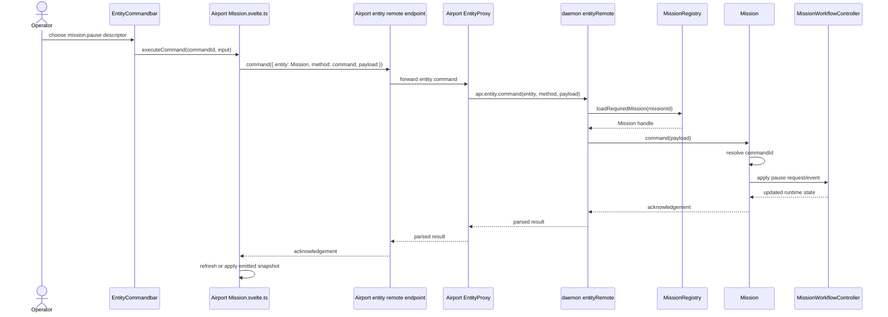
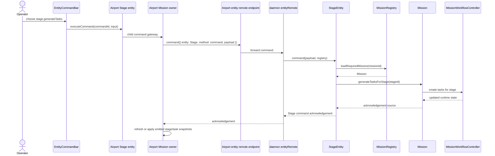
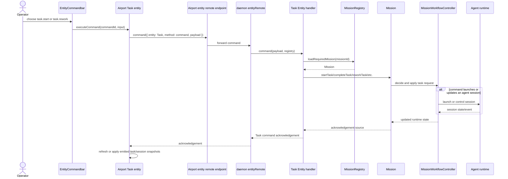
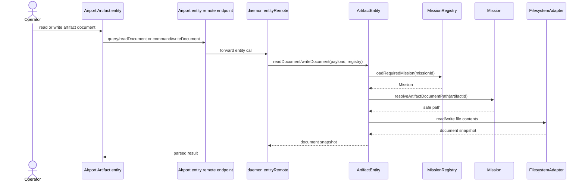
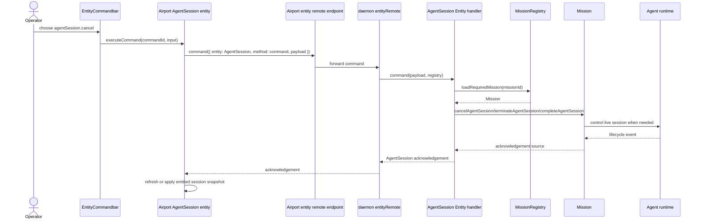
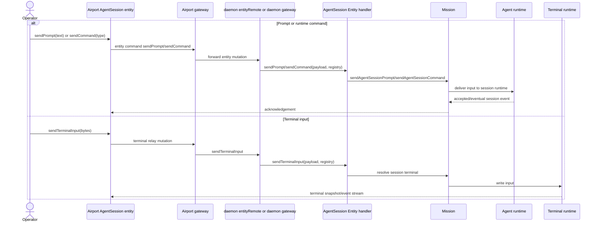
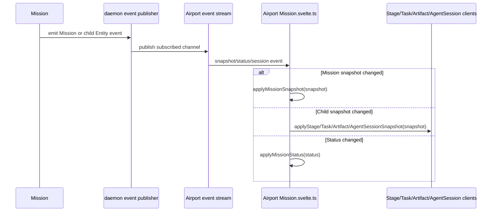

<!-- /docs/architecture/entity-command-surface.md: Current Mission Entity command surface inventory and simplification plan. -->

# Entity Command Surface

This note describes the Mission Entity command surface implemented in `packages/core/src/entities/*` and `apps/airport/web/src/lib/components/entities/*`.

The target direction is:

- Entity contracts expose commands as the authoritative operator surface.
- `commandId` is the canonical behavior identifier end to end.
- Airport is a control surface and proxy; it does not invent Mission behavior.
- Mission owns running Mission behavior and workflow decisions.
- Child Entities own their own readable contract shape and command handling entry point.
- Command identity is expressed by `commandId` and typed `input` only.

## Vocabulary

| Term | Meaning |
| --- | --- |
| Entity | A contract-bearing domain object with schema, behavior, methods, events, and optional command descriptors. |
| Command | A user or system request to perform Entity behavior, identified by `commandId` and optionally carrying `input`. |
| Query | A read method that returns an Entity snapshot or document without changing authoritative state. |
| Mutation | A command method that accepts a command or write payload and may change state. |
| Snapshot | A schema-validated read model returned by an Entity. |
| Control view | A composed read model for surface rendering. This should only exist when it has domain meaning beyond a plain snapshot. |
| Airport | Browser and terminal operator surface. It renders and forwards commands but is not command authority. |

Entity command payloads, command descriptors, Airport command rendering, daemon dispatch, and command tests use `commandId` and typed `input` as the complete operation identity.

## Entity Contract Pattern

Each Entity should stay in the three-file structure used by the current reset:

| File | Responsibility |
| --- | --- |
| `<Entity>.ts` | Behavior, command execution, snapshot reading, domain decisions that belong to that Entity. |
| `<Entity>Schema.ts` | Zod schemas and inferred TypeScript types for identity payloads, command payloads, acknowledgements, snapshots, and event payload data. |
| `<Entity>Contract.ts` | The public Entity method and event map. No behavior and no hidden modeling. |

The generic contract shape currently supports `properties`, but these Mission-owned contracts do not use contract properties. Their externally visible properties are the fields in their snapshot schemas.

## Current Entity Inventory

### Mission

`Mission` is the daemon-owned Running Mission instance. It is the authority for Mission lifecycle, workflow execution, stage/task/session behavior, document access, terminal access, and Mission-level command availability.

| Aspect | Current surface |
| --- | --- |
| Class | `packages/core/src/entities/Mission/Mission.ts` |
| Schema | `packages/core/src/entities/Mission/MissionSchema.ts` |
| Contract | `packages/core/src/entities/Mission/MissionContract.ts` |
| Entity name | `Mission` |
| Contract queries | `read`, `readControlView`, `readDocument`, `readWorktree`, `readTerminal` |
| Contract mutations | `command`, `writeDocument`, `ensureTerminal`, `sendTerminalInput` |
| Contract events | `snapshot.changed`, `status` |
| Command owners | Mission, Stage, Task, AgentSession through `MissionCommandDescriptors.ts` |

Snapshot properties currently include `mission`, `stages`, `tasks`, `artifacts`, `agentSessions`, `status`, and `workflow`. The nested `mission` object contains the Mission identity and Mission-level commands. Several top-level fields duplicate information available through status or workflow-shaped data.

Important public behavior methods include:

| Method group | Methods |
| --- | --- |
| Lifecycle | `resolve`, `create`, `load`, `initialize`, `refresh`, `dispose` |
| Remote command entry points | `command` |
| Mission commands | `pauseMission`, `resumeMission`, `panicStopMission`, `clearMissionPanic`, `restartLaunchQueue`, `deliver` |
| Task commands | `startTask`, `completeTask`, `reopenTask`, `reworkTask`, `reworkTaskFromVerification`, `setTaskAutostart` |
| Stage commands | `generateTasksForStage` |
| Session commands | `completeAgentSession`, `cancelAgentSession`, `terminateAgentSession`, `sendAgentSessionPrompt`, `sendAgentSessionCommand` |
| Reads | `buildMissionSnapshot`, `buildMissionControlViewSnapshot`, `readStageSnapshot`, `readTaskSnapshot`, `readArtifactSnapshot`, `readAgentSessionSnapshot` |
| Documents | `readDocument`, `writeDocument`, `resolveArtifactDocumentPath`, `readWorktree` |
| Terminals | `ensureTerminal`, `readTerminal`, `sendTerminalInput` |
| Workflow collaboration | `startWorkflow`, `evaluateGate`, workflow controller bindings |

Architectural read:

- Mission should remain the aggregate authority for running Mission state and workflow decisions.
- Mission should not keep separate semantic payloads named after actions. It should accept canonical command invocations.
- Mission should not expose multiple command entry points unless the split reflects true authority boundaries.
- Mission should not carry Airport-specific tower/tree presentation as core Mission truth.

### Stage

`StageEntity` is a mission-owned child Entity. It reads Stage state through its owning Mission and exposes Stage-scoped commands.

| Aspect | Current surface |
| --- | --- |
| Class | `packages/core/src/entities/Stage/Stage.ts` |
| Schema | `packages/core/src/entities/Stage/StageSchema.ts` |
| Contract | `packages/core/src/entities/Stage/StageContract.ts` |
| Contract queries | `read` |
| Contract mutations | `command` |
| Contract events | `snapshot.changed` |
| Snapshot fields | `stageId`, `lifecycle`, `isCurrentStage`, `artifacts`, `tasks`, `commands` |
| Commands | `stage.generateTasks` |

Architectural read:

- Stage should own the Stage command entry point and validate Stage identity.
- If Mission must perform the workflow mutation, Stage should delegate to Mission intentionally, not through an action translation layer.
- Stage command ids should live in Stage's contract or a shared Entity command registry, not as Mission-owned global state unless Mission is deliberately the command namespace owner.

### Task

`Task` is both a mission-owned remote Entity and a local workflow state wrapper. It owns task behavior such as readiness, start, completion, reopen, rework, autostart, and launch session decisions.

| Aspect | Current surface |
| --- | --- |
| Class | `packages/core/src/entities/Task/Task.ts` |
| Schema | `packages/core/src/entities/Task/TaskSchema.ts` |
| Contract | `packages/core/src/entities/Task/TaskContract.ts` |
| Contract queries | `read` |
| Contract mutations | `command` |
| Contract events | `snapshot.changed` |
| Snapshot fields | `taskId`, `stageId`, `sequence`, `title`, `instruction`, `lifecycle`, `dependsOn`, `waitingOnTaskIds`, `agentRunner`, `retries`, optional file identity, `commands` |
| Commands | `task.start`, `task.complete`, `task.reopen`, `task.rework`, `task.reworkFromVerification`, `task.enableAutostart`, `task.disableAutostart` |

Important behavior methods include `isReady`, `isActive`, `resolveStartRunnerId`, `fromWorkflowState`, `buildVerificationReworkRequest`, `start`, `startFromMissionControl`, `complete`, `reopen`, `rework`, `setAutostart`, and `launchSession`.

Architectural read:

- Task has enough behavior to be treated as a real child Entity, not a passive read row.
- Task command ids should be authoritative. The current command payload should not also carry a separate action enum.
- `startFromMissionControl` should be reviewed as vocabulary: if it means operator-started task, name it for behavior rather than a surface.

### Artifact

`ArtifactEntity` is a mission-owned child Entity for generated or edited Mission artifacts. It has real document read/write behavior but no implemented command behavior today.

| Aspect | Current surface |
| --- | --- |
| Class | `packages/core/src/entities/Artifact/Artifact.ts` |
| Schema | `packages/core/src/entities/Artifact/ArtifactSchema.ts` |
| Contract | `packages/core/src/entities/Artifact/ArtifactContract.ts` |
| Contract queries | `read`, `readDocument` |
| Contract mutations | `writeDocument` |
| Contract events | `snapshot.changed` |
| Snapshot fields | `artifactId`, `kind`, `label`, `fileName`, optional `key`, `stageId`, `taskId`, `filePath`, `relativePath`, `commands` |
| Commands | None implemented; Artifact exposes no command mutation |

Architectural read:

- Artifact document access belongs to Artifact.
- If Artifact gains commands, add a command mutation only once those commands have explicit Artifact ownership.
- If Artifact will have commands, give them explicit Artifact ownership and stop forcing `commands: []` in Mission control-view code.

### AgentSession

`AgentSession` is a mission-owned child Entity and runtime session record wrapper. It owns session state shape and session-scoped runtime controls.

| Aspect | Current surface |
| --- | --- |
| Class | `packages/core/src/entities/AgentSession/AgentSession.ts` |
| Schema | `packages/core/src/entities/AgentSession/AgentSessionSchema.ts` |
| Contract | `packages/core/src/entities/AgentSession/AgentSessionContract.ts` |
| Contract queries | `read`, `readTerminal` |
| Contract mutations | `command`, `sendPrompt`, `sendCommand`, `sendTerminalInput` |
| Contract events | `snapshot.changed`, `event`, `lifecycle` |
| Snapshot fields | `sessionId`, `runnerId`, optional `transportId`, `runnerLabel`, optional session log and terminal fields, assignment fields, `lifecycleState`, `scope`, `telemetry`, failure fields, timestamps, `commands` |
| Commands | `agentSession.complete`, `agentSession.cancel`, `agentSession.terminate` |

Important behavior methods include `read`, `readTerminal`, `command`, `sendPrompt`, `sendCommand`, `sendTerminalInput`, `isCompatibleForLaunch`, `lifecycleEventType`, `buildTaskScope`, `createRecordFromLaunch`, `createStateFromSnapshot`, `toLifecycleState`, `done`, `cancel`, and `terminate`.

Architectural read:

- Session lifecycle commands fit the Entity command model.
- `sendPrompt`, `sendCommand`, and `sendTerminalInput` are not generic Entity commands today. They are runtime input channels. That distinction can remain if it is explicit.
- If the desired model is one command surface only, these runtime input channels should become command descriptors with typed input. If not, document them as non-command streaming/input methods.

## Supporting Modules

### `MissionCommandDescriptors.ts`

Current role:

- Defines the global command id registry for Mission-owned behavior.
- Defines command owner metadata for Mission, Stage, Task, and AgentSession.
- Builds `EntityCommandDescriptor` values with ownership attached.
- Describes runtime command affordances that are computed from Mission workflow state, not static Entity API metadata.

Architectural concern:

- It centralizes command ids for child Entities under Mission. That is convenient while Mission is the aggregate authority, but it blurs ownership. A cleaner split is either:
  - each Entity contract owns its command ids, and Mission only delegates behavior, or
  - Mission explicitly owns all Mission-tree commands and child contracts are remote address wrappers.

These descriptors intentionally stay out of `MissionContract.ts` while they remain dynamic. `MissionContract.ts` describes the stable remote method and event surface; command descriptors describe which commands are currently available, disabled, confirmable, or input-taking for a specific Mission snapshot.

The code should choose one model. Mixed ownership makes descriptors, payloads, and tests argue with each other.

### `MissionControlView.ts`

Current role:

- Builds `MissionSnapshot` and `MissionControlViewSnapshot`.
- Resolves Stage, Task, Artifact, and AgentSession snapshots by id.
- Adds command descriptors to Mission, Stage, Task, and AgentSession snapshots.
- Forces Artifact commands to an empty array.

Architectural concern:

- The module currently looks like an extraction made to reduce `Mission.ts` size, not an independent domain concept.
- Snapshot assembly can be Mission responsibility if it is just object composition.
- Command descriptor building can live with the Entity that owns the commands.
- A separate control-view module is justified only if it models a stable read contract with rules of its own.

### `MissionStatusView.ts`

Current role:

- Builds operator status, stage rail data, task tree nodes, current stage resolution, product files, and recommended command/action hints.

Architectural concern:

- This is surface composition. Terms like tower tree and recommended action are Airport/operator presentation concepts, not Mission runtime truth.
- If Airport needs this model, move it to an Airport read-model module or rename it as an operator view model.
- If core keeps it, it should be explicitly named as a read model, not as Mission status authority.

### `MissionRegistry.ts`

Current role:

- Daemon-side Mission loader/cache.
- Resolves repository roots and Mission files.
- Creates request-scoped `MissionHandle` objects by binding a large set of Mission methods.
- Injects Mission authority into child Entity handlers.

Architectural concern:

- The registry is valuable and should remain the daemon loader/cache boundary.
- The `MissionHandle` is too broad. It mirrors much of `Mission`, which makes the registry look like another Mission authority.
- A smaller handle should expose only request execution capabilities needed by Entity contracts: load Mission, read child snapshot, execute command, read/write document, terminal access.

### `entityRemote.ts`

Current role:

- Generic daemon dispatch for Entity query and mutation calls.
- Resolves the contract by `entity` and `method` strings.
- Parses payloads and results through contract schemas.
- Injects `MissionRegistry` for Mission-owned Entities.

Architectural concern:

- The generic protocol is simple but stringly typed: `{ entity, method, payload } -> unknown`.
- Correctness depends on every layer spelling entity and method names correctly.
- If command contracts are the future, generate or expose typed client helpers from contracts instead of hand-writing gateway switches.

### Airport Mission Entity And Command Bar

Current role:

- `Mission.svelte.ts` wraps generic remotes in Mission and child command gateways.
- Browser child Entity wrappers call the child Entity `command` mutation and refresh the Mission after mutations.
- `EntityCommandbar.svelte` renders `commands`, tracks command pending/error state, requests command confirmation, and calls `executeCommand(commandId, input)` on the browser Entity wrapper.
- Mission, Task, Artifact, and AgentSession wrappers now use Commandbar naming and `onCommandExecuted` callbacks.

Architectural concern:

- Airport should be a thin proxy plus local UI state, not another command interpretation layer.
- Mission-level Airport commands now pass `commandId` directly through `executeMissionCommand`.
- Airport still has typed helper methods for documents, worktrees, terminals, prompt delivery, and runtime command delivery where those represent different transport behavior.
- The remaining simplification pressure is to keep those helper methods explicitly transport-specific and prevent them from becoming another domain command vocabulary.

## Command Authority Target

The clean command envelope should be the same for Mission and child Entities:

```ts
type EntityCommandInvocation = {
  entity: 'Mission' | 'Stage' | 'Task' | 'Artifact' | 'AgentSession';
  entityId: string;
  commandId: string;
  input?: unknown;
};
```

The transport may still use `{ entity, method, payload }`, but the payload should not contain a second semantic operation name. For example, avoid this shape:

```ts
{
  command: {
    action: 'pause'
  }
}
```

Prefer this shape:

```ts
{
  missionId: '...',
  commandId: 'mission.pause',
  input: undefined
}
```

For all command-capable Entities, the rule is:

1. The snapshot advertises command descriptors.
2. The UI renders those descriptors.
3. The UI sends back the descriptor `commandId` and typed input.
4. The contract validates identity, command id, and input.
5. The Entity executes behavior or delegates to its owning aggregate.
6. The result acknowledges command acceptance.
7. Events and follow-up reads update the surface.

## End-To-End Command Flows

### Mission Command



Current state: the first cleanup slice sends `commandId` as the authority from Airport Mission command rendering through the SvelteKit gateway, daemon `entity.command` dispatch, and Mission command payload validation. The remaining Mission command-surface cleanup is ownership, not vocabulary: child command ids still live in `MissionCommandDescriptors.ts` while the preferred model is for child Entity contracts to own their own command ids and input schemas.

### Stage Command



Target state: Stage owns command identity and validation; Mission owns workflow mutation if task generation is an aggregate operation.

### Task Command



Target state: Task command input is typed by command id. Rework text, verification rework, and autostart toggles should not need action assertions.

### Artifact Document And Command Flow



Artifact remains command-light: it exposes read/write document behavior and no command mutation until a real Artifact-owned command exists.

### AgentSession Lifecycle Command



### AgentSession Prompt, Runtime Command, And Terminal Input



Architectural decision needed: either keep prompt/runtime command/terminal input as explicit non-command input channels, or model them as typed Entity commands. Keeping both is acceptable only if the distinction is named and intentional.

### Event And Refresh Flow



Target state: command acknowledgement says the command was accepted. Snapshots and events carry the resulting state. The client should not need mixed assertions or local action semantics to decide what happened.

## Simplification Plan

### 1. Make Command Payloads Canonical

Status: implemented for Mission command entry points and Airport Mission command forwarding.

Replace operation-specific Mission command payloads with one canonical command invocation per command-capable Entity:

- `missionId`
- target id when needed, such as `stageId`, `taskId`, `artifactId`, or `sessionId`
- `commandId`
- optional `input`

Remove payload fields that repeat the operation under another name.

### 2. Move Command Id Ownership To The Owning Entity

Status: partially implemented. Stage, Task, and AgentSession now expose canonical `command` mutations; `MissionCommandDescriptors.ts` still builds the descriptor set for the Mission tree.

Choose one ownership model and make it visible in files:

- Preferred: `StageContract`, `TaskContract`, `ArtifactContract`, and `AgentSessionContract` own their command ids and input schemas. Mission remains the aggregate behavior delegate.
- Alternative: `MissionCommandDescriptors` explicitly owns every command in the Mission tree, and child contracts are documented as address wrappers.

The preferred model matches the user's rule: everything that can be linked to an Entity should be Entity responsibility.

### 3. Collapse Redundant Mission Read Models

Status: still open. `MissionControlViewSnapshot` remains separate from `MissionSnapshot`.

Review `MissionSnapshot` and `MissionControlViewSnapshot` together.

Delete `MissionControlViewSnapshot` if it only carries subsets of `MissionSnapshot`. Keep one authoritative snapshot and let Airport select fields locally.

Keep a separate control view only if it has a stable, named domain contract that is not just a smaller snapshot.

### 4. Move Tower/Status Presentation Out Of Core Mission

Status: still open. `MissionStatusView.ts` remains in core and should be renamed, moved, or explicitly justified as an operator read model.

`MissionStatusView.ts` should become one of these:

- an Airport read-model module, if it exists for browser/operator layout;
- an explicit `MissionOperatorView` contract, if core intentionally publishes operator views;
- deleted, if its data can be derived from the canonical snapshot by the surface.

Do not let core Mission status mean both workflow truth and Airport tree presentation.

### 5. Thin The Airport Client Gateway

Status: partially implemented. Mission-level browser commands use `executeMissionCommand(commandId, input)`, and command UI uses Commandbar terminology.

Airport Mission client should send generic commands by descriptor:

- keep document, worktree, terminal, prompt, and event stream helpers only where they represent different transport behavior;
- keep Airport command rendering descriptor-driven.

### 6. Narrow `MissionRegistry` Handles

Status: still open. The registry is the right loader/cache boundary, but its request handle still mirrors a broad set of Mission methods.

Keep `MissionRegistry` as the daemon loader/cache, but stop mirroring the whole Mission class in `MissionHandle`.

A request handle should expose minimal capabilities for Entity handlers:

- load the Mission;
- execute a command;
- read a child snapshot;
- read/write documents;
- read/write terminal input.

This preserves the registry boundary without creating another Mission authority.

## Open Decisions

1. Should `sendPrompt`, `sendCommand`, and terminal input become Entity commands, or remain typed runtime input methods?
2. Should core publish an operator view, or should Airport own all tower/tree/status presentation?
3. Should child command ids live in each child contract or in one Mission-tree command registry?
4. What Artifact-owned command should justify adding an Artifact `command` mutation?
5. Should `MissionSnapshot` become the only Mission read model?

## Recommended Next Implementation Order

1. Move child command ids/input schemas into child Entity schema/contract files.
2. Keep Artifact command-light until Artifact has real commands.
3. Collapse `MissionControlViewSnapshot` into `MissionSnapshot` or rename it as an intentional operator view.
4. Move or rename `MissionStatusView.ts` so Airport presentation is not mistaken for Mission runtime truth.
5. Narrow `MissionRegistry` handles so the registry loads and scopes Missions without becoming another Mission authority.
6. Decide whether AgentSession prompt/runtime command/terminal input remain explicit input channels or become typed Entity commands.
