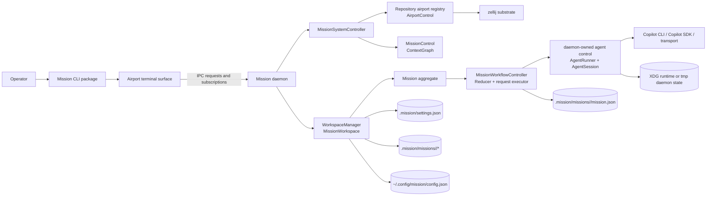

# Architecture

This section is the implementation-grounded architecture reference for Mission.

It documents the system as it exists in the repository today across:

- the repository-owned control state under `.mission/`
- the daemon-owned control plane and system snapshot
- the mission-local workflow engine and runtime record
- the provider-neutral agent runtime contract
- the repository-scoped airport layout authority
- the Airport terminal surfaces and their client relationship to the daemon
- the published Mission CLI package and its distribution boundary
- the public IPC and package export surfaces

This is not a speculative redesign document. When older specs, older notes, and current code differ, this section resolves against the current implementation while calling out meaningful drift in [discrepancies.md](./discrepancies.html).

	

		<strong>Current implementation</strong>
		
This architecture section resolves against the repository code, daemon behavior, persisted state, and routed surfaces that exist today.

	

	

		<strong>Target architecture</strong>
		
Specifications and replay material still matter because they capture the cleaner end-state Mission is driving toward. Treat them as directional intent unless this section explicitly says the current code already matches.

	

## How To Read This Section

1. Start with [system-context.md](./system-context.html) for the end-to-end topology.
2. Read [repository-and-dossier.md](./repository-and-dossier.html) and [semantic-model.md](./semantic-model.html) for the repository, mission, stage, task, artifact, and session model.
3. Read [daemon.md](./daemon.html), [workflow-engine.md](./workflow-engine.html), [agent-runtime.md](./agent-runtime.html), and [airport-control-plane.md](./airport-control-plane.html) for the main authorities.
4. Read [airport-terminal-surface.md](./airport-terminal-surface.html) and [contracts.md](./contracts.html) for Airport terminal surface and protocol boundaries.
5. Use [recovery-and-reconciliation.md](./recovery-and-reconciliation.html), [package-map.md](./package-map.html), and [integrity-checklist.md](./integrity-checklist.html) as operational reference pages.

## System Context

## Authority Matrix

| Concern | Authority | Non-authorities |
| --- | --- | --- |
| Repository adoption and settings | `initializeMissionRepository(...)`, `WorkflowSettingsStore`, `.mission/settings.json` | Airport terminal surfaces, Airport control, task markdown |
| Mission execution truth | `MissionWorkflowController` + `mission.json` | Terminal local state, airport state |
| Semantic selection graph | `MissionControl` inside `MissionSystemController` | `mission.json`, zellij |
| Layout bindings and focus intent | `AirportControl` and `RepositoryAirportRegistry` | surface-local routing, workflow engine |
| Live terminal panes | `TerminalManagerSubstrateController` observing and driving zellij | Workflow reducer |
| Agent execution | daemon-owned agent control path + `AgentRunner` / `AgentSession` implementations | Airport terminal surfaces, Airport control |
| Client protocol | `DaemonClient` / `DaemonApi` + daemon request handlers | Direct file editing from local surfaces |

## Replay Anchors

The architecture coverage in this section reflects the five replayed architectural missions captured under `.mission/missions/` and mapped in `specifications/replay/retrospective-specification-coverage-map.md`.

| Replay anchor | Primary architecture home in these docs |
| --- | --- |
| Repository Adoption And Mission Dossier Layout | [repository-and-dossier.md](./repository-and-dossier.html) |
| Mission Semantic Model | [semantic-model.md](./semantic-model.html) |
| Workflow Engine And Repository Workflow Settings | [workflow-engine.md](./workflow-engine.html) and [contracts.md](./contracts.html) |
| Agent Runtime Unification | [agent-runtime.md](./agent-runtime.html) |
| Airport Control Plane | [airport-control-plane.md](./airport-control-plane.html) and [airport-terminal-surface.md](./airport-terminal-surface.html) |

## Source-Of-Truth Ladder

Use this order when reconciling architectural questions:

1. Current implementation in `packages/mission`, `packages/core`, `packages/airport`, and `apps/airport/terminal`
2. Persisted runtime surfaces: `.mission/settings.json`, `.mission/missions/<mission-id>/mission.json`, user config, daemon runtime files
3. Current reference docs such as `docs/reference/state-schema.md`
4. Source specifications under `specifications/`
5. Replayed mission dossiers under `.mission/missions/`

If two layers disagree, prefer the higher layer and record the mismatch in [discrepancies.md](./discrepancies.html).
