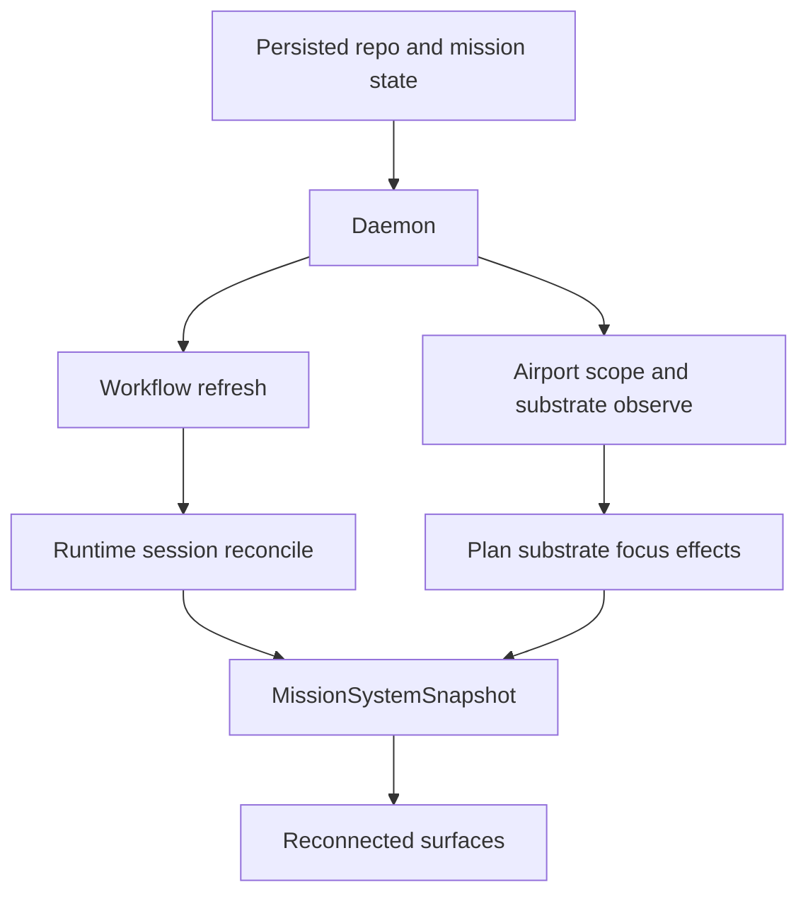

# Recovery And Reconciliation

Mission is designed to recover by rebuilding live state from explicit persisted boundaries instead of trusting one long-lived process image.

## What Survives A Restart

| Concern | Survives process restart | Recovery source |
| --- | --- | --- |
| Repository discovery roots | Yes | Mission config |
| Repository workflow settings | Yes | `.mission/settings.json` |
| Airport pane intent | Yes | `.mission/settings.json` |
| Mission execution state | Yes | `mission.json` |
| Tower local selection and overlays | No | recomputed from fresh daemon snapshot |
| Connected pane registrations | No | surfaces reconnect |
| Observed zellij focus | No | substrate is resampled |

## Recovery Paths

### Mission Recovery

1. `MissionWorkflowController.refresh()` reads `mission.json`.
2. The Mission runtime data must pass strict schema validation; invalid data is rejected instead of normalized.
3. The controller ensures eligible generated tasks exist for the next incomplete stage.
4. `reconcileSessions()` asks the runtime executor to compare live runtime sessions against mission runtime state.

### Airport Recovery

1. Airport surfaces reconnect to the daemon and refresh `system.status` plus entity-backed mission state.
2. Client-reported pane observations rebuild `AirportSubstrateState` for the connected surface.
3. `planAirportSubstrateEffects(...)` derives focus effects only when an attached pane should be focused.
4. No daemon-owned repository airport registry participates in recovery in the current runtime.

### Surface Recovery

1. `connectAirportControl(...)` attempts to connect to the daemon.
2. If protocol versions differ, it stops the incompatible daemon and starts a compatible one.
3. Tower reconnects, claims its gate, and receives fresh airport and mission projections.

## Reconciliation Loops

## Invariants

1. The daemon snapshot is disposable and rebuildable.
2. `mission.json` is required for mission execution recovery.
3. Airport pane existence is observed, not assumed.
4. Surface reconnect should not require manual re-entry of repository or mission state when persisted context is available.
