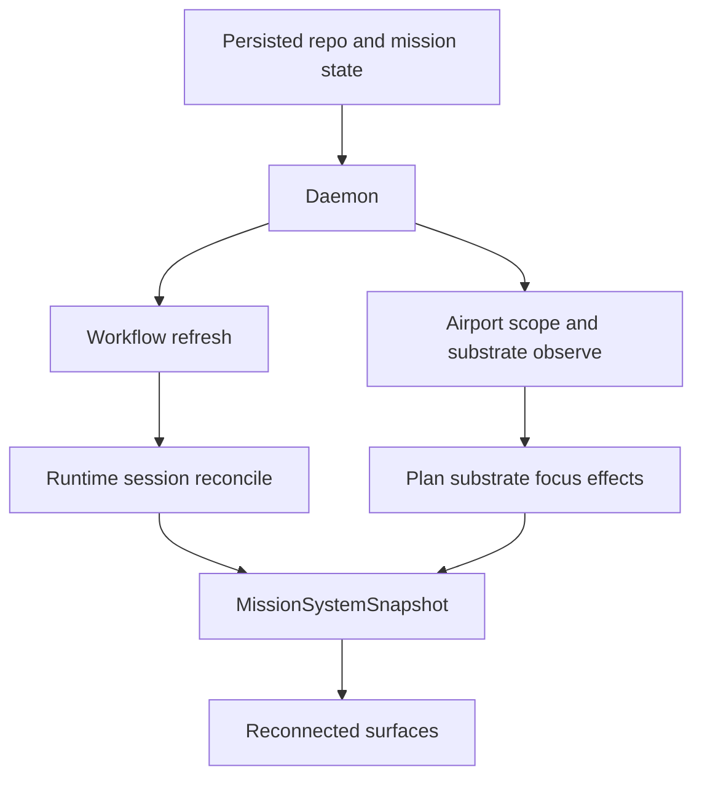

# Recovery And Reconciliation

Mission is designed to recover by rebuilding live state from explicit persisted boundaries instead of trusting one long-lived process image.

## What Survives A Restart

| Concern | Survives process restart | Recovery source |
| --- | --- | --- |
| Repository registration | Yes | user config |
| Repository workflow settings | Yes | `.mission/settings.json` |
| Airport pane intent | Yes | `.mission/settings.json` |
| Mission execution state | Yes | `mission.json` |
| Tower local selection and overlays | No | recomputed from fresh daemon snapshot |
| Connected pane registrations | No | surfaces reconnect |
| Observed zellij focus | No | substrate is resampled |

## Recovery Paths

### Mission Recovery

1. `MissionWorkflowController.refresh()` reads `mission.json`.
2. The document is normalized if persisted session identities need adjustment.
3. The controller ensures eligible generated tasks exist for the next incomplete stage.
4. `reconcileSessions()` asks the runtime executor to compare live runtime sessions against mission runtime state.

### Airport Recovery

1. `RepositoryAirportRegistry` loads persisted airport intent from `.mission/settings.json`.
2. `AirportControl` scopes itself to the repository with default or persisted pane bindings.
3. `TerminalManagerSubstrateController.observe(...)` samples zellij panes.
4. `MissionSystemController` plans focus effects and then folds observed substrate state back into airport state.

### Surface Recovery

1. `connectAirportControl(...)` attempts to connect to the daemon.
2. If protocol versions differ, it stops the incompatible daemon and starts a compatible one.
3. Tower reconnects, claims its gate, and receives fresh airport and mission projections.

## Reconciliation Loops

## Invariants

1. The daemon snapshot is disposable and rebuildable.
2. `mission.json` is required for mission execution recovery.
3. Airport pane existence is observed, not assumed.
4. Surface reconnect should not require manual re-entry of repository or mission state when persisted context is available.