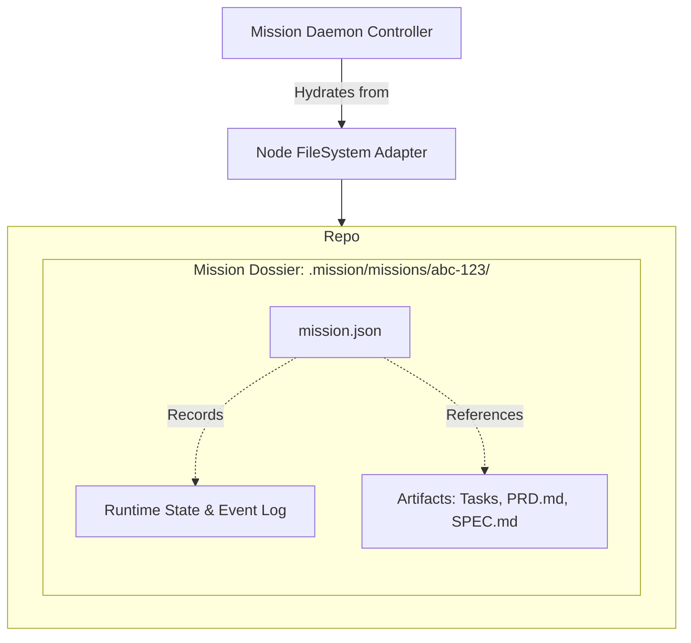

# Repository & Dossier Architecture

Mission architecture dictates that all related context and structural identity originates from the filesystem—specifically from a controlled `.mission/` directory inside a host Git repository.

## Components & File Layout

| Path / File | Role | Component Ownership |
| :--- | :--- | :--- |
| **`.mission/`** | The integration root marking a valid Mission repository. | `packages/core` initializers |
| **`.mission/workflow.json`** | System-wide daemon settings, layout recovery state, and intent preferences | Daemon settings |
| **`.mission/missions/<id>/`** | The "Dossier": The canonical, self-contained record of a single mission lifecycle. | Controller |
| **`.mission/missions/<id>/mission.json`** | The source of truth for runtime events and the execution state snapshot. | Workflow Engine |

## The Persistence Boundary

Mission completely eschews an external database. If the `.mission/missions/<mission-id>/mission.json` file can be read, the daemon can perfectly recover its state:

1. **Recovery Safety**: Reboots read from disk directly to rebuild the latest `WorkflowState`.
2. **Event Sourcing**: The `mission.json` grows via structured event objects, meaning past context is never silently deleted.
