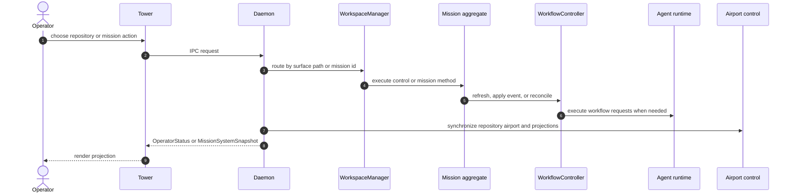

# System Context

Mission is a local-first engineering control system with three distinct runtime planes:

1. The repository plane, where durable Mission control files live under `.mission/`.
2. The daemon plane, where the system composes repository state, mission state, airport state, and client connections into a live `MissionSystemSnapshot`.
3. The surface plane, where Tower and other clients render daemon projections and submit intent.

## Runtime Environments

| Environment | What runs there | What it owns |
| --- | --- | --- |
| Git repository checkout | `.mission/settings.json`, mission dossiers, tracked artifacts | Repository-scoped control state and mission history |
| External mission worktree root | Materialized mission worktrees resolved from `missionWorkspaceRoot` | Local checkout for doing the mission work |
| Daemon process | `Daemon`, `WorkspaceManager`, `MissionSystemController` | IPC, orchestration, live control-plane state |
| Agent runtime provider process | `CopilotCliAgentRunner`, `CopilotSdkAgentRunner`, transport | Session execution and provider translation |
| Terminal substrate | zellij session and panes | Physical pane focus and visibility |
| Tower process | `bootstrapTowerPane`, `TowerController`, OpenTUI renderer | Ephemeral UI state only |

## End-To-End Control Flow

## Source Of Truth Boundaries

| State surface | Scope | Persisted | Authority |
| --- | --- | --- | --- |
| `.mission/settings.json` | Repository | Yes | Repository policy and airport intent defaults |
| `.mission/missions/<mission-id>/mission.json` | Mission | Yes | Mission workflow runtime truth |
| Mission artifact files | Mission | Yes | Human-readable outputs and task materialization |
| `MissionSystemSnapshot` | Daemon | No | Live composite view for surfaces |
| Airport substrate observation | Repository + daemon runtime | No | Observed zellij state |
| Agent session snapshots | Runtime | Optional hook | Live session facts and provider lifecycle |

## Core Architectural Rule

Mission deliberately does not collapse everything into a single state tree.

- Repository policy is separate from mission execution.
- Mission execution is separate from daemon-wide live projections.
- Airport layout state is separate from workflow state.
- Provider runtime state is separate from semantic workflow truth.

That separation is the main reason the system can recover, reconnect, and reproject without letting the UI or the terminal substrate become the authority.