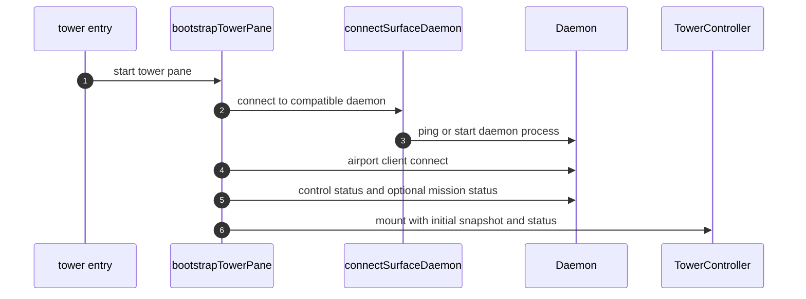

# Tower Terminal Surface

Tower is the operator-facing terminal application. It is a client of the daemon, not a second authority.

## Runtime Role

| Layer | Current implementation |
| --- | --- |
| Entry point | `apps/tower/terminal/src/index.ts` |
| Boot and connection | `bootstrapTowerPane.ts`, `connectSurfaceDaemon.ts` |
| UI root | `mountTowerUi.tsx` |
| Main controller | `TowerController.tsx` |
| Presentation | OpenTUI Solid components under `src/tower/components/` |

## Boot Sequence

## Local State Versus Daemon State

Tower keeps local state for interaction only:

- focus area within the UI
- selected theme
- selected header tab
- picker text, overlays, and command flow steps

Tower may use `command` language for its picker, command panel, and typed slash input, but those are UI interaction forms. The underlying business object should still be a daemon-provided operator action.

Tower must preserve daemon action order. It may narrow a visible list by local text query, but it must not re-rank actions, apply local availability policy, or invent a separate next-action heuristic.

Tower does not own:

- repository registration
- mission runtime state
- airport bindings
- session lifecycle
- workflow gate state

Those come from `OperatorStatus` and `MissionSystemSnapshot` returned by the daemon.

## Surface Contracts

| Tower concern | Daemon dependency |
| --- | --- |
| Repository view | `control.status`, `control.repositories.*`, `control.action.*` |
| Mission view | `mission.status`, `mission.action.*`, `mission.gate.evaluate` |
| Session control | `task.launch`, `session.*` |
| Layout projection | `airport.client.connect`, `airport.client.observe`, `airport.status` |

## Gate Attachment Model

Each tower pane launches with an injected `MISSION_GATE_ID` and claims exactly one airport gate. The daemon then uses that registration to associate the pane with the repository airport state.

## Runtime Constraint

The current Tower implementation requires Bun at runtime because `@opentui/core` imports `bun:ffi`. That is a surface/runtime dependency, not a workflow dependency.

## Non-Responsibilities

Tower must not become the source of truth for mission routing, task lifecycle, or gate ownership. If Tower and the daemon disagree, the daemon wins.

That rule also applies to available actions: ordering, filtering, and enablement are daemon-owned semantics, not UI policy.
