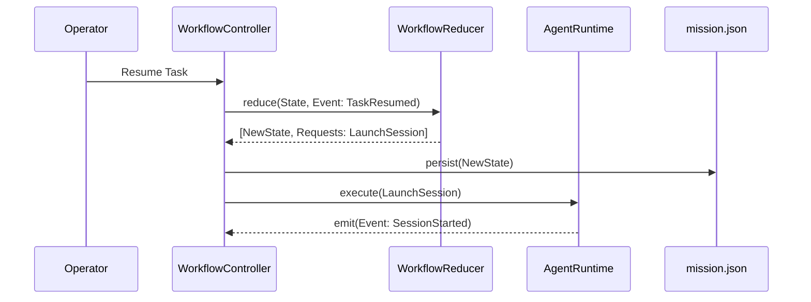

# Workflow Engine

The Workflow Engine is the deterministic heart of Mission. It owns state transitions, validates execution boundaries, and ensures the operator can safely pause, panic, or recover missions. The engine enforces the semantic model strictly, never directly executing side effects.

## Responsibility Map

| Component | Responsibility | Persisted State Source of truth |
| :--- | :--- | :--- |
| **WorkflowReducer** | Pure function mapping Events + State to new State + Requests | None (pure) |
| **WorkflowController** | Persists state, invokes reducer, routes effects | `mission.json` |
| **RequestExecutor** | Dispatches requests to filesystem, runtime, or other effects | None |

## Core Architecture

The engine is built around an event-sourcing/reducer pattern. Rather than loosely coupled classes modifying state out-of-band, the engine centralizes all state changes into a strict timeline of `WorkflowEvent` objects.

### 1. The Reducer Pattern
When an operator issues a command (e.g., `START`), or moving a task to `completed`, the system translates this into a discrete `WorkflowEvent`. The `WorkflowReducer` receives the current `WorkflowState` and the event, yielding:
1.  **Next State**: The updated `WorkflowState` snapshot.
2.  **WorkflowRequests**: An array of side-effect requirements (e.g., "Launch Session", "Write File").
3.  **WorkflowSignals**: Temporary signals that trigger synchronous daemon UI refreshes or operator notifications.

## State Ownership & Boundaries

The Workflow Engine strictly owns the **Runtime State** block of the Mission Dossier. It is the only component allowed to mark a task as `completed`, update a stage progression, or persist an event.

### Safety Invariants
1.  **Immutability Base**: Events in the log are never mutated or deleted.
2.  **Side Effect Isolation**: The reducer cannot read from the filesystem, query git, or run an LLM directly. 
3.  **Halt on Panic**: When an exception escapes an executor, the Controller inserts a `PanicEvent`, pausing execution globally until the operator resolves the crisis.
