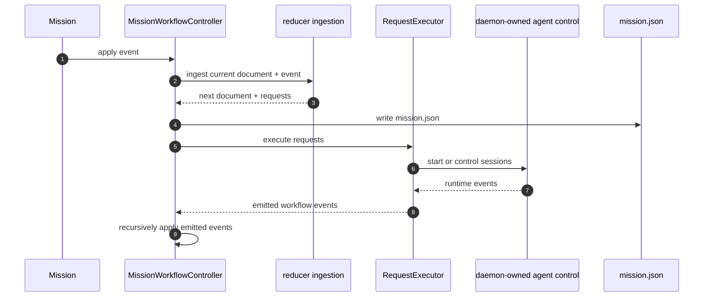

# Workflow Engine

The workflow engine is the mission-local execution authority. Its job is to reduce workflow events into a durable runtime record, emit side-effect requests, and reconcile runtime session facts back into mission state.

The engine owns workflow semantics, not workflow content. The active workflow preset is repository-owned state under `.mission/workflow/`, including the serializable workflow definition and the stage/task template corpus that task generation consumes in production.

## Primary Components

| Component | Responsibility | Owned state | Persisted state |
| --- | --- | --- | --- |
| `MissionWorkflowController` | Loads, initializes, persists, and replays machine-derived requests around the mission runtime record | cached `MissionRuntimeRecord` | `mission.json` |
| reducer ingestion logic | Applies one event to the current runtime record and yields requests | none, pure transformation | none |
| workflow policy helpers | Own stage eligibility, completion, generation, reopen, and mission completion rules | none, pure derivation | none |
| `MissionWorkflowRequestExecutor` | Executes request side effects such as task generation and session launch | daemon-owned agent control dependency, buffered runtime events | none directly |
| Task generation helpers | Turn workflow config and templates into task records | generation result in memory | task files + artifact files |

## Repository-Owned Workflow Preset

Repository initialization scaffolds the workflow preset into:

```text
.mission/workflow/workflow.json
.mission/workflow/templates/
```

That preset is part of repository policy, not a hidden package implementation detail.

- `workflow.json` is the repository-owned workflow definition the engine loads and snapshots into each mission runtime record.
- `templates/` contains the repository-owned stage and task templates the executor renders when materializing artifacts and generated tasks.
- the packaged build still includes the default preset assets so Mission can scaffold new repositories, but once a repository is initialized the repo copy is the live source of truth.

Execution settings are reducer-owned policy, not documentation-only decoration: `execution.maxParallelTasks` limits how many tasks may be `queued` or `running`, and `execution.maxParallelSessions` limits how many launch/session slots may be occupied at once.

Task auto-launch is also reducer-owned policy. A task may auto-queue only after the derived projection marks it `ready`, which means it is in the active stage and every `dependsOn` task is already `completed`. Tasks with unresolved dependencies stay `pending`, expose `waitingOnTaskIds`, and are not eligible for auto-launch yet.

## Runtime Record Structure

The authoritative mission execution document is:

```text
.mission/missions/<mission-id>/mission.json
```

Its top-level shape is:

| Field | Meaning |
| --- | --- |
| `schemaVersion` | Runtime record schema version |
| `missionId` | Mission identity |
| `configuration` | Snapshotted workflow configuration |
| `runtime` | Current workflow runtime state |
| `eventLog` | Append-only workflow event history |

## Runtime State Contents

| Runtime field | Purpose |
| --- | --- |
| `lifecycle` | Mission lifecycle such as `draft`, `running`, `paused`, or `delivered` |
| `activeStageId` | Current active stage when one is relevant |
| `pause` | Human or system pause state |
| `panic` | Panic-stop configuration and active panic state |
| `stages` | Derived stage projections |
| `tasks` | Authoritative task runtime records |
| `sessions` | Workflow-tracked session runtime records |
| `gates` | Workflow gate projections such as implement, verify, audit, deliver |
| `launchQueue` | Pending task launch requests |
| `updatedAt` | Last workflow update timestamp |

## Event Families

| Event family | Examples | Effect |
| --- | --- | --- |
| Mission lifecycle | `mission.created`, `mission.started`, `mission.paused`, `mission.delivered` | Advances mission-level lifecycle |
| Task generation | `tasks.generated` | Creates runtime task records for a stage |
| Task lifecycle | `task.queued`, `task.started`, `task.completed`, `task.reopened` | Drives task execution state |
| Session lifecycle | `session.started`, `session.launch-failed`, `session.completed`, `session.failed`, `session.cancelled`, `session.terminated` | Keeps workflow state aligned with agent runtime |
| Policy changes | `task.launch-policy.changed` | Changes per-task runtime launch settings |

## Request Execution Boundary

The reducer never opens files, starts zellij, or talks to a model provider. It emits requests. The current request executor handles these request categories:

| Request type | Current executor behavior |
| --- | --- |
| `tasks.request-generation` | Materializes stage artifacts and generated task files, then emits `tasks.generated` |
| `session.launch` | Resolves a runner and starts an `AgentSession` through the shared daemon-owned agent control path, then emits `session.started` or `session.launch-failed` |
| `session.prompt` | Routes a prompt to a running `AgentSession` through the same control path |
| `session.command` | Routes a normalized command to a running `AgentSession` through the same control path |
| `session.cancel` | Cancels a running session through the same control path |
| `session.terminate` | Terminates a running session through the same control path |

The important boundary is that workflow does not depend on UI pane state, but it does depend on normalized runtime truth.

Session interruption is scoped to the session record. When a running session is cancelled or terminated, the session itself becomes terminal, but the task re-enters normal derived readiness for its stage instead of becoming terminal `cancelled` automatically.

The reducer no longer emits decorative mission-level requests. Mission completion is state plus signals inside the machine, not an executor no-op.

That includes operator interference when it changes the real execution substrate. If a human kills a terminal-backed session outside the happy path, the daemon must reconcile that disappearance back into workflow state. Treating that as workflow input is correct because it is runtime truth, not presentation state.

## Execution Loop



## Task Generation Rules

The engine now single-sources generation eligibility in the workflow policy layer. A `tasks.request-generation` request is derived when all of these are true:

1. the mission is not already delivered
2. the stage is the next incomplete stage in workflow order
3. no tasks for that stage already exist in runtime state
4. the workflow configuration includes generation templates for that stage

The reducer emits that request during normal event ingestion, and the controller may replay the same machine-derived request during refresh to recover from missed side effects or older persisted records. Stage progression and task generation stay coupled to the persisted configuration snapshot in `mission.json`, but the rules now live in one place.

Task rendering is repository-local at execution time. The executor materializes stage artifacts and generated tasks from `.mission/workflow/templates/`, not from hard-coded package-relative source files, so repository owners can evolve the preset after initialization.

## Task Auto-Launch Rules

Automatic queueing and session launch are derived only for tasks that are already `ready`. In practice that requires all of these to be true:

1. the mission lifecycle is `running`
2. no pause or panic stop is active
3. the task is in the current eligible stage
4. every task listed in `dependsOn` is `completed`
5. the task runtime launch policy has `autostart: true`
6. `execution.maxParallelTasks` and `execution.maxParallelSessions` still have capacity

If dependencies are still unresolved, the task remains `pending` with `waitingOnTaskIds` populated and the reducer does not auto-queue it.

## Invariants

1. `mission.json` is the mission execution authority after initialization.
2. The controller persists after every applied event before running follow-up requests.
3. Workflow rules such as eligible stage, implicit final-stage completion, and reopen constraints must be defined once and consumed by reducer, validation, and refresh reconciliation.
4. Stage state is derived from tasks, not manually edited by Tower.
5. Session events must be translated back into workflow events before they become mission truth.
6. Operator-facing surfaces may refresh or invalidate command projections, but they must not decide workflow transitions.
7. Runtime transport failures, detached sessions, and externally terminated sessions are valid workflow inputs once normalized by the daemon runtime layer.

## End-To-End Coverage

The workflow engine now has a controller-level end-to-end suite in `packages/core/src/workflow/engine/workflowEngine.e2e.test.ts`.

That suite is intentionally above the reducer-only layer. It exercises the full persisted loop:

- event validation
- reducer transition and derivation
- mission document persistence
- recursive request execution
- emitted event ingestion
- refresh recovery against persisted runtime state

The required scenario matrix covered there is:

1. Happy-path mission execution from `mission.created` through automatic generation, auto-launch, manual queueing, completion, and `mission.delivered`.
2. Human control paths including `mission.paused`, `mission.resumed`, session prompt, session command, cancel, and terminate.
3. Failure and recovery paths including `session.launch-failed` and `task.reopened`.
4. Panic and recovery paths including `mission.panic.requested`, queue clearing, session termination, `mission.panic.cleared`, and `mission.launch-queue.restarted`.
5. Refresh repair of machine-derived requests when persisted state is missing generated follow-up work.

That suite is the guardrail for the claim that the workflow engine is a first-class state machine rather than a collection of reducer-only unit rules.

## Operator Interference Boundary

Mission intentionally supports humans interrupting the normal flow.

That means the workflow engine must tolerate these cases:

- a terminal session is closed outside Mission
- a prompt is interrupted manually
- a daemon restart must reconcile persisted session references against reality

These are not UI concerns. They are execution concerns.

The correct architecture is:

- surfaces may observe and request actions
- runtime normalizes what is actually alive, failed, or terminated
- workflow consumes those normalized facts

The incorrect architecture would be:

- surfaces reporting focus, selection, or pane visibility as workflow truth
- workflow inferring session liveness from client attachment
- pane binding deciding task eligibility

## Relationship To Replay Anchors

This page is the architecture home for the replayed mission "Workflow Engine And Repository Workflow Settings" and should be read together with `specifications/mission/workflow/workflow-engine.md` and `docs/reference/state-schema.md`.
