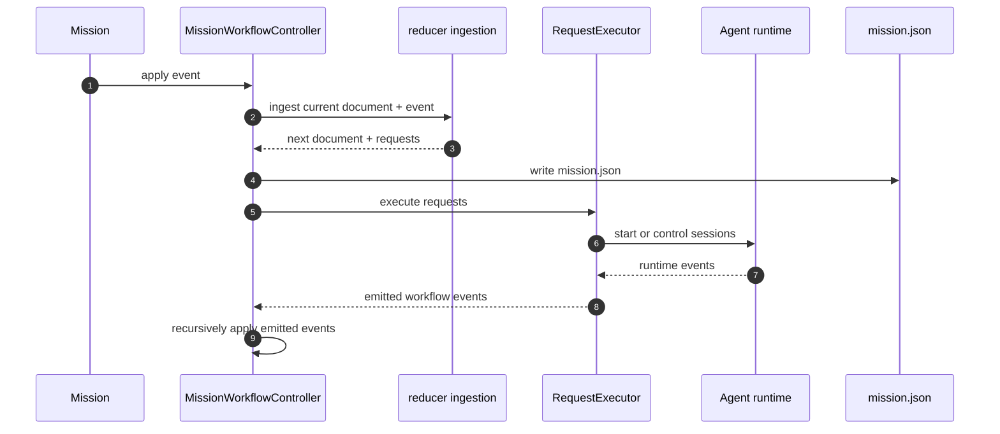

# Workflow Engine

The workflow engine is the mission-local execution authority. Its job is to reduce workflow events into a durable runtime record, emit side-effect requests, and reconcile runtime session facts back into mission state.

## Primary Components

| Component | Responsibility | Owned state | Persisted state |
| --- | --- | --- | --- |
| `MissionWorkflowController` | Loads, initializes, normalizes, updates, and persists the mission runtime record | cached `MissionRuntimeRecord` | `mission.json` |
| reducer ingestion logic | Applies one event to the current runtime record and yields requests | none, pure transformation | none |
| `MissionWorkflowRequestExecutor` | Executes request side effects such as task generation and session launch | orchestrator, runner map, buffered runtime events | none directly |
| Task generation helpers | Turn workflow config and templates into task records | generation result in memory | task files + artifact files |

## Runtime Record Structure

The authoritative mission execution document is:

```text
.mission/missions/<mission-id>/mission.json
```

Its top-level shape is:

| Field | Meaning |
| --- | --- |
| `schemaVersion` | Runtime record schema version |
| `missionId` | Mission identity |
| `configuration` | Snapshotted workflow configuration |
| `runtime` | Current workflow runtime state |
| `eventLog` | Append-only workflow event history |

## Runtime State Contents

| Runtime field | Purpose |
| --- | --- |
| `lifecycle` | Mission lifecycle such as `draft`, `running`, `paused`, or `delivered` |
| `activeStageId` | Current active stage when one is relevant |
| `pause` | Human or system pause state |
| `panic` | Panic-stop configuration and active panic state |
| `stages` | Derived stage projections |
| `tasks` | Authoritative task runtime records |
| `sessions` | Workflow-tracked session runtime records |
| `gates` | Workflow gate projections such as implement, verify, audit, deliver |
| `launchQueue` | Pending task launch requests |
| `updatedAt` | Last workflow update timestamp |

## Event Families

| Event family | Examples | Effect |
| --- | --- | --- |
| Mission lifecycle | `mission.created`, `mission.started`, `mission.paused`, `mission.delivered` | Advances mission-level lifecycle |
| Task generation | `tasks.generated` | Creates runtime task records for a stage |
| Task lifecycle | `task.queued`, `task.started`, `task.completed`, `task.blocked`, `task.reopened` | Drives task execution state |
| Session lifecycle | `session.started`, `session.launch-failed`, `session.completed`, `session.failed`, `session.cancelled`, `session.terminated` | Keeps workflow state aligned with agent runtime |
| Policy changes | `task.launch-policy.changed` | Changes per-task runtime launch settings |

## Request Execution Boundary

The reducer never opens files, starts zellij, or talks to a model provider. It emits requests. The current request executor handles these request categories:

| Request type | Current executor behavior |
| --- | --- |
| `tasks.request-generation` | Materializes stage artifacts and generated task files, then emits `tasks.generated` |
| `session.launch` | Starts an `AgentSession` through the orchestrator, then emits `session.started` or `session.launch-failed` |
| `session.prompt` | Sends a prompt to a running session |
| `session.command` | Sends a normalized command to a running session |
| `session.cancel` | Cancels a running session |
| `session.terminate` | Terminates a running session |

## Execution Loop



## Task Generation Rules

The engine currently auto-generates tasks for eligible stages when all of these are true:

1. the mission is not already delivered
2. the stage is the next incomplete stage in workflow order
3. no tasks for that stage already exist in runtime state
4. the workflow configuration includes generation templates for that stage

This means stage progression and task generation are tightly coupled to the persisted configuration snapshot in `mission.json`.

## Invariants

1. `mission.json` is the mission execution authority after initialization.
2. The controller persists after every applied event before running follow-up requests.
3. Stage state is derived from tasks, not manually edited by Tower.
4. Session events must be translated back into workflow events before they become mission truth.

## Relationship To Replay Anchors

This page is the architecture home for the replayed mission "Workflow Engine And Repository Workflow Settings" and should be read together with `specifications/mission/workflow/workflow-engine.md` and `docs/reference/state-schema.md`.
