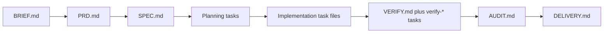

# Spec-Driven Development

> As a Principal Architect, I want to convert a `BRIEF.md` into a `PRD.md` and a `PRD.md` into a `SPEC.md` before implementation begins, so the AI is constrained by explicit architecture rather than improvising code.

Mission's workflow is designed to turn vague intent into bounded execution artifacts. The important distinction is that authored product templates, generated task files, and persisted runtime artifacts are not the same thing. The codebase treats them as separate layers, and adoption decisions should be based on that separation rather than on the older specification prose.

## The Artifact Chain

At the authored-product level, the current template corpus defines this progression:

| Artifact | Purpose | Template location |
| --- | --- | --- |
| `BRIEF.md` | Canonical intake context for the mission | `templates/mission/BRIEF.md` |
| `PRD.md` | Problem statement, outcome, constraints, success criteria | `templates/mission/products/PRD.md` |
| `SPEC.md` | Target architecture, signatures, and file matrix | `templates/mission/products/SPEC.md` |
| `VERIFY.md` | Runtime verification artifact for implementation evidence | Runtime artifact name from workflow manifest |
| `AUDIT.md` | End-to-end findings and residual risks | `templates/mission/products/AUDIT.md` |
| `DELIVERY.md` | Delivery summary, evidence, and release notes | `templates/mission/products/DELIVERY.md` |

One detail is worth calling out explicitly: the template corpus includes `VERIFICATION.md`, but the runtime workflow manifest defines the verification artifact key as `verify` and the actual runtime file name as `VERIFY.md`. User-facing documentation should follow the manifest because that is what the running system uses.

## From Authored Artifacts To Runtime Tasks

Mission does not treat a mission as one large coding chat. Instead, it turns product artifacts into bounded task files:

| Stage | Generated task intent | Verified source |
| --- | --- | --- |
| PRD | Rewrite or enrich `PRD.md` from `BRIEF.md` | `tasks/PRD/01-prd-from-brief.md` |
| SPEC | Draft `SPEC.md` from `PRD.md` | `tasks/SPEC/01-spec-from-prd.md` |
| SPEC | Produce the implementation and verification ledger | `tasks/SPEC/02-plan.md` |
| Implementation | Execute planned slices and paired verification tasks | Runtime-generated under `03-IMPLEMENTATION/tasks` |
| Audit | Review evidence and residual risk | Later-stage task generation and artifacts |

The planning task is particularly important. It instructs the planner to create paired implementation and verification task files in `03-IMPLEMENTATION/tasks`, with verification files prefixed by `verify-` and dependent on their corresponding implementation task. That is the operational mechanism by which Mission turns a high-level spec into bounded execution units.

## Implemented Stage Model

The current workflow manifest defines five stages in a fixed order:

```text
prd -> spec -> implementation -> audit -> delivery
```

The stage directories are also fixed by the manifest:

| Stage | Directory | Runtime artifact bindings |
| --- | --- | --- |
| `prd` | `01-PRD` | `PRD.md` |
| `spec` | `02-SPEC` | `SPEC.md` |
| `implementation` | `03-IMPLEMENTATION` | `VERIFY.md` |
| `audit` | `04-AUDIT` | `AUDIT.md` |
| `delivery` | `05-DELIVERY` | `DELIVERY.md` |

Stages are structural. Tasks execute work. That distinction is enforced in the reducer and should shape how architects evaluate the system. Mission does not model a stage as an executable actor. Instead, tasks are generated for the currently eligible stage, and stage status is later projected from task state.



## Why This Reduces Context Drift

Mission constrains AI by narrowing the active objective at each step:

1. The PRD task is allowed to change only `PRD.md`.
2. The spec task is allowed to change only `SPEC.md`.
3. The planning task creates execution ledger files, not application code.
4. Implementation is broken into bounded slices with paired verification work.
5. Audit and delivery are separate terminal steps rather than afterthoughts.

This matters because the common failure mode in AI-assisted development is not merely wrong code. It is unbounded scope expansion: requirements, architecture, implementation, verification, and delivery all collapse into one long improvisational session. Mission resists that collapse by pushing each responsibility into its own artifact or task boundary.

## Verification And Audit In The Lifecycle

Verification is not optional commentary after implementation. The manifest binds verification to the implementation stage through paired task definitions and the `verify` artifact key. Audit is then a separate later stage with its own artifact and gate.

In practical terms:

- implementation produces code and focused verification evidence
- verification consolidates proof in `VERIFY.md`
- audit records findings and residual risks in `AUDIT.md`
- delivery summarizes the outcome and operator-facing evidence in `DELIVERY.md`

That structure gives an adopting team a cleaner answer to a hard question: not just "did the agent write code," but "what requirements constrained it, what spec bounded it, what evidence verified it, and what audit judged the result?"