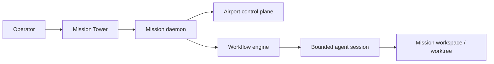

# Mission

Mission is a local state machine, daemon-owned control plane, and terminal surface for AI-driven software development. It exists to solve a narrow operational problem: most AI coding workflows still rely on long-lived chat context, ad hoc shell scripts, and work on the active branch. That combination produces context rot, branch corruption, and brittle orchestration that becomes hard to trust once a session crashes or drifts.

Mission replaces that model with explicit runtime state, isolated mission workspaces, and a human-governed execution surface. In the current codebase, the public CLI entry routes through `mission` and resolves to the Tower surface by default, with the daemon auto-started when needed. The Tower is the operator console; the daemon and its airport projections own control-plane truth.

## Why Teams Evaluate Mission

Principal Architects generally care about three things before adopting an AI orchestration system:

1. Whether runtime state is explicit and recoverable.
2. Whether agent work is isolated from the active repository checkout.
3. Whether a human can interrupt, gate, and resume execution without ambiguity.

Mission addresses those concerns with a reducer-driven workflow runtime, repository-scoped daemon settings under `.mission/`, and mission worktrees rooted outside the main checkout. The operator launches the Tower, the daemon maintains the authoritative control state, and each unit of work is executed in a bounded mission workspace instead of a shared chat window or mutable active branch.

## Air Traffic Control For AI Development

Mission is best understood as air traffic control for a repository:

- The daemon maintains control-plane state and airport projections.
- The Tower is the interactive surface used to observe and steer that state.
- Agent sessions are launched into isolated mission workspaces instead of the primary checkout.
- Human governance remains explicit through pause, panic, and launch policy controls.

This architecture matters because Tower is not the layout authority and the agent is not the workflow authority. Layout truth lives in the airport control plane. Execution truth lives in the workflow engine and its persisted mission runtime record. The UI is a projection of daemon state, not a substitute for it.

## Current Public Surface

The public CLI surface currently consists of:

- `mission` to launch the terminal Tower surface.
- `mission install` to configure user-level Mission prerequisites.
- `mission airport:status` to inspect airport state.
- `mission daemon:stop` to stop the daemon.
- `missiond` as the related daemon process entry.

The router does not currently expose `mission init` as a supported public command. Repository scaffolding can still occur automatically when Mission starts and discovers missing control state, but user-facing documentation should treat `init` as an internal helper present in source rather than the public entrypoint.

## What To Read Next

- [Installation](getting-started/installation.md) covers user-level setup and first-run behavior.
- [Repository Setup](getting-started/repository-setup.md) explains what repository bootstrap creates and what it does not create.
- [Workflow Engine](architecture/workflow-engine.md) explains how the reducer-based mission runtime works.
- [CLI Commands](reference/cli-commands.md) enumerates the routed command surface exactly as it exists today.