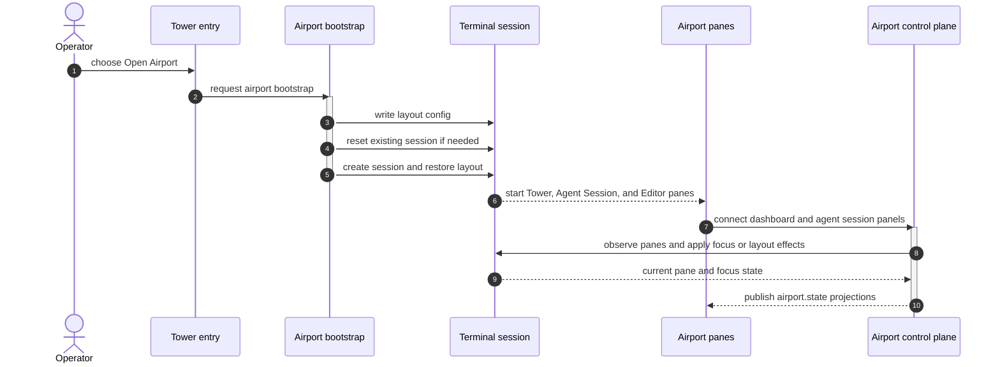
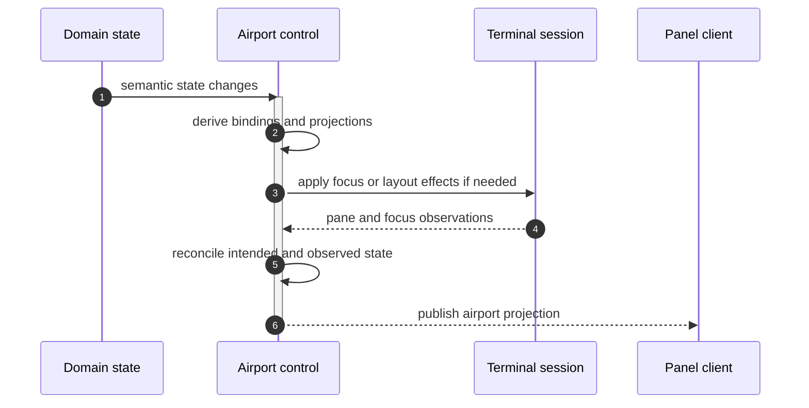

# Airport Control Plane

This document defines the from-scratch architecture for Mission's top-level application controller.

It is normative.

It assumes a clean break.

It does not preserve compatibility with the current CLI tower process model, the current sidepane shell loop, the current terminal transport contracts, the current mission daemon socket model, or any existing mission runtime persistence shape.

This document defines the authoritative design for:

- one daemon-owned application controller
- one canonical shared state root
- one airport layout control plane
- panel projection and IPC boundaries
- terminal-manager reconciliation as terminal substrate control

It also defines implementation principles for object ownership, module boundaries, DRY usage, and helper-function discipline so the rewritten system stays coherent rather than becoming a larger distributed control problem.

## Status

This is a design specification.

It is intentionally written before implementation.

It is allowed to invalidate large parts of the current codebase.

That is expected.

## Relationship To Other Specifications

This document must be read alongside the workflow engine specification, the core object model specification, the mission model, the agent runtime specification, and the workflow control surface specification.

Priority rule:

1. workflow engine specification defines mission runtime truth and workflow event semantics
2. mission model specification defines core domain entities and ownership
3. this airport control plane specification defines the top-level application controller, shared state composition, panel projections, and terminal substrate reconciliation
4. operator surfaces are projections over the daemon-owned system state defined here and in the workflow specifications

If an operator surface or terminal behavior conflicts with this document, the surface or terminal behavior is wrong and must change.

## Problem Statement

Mission has crossed a design boundary.

The terminal layer is no longer a convenience wrapper around a CLI.

It is now a first-class application runtime with:

- repository selection
- mission selection
- mission-local workspaces
- task execution routing
- artifact routing
- agent session routing
- terminal pane lifecycle
- multi-panel layout behavior
- user focus behavior
- editor/agent-session/dashboard synchronization

The existing approach of letting panels, shell scripts, or adapters directly coordinate layout and runtime behavior is architecturally invalid for this level of complexity.

That approach causes:

- implicit distributed state
- direct panel-to-panel coupling
- focus-as-control-state bugs
- duplicated routing logic
- hard-to-restart panel processes
- substrate-specific behavior leaking into domain logic
- brittle terminal pane coordination

The correct architecture is:

- one daemon
- one canonical state root
- one explicit airport control plane
- dumb panels that subscribe to projections
- one terminal-manager reconciliation layer that applies airport intent to the real terminal substrate

## Goals

The control plane must be:

- daemon-authoritative
- event-driven
- state-centric
- projection-oriented
- repository-aware
- mission-aware
- task-centric for execution
- terminal-substrate-aware without being substrate-owned
- object-oriented in ownership
- explicit about reconciliation
- free of legacy fallbacks, wrappers, aliases, or compatibility shims
- suitable for future repository switching without redesigning the runtime model

## Bootstrap Boundary

The airport control plane owns authoritative layout truth after the application is running.

The control plane does not require Airport itself to be the Tower entry path.

The Tower entry may open Airport by creating or attaching the terminal-manager session and starting the initial panes.

That bootstrap is not authoritative layout logic.

It is an entry-path responsibility that hands off to Airport once panels connect and substrate state can be reconciled.

After handoff:

- Airport owns gate bindings
- Airport owns focus intent and observed focus reconciliation
- Airport owns substrate effect application
- surfaces remain projections or bootstrap clients, not layout authorities



At that point, the bootstrap is finished and Airport becomes the layout authority.

Diagram key:

- `Entry`: the operator-facing Tower entry concept. In the current terminal implementation this entry path resolves through the `mission` shell command plus `apps/tower/terminal/src/index.ts` and `apps/tower/terminal/src/routeTowerEntry.ts`.
- `Bootstrap`: `apps/tower/terminal/src/commands/airport-layout.ts`
- `Session`: terminal-manager or zellij session that hosts the outer airport layout
- `Panes`: Tower pane from `apps/tower/terminal/src/tower/bootstrapTowerPane.ts`, agent session pane from `apps/tower/terminal/src/commands/airport-layout.ts`, plus the editor pane program
- `Control`: the mission daemon RPC surface plus `packages/airport/src/AirportControl.ts` and `packages/airport/src/terminal-manager.ts`

Reading guide:

- `Entry` is the operator action that opens Airport.
- `Bootstrap` only owns entry routing and initial session setup.
- Authority moves to `Control` after the Tower and Agent Session panes connect.
- The editor belongs to the outer layout but does not call `connectPanel` in the current implementation.
- `Control` owns gate bindings, focus intent, and substrate reconciliation after handoff.

### Reconciliation Loop

Once the bootstrap handoff is complete, Airport operates as a reconciliation loop between daemon truth and the observed substrate.



Diagram key:

- `Domain`: mission daemon state changes that drive airport intent
- `Airport`: `packages/airport/src/AirportControl.ts`
- `Session`: terminal-manager substrate observed through `packages/airport/src/terminal-manager.ts`
- `Client`: any connected panel client that receives projections

## Non-Goals

This specification does not define:

- the exact terminal-manager layout file syntax used by airport-layout bootstrap
- the exact WebSocket or socket transport framing
- visual design of panels
- editor-specific automation details for `micro`, `neovim`, or future editors
- long-term plugin-specific terminal-manager implementation details
- migration of existing daemon state or mission history

This specification explicitly forbids:

- keeping old and new control planes alive side by side
- compatibility wrappers around current panel routing code
- layout control by shell-script target files as a long-term architecture
- panel-owned truth for mission, task, artifact, session, or focus state

## Clean Break Requirement

This design is a replacement.

Implementation must assume:

- no backwards compatibility with current control-plane behavior
- no preservation of current terminal-routing APIs is required
- no preservation of current daemon message schema is required
- no preservation of current terminal-manager sidepane control loop is required
- no preservation of current mission runtime persistence schema is required
- no existing mission or runtime history is required as a design constraint

The rewrite may reuse code for implementation convenience only when that code fits this specification without semantic compromise.

## Architectural Summary

The system has one runtime host process:

- `missiond`

Inside `missiond`, there are two bounded contexts:

1. `MissionControl`
2. `AirportControl`

These bounded contexts share one authoritative composite state:

- `MissionSystemState`

Panels do not communicate with each other.

Panels communicate only with `missiond`.

The daemon receives commands, updates state, reconciles airport intent, applies substrate effects, and broadcasts updated projections.

## Top-Level Runtime Model

### One Daemon

There is exactly one daemon.

That daemon:

- owns the canonical state root
- owns command validation
- owns domain reduction
- owns airport reconciliation
- owns substrate effect application
- owns projection broadcasting

The daemon is the only process allowed to mutate authoritative state.

### Bounded Contexts

#### MissionControl

MissionControl owns semantic truth.

It answers:

- which repository is selected
- which mission is selected
- which mission workspace is active
- which tasks exist
- which artifacts exist
- which agent sessions exist
- what workflow status each mission currently has

MissionControl does not own layout, gate bindings, pane ids, or terminal focus.

#### AirportControl

AirportControl owns application layout truth.

It answers:

- which gates exist
- what each gate is bound to
- what layout intent is active
- what focus intent is active
- what substrate observations are currently known
- what panel processes should display

AirportControl does not decide what a mission means, what a task means, or whether a workflow stage is complete.

## Package And Module Topology

The architectural code shape is:

- `packages/core`
- `packages/airport`
- `apps/tower/terminal` and other surfaces as thin runtime clients or bootstraps
- `missiond` as the single daemon host process

### packages/core

`packages/core` owns:

- domain entities
- workflow engine
- mission runtime semantics
- command validation shared with the daemon where appropriate
- canonical semantic state types

`packages/core` does not own:

- gate bindings
- panel routing
- terminal-manager reconciliation
- editor gate behavior

### packages/airport

`packages/airport` owns:

- airport state types
- gate model
- panel registry
- client registry
- airport reconciliation logic
- projection derivation rules that depend on layout and routing
- terminal substrate controller interfaces
- terminal-manager substrate implementation under airport ownership

`packages/airport` depends on the stable semantic model exposed by `packages/core`.

`packages/airport` must not become a second domain model or second workflow engine.

It is a bounded-context application controller, not a competing business-logic root.

### missiond

`missiond` composes `packages/core` and `packages/airport`.

`missiond` owns:

- the runtime loop
- the authoritative composite state root
- IPC hosting
- state persistence orchestration
- effect application orchestration

`missiond` is the only authority process.

### apps/tower/terminal and other surfaces

Surfaces own:

- rendering
- user input capture
- panel-local ephemeral state

Surfaces do not own:

- authoritative mission state
- authoritative airport state
- direct substrate control

### Composite State Root

The whole application state is one object.

```ts
export interface MissionSystemState {
  version: number;
  domain: ContextGraph;
  airport: AirportState;
  airports: AirportRegistryState;
}

export interface AirportRegistryState {
  activeRepositoryId?: string;
  repositories: Record<string, AirportState>;
}
```

Rules:

- `version` increments on every authoritative mutation
- `airport` is the currently active repository-scoped airport projection root
- `airports` is the daemon-owned repository-keyed airport registry
- the daemon always reduces and broadcasts whole-state version changes
- projections are derived from this state root only
- no panel is allowed to keep authoritative state outside this root

For `v1`, every accepted user intent or accepted system observation that changes `MissionSystemState` increments `version`, including airport-state changes.

## Canonical Domain State

The canonical domain graph stores semantic truth, not terminal/layout truth.

### Required Domain Contexts

The first-class contexts are:

- `repository`
- `mission`
- `task`
- `artifact`
- `agentSession`

`status` is not a peer entity.

`status` is a derived projection over mission, task, artifact, and session state.

### Domain State Shape

The exact field names may change during implementation, but the semantic shape is mandatory.

```ts
export interface ContextGraph {
  selection: ContextSelection;
  repositories: Record<string, RepositoryContext>;
  missions: Record<string, MissionContext>;
  tasks: Record<string, TaskContext>;
  artifacts: Record<string, ArtifactContext>;
  agentSessions: Record<string, AgentSessionContext>;
}

export interface ContextSelection {
  repositoryId?: string;
  missionId?: string;
  taskId?: string;
  artifactId?: string;
  agentSessionId?: string;
}
```

### Selection Rule

Selection is domain/UI intent.

Selection is not execution truth.

Selection is not layout truth.

Selection is not focus truth.

This distinction is mandatory.

The words `selected`, `running`, `bound`, and `focused` are not interchangeable.

### RepositoryContext

Minimum required fields:

- repository identity
- repository root path
- repository display label
- known missions
- repository-level workflow settings identity if applicable

### MissionContext

Minimum required fields:

- mission identity
- repository identity
- mission brief identity or embedded brief summary
- workspace path
- current stage
- lifecycle state
- task ids
- artifact ids
- session ids

MissionContext must be sufficient for airport routing without asking terminal-manager anything.

### TaskContext

Minimum required fields:

- task identity
- mission identity
- stage identity
- subject/title
- instruction summary
- lifecycle state
- dependency ids
- primary artifact id if any
- associated agent session ids if any

TaskContext must not be shaped around a specific panel.

### ArtifactContext

Minimum required fields:

- artifact identity
- mission identity or repository identity
- owning task id if task-owned
- filesystem path
- logical kind
- display label

Artifacts are semantic records.

They are not editor tabs.

### AgentSessionContext

Minimum required fields:

- session identity
- mission identity
- task identity when task-owned
- working directory
- runtime id
- lifecycle state
- contextual prompt metadata
- terminal or runtime attachment metadata

AgentSessionContext is domain/runtime truth.

It is not a pane binding.

## Canonical Airport State

Airport state stores operational layout truth.

It is separate from semantic domain truth.

### Airport Responsibilities

AirportControl owns:

- gate definitions
- gate bindings
- panel-process registration
- client registration
- focus intent
- observed focus state
- substrate observations
- gate-to-pane mapping
- routing policy application

### Airport State Shape

```ts
export type GateId = 'dashboard' | 'editor' | 'agentSession';

export interface AirportState {
  airportId: string;
  repositoryId?: string;
  repositoryRootPath?: string;
  sessionId?: string;
  gates: Record<GateId, GateBinding>;
  focus: AirportFocusState;
  clients: Record<string, AirportClientState>;
  substrate: AirportSubstrateState;
}
```

`airportId` is not a process-global singleton name.

The airport is repository-scoped.

This means:

- one repository selection maps to one canonical airport identity
- mission switching happens inside that airport
- changing repositories changes airport identity and substrate session naming

The daemon may keep multiple repository-scoped airports resident in memory at once.

Exactly one airport is active for panel projections at a time.

The rest remain inactive but retained in the repository-keyed airport registry.

`repositoryId` is the canonical repository identity used by the semantic domain graph.

`repositoryRootPath` is the resolved filesystem root used to derive substrate-facing names when needed.

### GateBinding

Gate binding answers: what should this gate currently show?

```ts
export interface GateBinding {
  targetKind: 'empty' | 'repository' | 'mission' | 'task' | 'artifact' | 'agentSession';
  targetId?: string;
  mode?: 'view' | 'control';
}
```

### Focus Model

Focus is not one field.

The system must distinguish:

- desired focus intent
- observed client focus
- visible gate binding

Minimum model:

```ts
export interface AirportFocusState {
  intentGateId?: GateId;
  observedGateId?: GateId;
}
```

For multi-client support, the preferred model is client-specific observed focus.

### Client State

Airport must explicitly model clients.

It is invalid to assume one client forever.

Minimum fields:

- client id
- connected flag
- current focused gate if known
- connected panel process identity if applicable

### V1 Gate And Client Cardinality Rule

For `v1`, one gate may have zero or one active panel process registration.

If a new panel process connects and claims the same gate identity, the new registration replaces the prior registration for that gate.

Clients may exist without a currently connected gate-bound panel process.

Gates may exist without a currently connected client.

### Substrate State

The terminal substrate state must be explicit enough to reconcile real terminal-manager state.

This means the airport may not track only a bag of pane ids.

It must track gate-oriented substrate observations.

Minimum model:

```ts
export interface AirportSubstrateState {
  attached: boolean;
  panesByGate: Partial<Record<GateId, AirportPaneState>>;
  observedFocusedPaneId?: number;
}

export interface AirportPaneState {
  paneId: number;
  expected: boolean;
  exists: boolean;
  title?: string;
}
```

`expected` means AirportControl currently intends this pane to exist and may already have emitted effects to create, restore, or bind it.

`exists` means the substrate has actually confirmed that the pane exists.

This distinction is mandatory.

Airport intent may lead substrate reality.

Substrate observations close that gap.

Panel-process state and substrate-pane state are distinct observations.

Neither may be inferred solely from the other.

It is valid for a panel process to exist while the substrate pane is gone, and it is valid for a substrate pane to exist while the intended panel process is absent or unhealthy.

## Gate Model

Gates are stable layout slots.

They are Airport-owned application concepts.

They are not terminal-manager pane ids.

The initial mandatory gates are:

- `dashboard`
- `editor`
- `agentSession`

The stable rule is:

- gates have stable identities across layout restarts
- gates are what panels and routing logic target
- substrate pane ids are implementation details mapped to gates

## Panel Process Model

Panels are processes.

Panels are not authorities.

Panels may be:

- CLI tower/dashboard
- editor wrapper process
- agent session wrapper process
- future VS Code or webview surfaces

Each panel process:

- connects to the daemon
- identifies its panel type and gate identity
- requests a snapshot on connect
- subscribes to projection updates
- emits commands only through the daemon

### Panel Identity Rule

Panels are not allowed to infer their gate identity from layout heuristics, process names, or substrate inspection.

If AirportControl starts or restores a panel process for a gate, AirportControl must inject that gate identity into the process at startup.

For process-based panels, the preferred mechanism is environment injection.

Examples:

- `MISSION_GATE_ID=dashboard`
- `MISSION_GATE_ID=editor`
- `MISSION_GATE_ID=agentSession`

The panel must present that injected identity during daemon connection handshake.

This rule eliminates the chicken-and-egg problem where a dumb panel process would otherwise need to guess which gate it represents.

If a panel crashes and restarts, it must be able to reconnect and immediately reconstruct its correct state from projections alone.

This is a mandatory resilience property.

## Shared State Rule

There is no shared mutable state between panels.

There is only:

- daemon-owned state
- panel-local ephemeral render state

Panels may cache received projections for rendering convenience.

Panels may not store authoritative copies of mission, airport, or substrate state.

## IPC Model

The daemon must expose one IPC channel.

The transport may be:

- local WebSocket
- Unix socket with JSON messages
- other local daemon transport

The transport is not the architecture.

The architecture requires these semantic operations:

- command submission
- snapshot request
- subscription to projection updates
- observation reporting from substrate adapters or panel processes

Observations are processed through the same authoritative loop as user intents, but they are not validated as user commands.

Observations are validated only for structural correctness and source legitimacy.

### Mandatory Transport Semantics

Every client must be able to:

1. connect
2. identify itself
3. request a snapshot or initial projection set
4. subscribe to updates
5. send commands
6. send observations when applicable

### Command Rule

Commands are intents.

Panels do not mutate state directly.

### Observation Rule

Substrate and runtime observations are facts.

They are not user intents.

The daemon must distinguish them conceptually even if they share a union type in code.

## Command Model

The daemon owns the only legal mutation path.

Commands fall into two families:

1. user intents
2. system observations

```ts
export type SystemCommand = UserIntent | SystemObservation;
```

This shared union type does not make intents and observations semantically equivalent.

It is only a transport and loop-shape convenience.

### UserIntent

Initial mandatory user intents include:

- select repository
- select mission
- select task
- select artifact
- select agent session
- focus gate
- launch task session
- send prompt to agent session
- cancel or terminate session
- open artifact in editor gate

### SystemObservation

Initial mandatory substrate/runtime observations include:

- terminal-manager attached
- terminal-manager detached
- pane created
- pane closed
- focused pane changed
- panel connected
- panel disconnected
- runtime session started
- runtime session ended

Observations may trigger state reconciliation.

Observations may not mutate state outside the same authoritative loop as user intents.

## Projection Model

Panels receive only the data they need.

Panels do not query arbitrary domain fragments.

The initial projection set must be intentionally small.

### Required V1 Projections

- `DashboardProjection`
- `EditorProjection`
- `AgentSessionProjection`
- optional `StatusProjection` if status is not folded into dashboard

### Projection Design Rules

1. projections are derived entirely from `MissionSystemState`
2. projections are panel-facing contracts, not domain entities
3. projections may include panel-convenient computed fields
4. projections must not require the panel to understand terminal-manager internals
5. projections must not require the panel to reconstruct airport policy locally

### DashboardProjection

Must include enough information to render:

- selected repository and mission summaries
- task list for the selected mission
- selected task
- relevant mission status summary
- whether the dashboard gate is focused
- relevant available actions if the command model is projected directly

### EditorProjection

Must include enough information to render or launch:

- artifact path to open
- read-only or editable mode
- whether the editor gate is focused
- optional display title or label

### AgentSessionProjection

Must include enough information to render or control:

- selected or bound agent session identity
- working directory
- task context summary
- context prompt if precomputed
- whether the agent session gate is focused

## Reconciliation Loop

The daemon owns one authoritative processing loop.

The order is mandatory.

### Processing Order

1. validate command
2. reduce domain state
3. reduce or reconcile airport state
4. compute required side effects
5. persist authoritative next state
6. apply side effects
7. broadcast updated projections

### Normative Processing Skeleton

```ts
function processCommand(
  currentState: MissionSystemState,
  command: SystemCommand
): MissionSystemState {
  const nextDomain = reduceDomain(currentState.domain, command);
  const nextAirport = reconcileAirport(nextDomain, currentState.airport, command);

  const nextState: MissionSystemState = {
    version: currentState.version + 1,
    domain: nextDomain,
    airport: nextAirport,
  };

  const effects = planEffects(currentState, nextState, command);
  persistState(nextState);
  applyEffects(effects);
  broadcastProjections(nextState);

  return nextState;
}
```

The function names are illustrative.

The ordering is normative.

`reconcileAirport(...)` is still a pure state transition over authoritative current state plus the accepted user intent or accepted observation.

It must not perform live substrate inspection.

All substrate facts must enter the loop only as observations.

### Critical Rule

Side effects do not decide truth.

Side effects apply truth.

If an effect fails or substrate reality differs, that discrepancy must return as an observation and be reconciled through the same authoritative loop.

This is the key system property.

Persisting authoritative next state before applying side effects is mandatory.

This rule exists so that substrate changes are always attempts to realize already-committed intended truth rather than uncommitted speculative behavior.

### Pending Effect Rule

AirportControl must distinguish between:

- intended substrate state
- effect application attempts
- observed substrate state

The daemon must not assume that a pane exists merely because it emitted an effect to create or restore it.

If pane creation, focus transition, or attachment is asynchronous, airport state remains operationally pending until the corresponding substrate observation confirms the new state.

This rule is the reason `AirportPaneState` distinguishes `expected` from `exists`.

Effects may be retried or revised during reconciliation, but intended state and observed state must never be collapsed into the same fact.

## Terminal-Manager Substrate Model

Terminal-manager is the terminal substrate.

It is not the source of truth.

It is also not a dumb string-only renderer.

Terminal-manager has its own active behavior around:

- pane existence
- focus
- clients
- session attachment
- stack behavior
- command application

Therefore the daemon must treat terminal-manager as a reconciled substrate.

### Terminal-Manager Rules

1. terminal-manager pane ids are implementation details
2. terminal-manager pane titles are display aids, not canonical ids
3. the daemon maps stable gate ids to observed pane ids
4. direct panel-to-terminal-manager control is forbidden
5. all terminal-manager actions must flow through airport-controlled effect application

### Forbidden Terminal-Manager Patterns

The following are forbidden as long-term architecture:

- shell loops as the authoritative router
- file-based target signaling as the authoritative router
- direct panel commands to terminal-manager
- using focus as the canonical application state
- treating pane titles as stable identities

### Allowed Terminal-Manager Role

Terminal-manager may be used to:

- create panes
- close panes
- attach to named sessions
- identify panes
- observe pane state
- dump pane content
- apply focus requests

But these are always effect-layer operations under airport control.

## Focus Semantics

Focus is a first-class concern.

The system must distinguish:

- what is selected in domain/UI state
- what gate is bound to what target
- what gate the daemon wants focused
- what gate the substrate reports as focused

Any design that treats these as one variable is invalid.

### Mandatory Focus Rule

Showing a target in a gate is not equivalent to focusing that gate.

This rule is foundational.

It exists specifically to prevent the class of bugs where the agent session view steals focus simply because the system needed to update the visible session.

### Native Substrate Focus Rule

Users may change focus directly through substrate-native controls.

Examples include:

- mouse interaction
- terminal-manager keybindings
- direct substrate commands outside daemon IPC

When the substrate reports a focus change observation, AirportControl must treat that observation as authoritative for observed focus.

AirportControl must then reconcile focus intent to match observed focus unless a stronger explicit daemon-owned focus transition is still pending.

The daemon must not blindly fight the substrate by forcing focus back to an older airport intent after a native focus change.

This rule ensures that native user navigation remains authoritative at the observation layer.

## State Persistence

The implementation may choose the exact persistence format.

The design constraints are:

- the daemon can restart and reconstruct authoritative state
- panel restarts do not change authoritative state
- airport runtime state may contain some ephemeral substrate observations
- domain state and airport intent should be persistable independently from transient substrate observations when needed

For initial implementation, it is acceptable to persist:

- `domain`
- airport gate bindings and focus intent

and reconstruct live substrate observations on attach.

For `v1`, airport persistence is intentionally split into:

- durable airport intent
- ephemeral airport observations

Durable airport intent is persisted in the repository's existing daemon settings document.

There is no separate cross-repository airport persistence file.

Each repository persists only its own airport intent.

The daemon reconstructs the multi-airport registry by lazily loading repository-scoped airport intent from each repository as that repository becomes active.

Durable airport intent includes:

- gate bindings
- focus intent

Ephemeral airport observations include:

- clients
- observed focus
- substrate pane observations
- live session attachment observations

Ephemeral airport observations may be reconstructed after daemon start and must not be treated as required durable restart state.

## Start-Up Behavior

On daemon startup:

1. load persisted domain state if configured
2. initialize an empty repository-keyed airport registry
3. load persisted airport intent for the first repository that becomes active
4. derive or restore that repository-scoped airport identity
5. discover substrate reality for the active airport
6. reconcile airport state against current substrate observations
7. start IPC server
8. accept panel connections and broadcast current projections

On panel startup:

1. connect to daemon
2. identify panel type and injected gate identity
3. receive snapshot or initial projection
4. render current state

Panels must not rely on startup ordering between themselves.

If the active repository changes, the daemon must re-scope the active airport before publishing subsequent projections.

For `v1`, this does not require full multi-airport orchestration.

It does require that the active airport identity, gate intent, and substrate session naming stop assuming a single global airport.

It also requires that the daemon retain repository-keyed airport state so switching back to a previously active repository restores that repository's last durable airport intent instead of rebuilding from scratch.

## Repository And Mission Switching

The architecture must support future repository switching without redesign.

This means:

- repository selection is part of domain selection state
- airport identity is scoped to repository selection state
- mission selection is scoped under repository selection
- mission workspace path is explicit in MissionContext
- gate bindings may target contexts from the currently selected mission only unless explicitly designed otherwise

The airport must route panel content based on canonical selection and binding policy, not based on whichever process happened to start first.

The recommended implementation model is:

- one repository-keyed airport registry owned by the daemon
- one airport controller instance per known repository in that registry
- exactly one active airport projection set at a time
- terminal-manager session naming derived from repository-scoped airport identity rather than a single hardcoded global session name

This preserves repository isolation while allowing the daemon to keep multiple airports warm and resumable.

## Object-Oriented Design Principles

The implementation must be object-oriented in ownership.

That does not mean every line of logic should become a class.

It means ownership, invariants, and coordination responsibilities must have explicit homes.

### Mandatory OOD Rules

1. Every long-lived concept must have one owner.
2. A stateful concept with identity must not be modeled as scattered helper functions.
3. Effect planning, domain reduction, and substrate control must not be mixed into one god object.
4. Panel-specific presentation logic must not leak into domain objects.
5. Adapters must not own business policy.

### Preferred Long-Lived Object Boundaries

- `MissionControl`
- `AirportControl`
- `ProjectionService`
- `EffectPlanner`
- `SubstrateController`
- `PanelRegistry`
- `CommandRouter`

Exact class names may change.

The ownership boundaries may not collapse.

## DRY Principles

DRY is required, but only at the right level.

The rewrite must avoid two opposite failures:

1. copy-pasted routing rules everywhere
2. over-abstracted utility layers that erase ownership and intent

### Mandatory DRY Rule

Business rules should be centralized.

Incidental string manipulations or tiny local transforms do not need to be force-extracted if extraction harms readability or ownership.

### Good DRY

- one place that decides gate binding policy
- one place that derives projections
- one place that maps gate ids to substrate effects
- one place that validates commands

### Bad DRY

- generic helper layers that hide core control flow
- reusable abstractions created before two genuine use cases exist
- utility modules that accumulate unrelated logic from many bounded contexts
- forcing every small transformation into a shared helper just to avoid a few repeated lines

## Helper Function Discipline

The implementation should avoid loose helper sprawl.

That instinct is correct.

However, helper avoidance is not absolute.

The rule is:

- use object methods or clearly owned services for meaningful stateful logic
- use private module-local helper functions for small pure transforms when that improves readability
- do not create global miscellaneous helper modules for control-plane behavior

The real constraint is ownership, not the raw count of functions.

## Forbidden Implementation Patterns

The rewrite must not introduce:

- panel-to-panel communication
- panel-owned mission truth
- panel-owned airport truth
- shell-script routing as system authority
- focus-stealing as binding policy
- substrate adapters deciding domain state
- god classes that mix command routing, state mutation, effect planning, and transport framing without clear boundaries
- vague `utils` modules holding control-plane policy
- compatibility aliases for the old control plane

## Required Initial Implementation Boundaries

The first implementation pass must deliver at least:

1. one daemon-owned composite state root
2. one command-processing loop
3. one airport bounded context
4. one terminal-manager substrate controller under airport ownership
5. one fixed set of panel projections
6. one panel connection model
7. one restart-safe projection model for panels

The first implementation pass does not need:

- dynamic projection schemas
- multi-daemon distribution
- generalized plugin runtime support
- full multi-client collaboration semantics beyond explicit client modeling
- compatibility bridges to current shell-based panel coordination

## V1 Minimal Surface

The smallest valid first implementation is:

- one repository selected at a time
- one mission selected at a time
- one task selected at a time
- one editor gate
- one agent session gate
- one dashboard gate
- one daemon connection model
- one terminal-manager substrate adapter

That is enough to prove the architecture.

It is not a toy.

It is the correct minimum.

## Acceptance Criteria

The design is satisfied only if all of the following become true:

1. panels can crash and reconnect without losing authoritative state
2. no panel needs to know pane ids of any other panel
3. no panel talks directly to terminal-manager
4. airport state can be reasoned about without reading panel code
5. domain state can be reasoned about without reading terminal-manager code
6. focus bugs cannot be explained by conflating selection, binding, and observed focus
7. switching repositories or missions is a state transition, not a shell choreography problem
8. side effects are planned from state and observations, not used as hidden state storage

## Final Architectural Rule

Mission is the semantic control plane.

Airport is the application layout control plane.

Terminal-manager is the terminal substrate.

Panels are clients.

The daemon is the only authority.

Any implementation that blurs these roles is architecturally wrong and must be rejected.