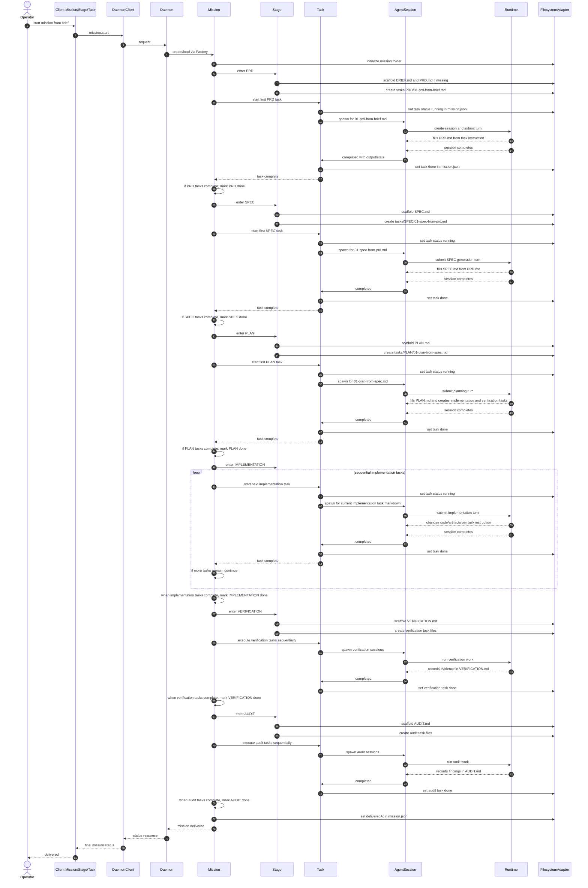

# Example Mission Cycle

This document describes a target end-to-end Mission cycle as an executable object model example.

It is intentionally written as a behavioral reference, not as a literal description of every current implementation detail.

The key architectural assumption in this example is:

- `Mission` owns workflow policy and stage progression.
- `Stage` owns stage scaffolding and default task creation.
- `Task` owns task execution.
- `AgentSession` is owned by `Task`, not by `Mission`.

That last point is the important correction: Mission should decide whether a task may run, but the running session itself belongs to the task that spawned it.

## Example Mission

Example mission:

- Title: `Task-owned agent sessions`
- Goal: refactor Mission so agent sessions are task-owned instead of mission-owned

Canonical product flow in this example:

1. `BRIEF.md` provides the intake context.
2. `PRD.md` is generated from the brief.
3. `SPEC.md` is generated from the PRD.
4. `PLAN.md` is generated from the spec and defines implementation and verification slices.
5. implementation task markdown files are then executed sequentially.
6. `VERIFICATION.md` and verification tasks close the technical validation loop.
7. `AUDIT.md` and audit tasks close the delivery loop.

## Sequence Diagram

## Step Analysis

### 1. Intake

Actors:

- Operator
- Client `Mission`
- `Daemon`
- `Factory`
- daemon `Mission`

Products:

- `BRIEF.md`
- mission directory
- `mission.json`

Notes:

- The mission begins from brief context only.
- At this point there is no agent session yet.

### 2. PRD Stage Start

Actors:

- daemon `Mission`
- `Stage(prd)`
- `Task(prd/01-prd-from-brief.md)`
- `FilesystemAdapter`

Products:

- `PRD.md`
- `tasks/PRD/01-prd-from-brief.md`
- task control state in `mission.json`

Notes:

- Stage owns scaffolding.
- Task file is the execution contract for the next actor.

### 3. PRD Task Execution

Actors:

- daemon `Task`
- `AgentSession`
- runtime provider

Products:

- updated `PRD.md`
- session record under the machine-local daemon runtime directory keyed by repo root
- task state update in `mission.json`

Notes:

- This is the step that justifies task-owned sessions.
- The session exists because a task is running, not because the mission generally exists.

### 4. Stage Completion Check

Actors:

- daemon `Mission`

Products:

- updated stage status in derived `MissionStatus`

Notes:

- `Mission` should not do task work.
- `Mission` only evaluates whether all tasks in the current stage are done.

### 5. SPEC Stage Start and Execution

Actors:

- daemon `Mission`
- `Stage(spec)`
- `Task(spec/01-spec-from-prd.md)`
- `AgentSession`

Products:

- `SPEC.md`
- `tasks/SPEC/01-spec-from-prd.md`
- updated `mission.json`

Notes:

- The SPEC task consumes PRD as input and produces SPEC as output.

### 6. PLAN Stage Start and Execution

Actors:

- daemon `Mission`
- `Stage(plan)`
- `Task(plan/01-plan-from-spec.md)`
- `AgentSession`

Products:

- `PLAN.md`
- `tasks/PLAN/01-plan-from-spec.md`
- later implementation task files generated from the plan
- later verification task files generated from the plan

Notes:

- `PLAN` is its own lifecycle stage, not a prelude hidden inside implementation.
- That gives implementation a formal decomposition checkpoint before code-writing tasks begin.
- The plan task is the point where the mission expands into concrete implementation and verification work.

### 7. Sequential Implementation Tasks

Actors:

- daemon `Mission`
- daemon `Task`
- `AgentSession`
- runtime provider

Products:

- source-code changes
- artifact updates as needed
- task markdown files for each implementation slice
- task state updates in `mission.json`

Notes:

- Mission starts only the next eligible task.
- Each task owns exactly one active execution session at a time.
- This gives a clean invariant: active session follows active task.

### 8. Verification Cycle

Actors:

- daemon `Mission`
- `Stage(verification)`
- verification `Task`
- `AgentSession`

Products:

- `VERIFICATION.md`
- verification task files
- verification evidence

Notes:

- Verification is not just a status flag.
- It is its own stage with its own products and task execution loop.

### 9. Audit Cycle

Actors:

- daemon `Mission`
- `Stage(audit)`
- audit `Task`
- `AgentSession`

Products:

- `AUDIT.md`
- audit task files
- delivery readiness findings

Notes:

- Audit is the governance stage before delivery.

### 10. Delivery

Actors:

- daemon `Mission`
- `FilesystemAdapter`

Products:

- `mission.json` with `deliveredAt`

Notes:

- Delivery is a mission-level policy transition.
- No session is required for the delivery state transition itself.

## Architectural Conclusion

This example implies the following object model:

- `Mission` owns stage orchestration and workflow policy.
- `Stage` owns scaffolding and default task definition.
- `Task` owns execution and completion.
- `AgentSession` is a child of `Task` and represents a concrete execution attempt.

That means session persistence should conceptually hang off the task lifecycle, even if the runtime state file remains machine-local outside the repository.

## Testability Value

This example can later become a behavioral test fixture.

The most useful assertions would be:

1. starting a mission enters PRD and creates exactly the PRD stage products
2. starting a task creates a task-owned session
3. finishing the session marks the task done
4. finishing all tasks marks the stage done
5. finishing a stage starts the next stage only when its prerequisites are satisfied
6. delivery writes only mission-level completion state