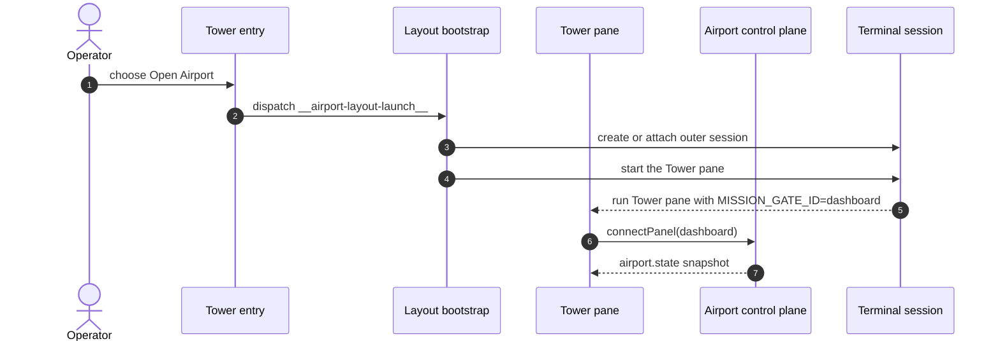

# Tower Layout And Routing

This document defines the terminal Tower shell layout and routing contract.

It replaces the older app-local implementation note that lived under the terminal package.

This is development-stage material.

It belongs in the airport-spec mission dossier until the Tower shell contract is stable enough to promote into the root product documentation.

It describes the stable shell structure that the Tower must present once launched.

It does not define workflow semantics, command availability, or daemon authority rules beyond what is needed to explain shell routing.

For the broader control-surface command contract, see [Workflow Control Surface](controller/workflow-control-surface.md).

## Scope

This document defines:

- launch entry behavior that determines the initial Tower context
- the shell regions that remain stable while the Tower is running
- the top-level routing model for repository and mission work
- focus order expectations for the terminal Tower surface
- invariants that keep repository flows and mission-control content separate

This document does not define:

- the outer airport layout bootstrap around the Tower
- operator command semantics
- mission workflow semantics
- daemon-side gate bindings or airport control-plane policy

## Launch Boundary

The terminal Tower can be launched from either the repository checkout or a mission worktree.

- Launching from the repository checkout opens repository mode.
- Launching from a mission worktree auto-selects that mission and opens mission mode.

The terminal Tower may run inside a larger airport layout bootstrapped through the terminal manager, but that outer layout is not the same thing as the Tower shell.

The airport layout bootstrap is responsible for creating or attaching the outer session, restoring the initial pane arrangement, and starting the Tower, pilot, and editor panes.

In this document, `mission` refers only to the domain work model: missions contain stages, stages contain tasks, and tasks may spawn agents.

The shell entry used to open Airport is not itself a domain mission. It is only an entry path into the Tower and Airport runtime.

Once that outer airport layout exists, Airport owns the authoritative gate bindings, focus intent, and substrate reconciliation.



Diagram key:

- `Entry`: the operator-facing Tower entry concept. In the current terminal implementation this resolves through the `mission` shell command plus `apps/tower/terminal/src/index.ts` and `apps/tower/terminal/src/routeTowerEntry.ts`
- `LayoutBootstrap`: `apps/tower/terminal/src/commands/airport-layout.ts`
- `TowerPane`: `apps/tower/terminal/src/tower/bootstrapTowerPane.ts`
- `Airport`: `packages/airport/src/AirportControl.ts`
- `Session`: terminal-manager or zellij session

Reading guide:

- `Entry` and `LayoutBootstrap` open and bootstrap the outer layout.
- Authority transfers when `TowerPane` calls `connectPanel(dashboard)`.
- After that handoff, `Airport` owns bindings, focus intent, and substrate reconciliation.

From that point onward, the Tower is a surface client and not the layout authority.

This document only describes the Tower surface itself.

## Startup Sequence

The current terminal startup path has several layers.

They are not the same responsibility, even though the current file names make them look similar.

The sequence is:

1. shell entry script
2. node or bun executable entry
3. terminal command router
4. airport layout bootstrap or Tower pane bootstrap
5. Tower UI runtime host
6. Tower UI controller

### Responsibility By File

1. `mission` shell entry script

  Responsibility: choose the runtime path before TypeScript starts.

  It decides whether to:

  - bootstrap the outer airport layout through terminal-manager
  - launch a single Tower pane directly
  - run in HMR mode
  - pass through special command modes

  It also sets environment variables such as `MISSION_GATE_ID`, `MISSION_DAEMON_COMMAND`, and terminal-manager related flags before executing `apps/tower/terminal/src/index.ts`.

2. `apps/tower/terminal/src/index.ts`

  Responsibility: executable adapter only.

  It does not contain routing or Tower logic.

  It only forwards control to `routeTowerEntry()` in `apps/tower/terminal/src/routeTowerEntry.ts`.

3. `apps/tower/terminal/src/routeTowerEntry.ts`

  Responsibility: terminal entry router.

  This file is not the Tower UI.

  It parses the command shape and dispatches to one of several handlers:

  - `bootstrapTowerPane` for the dashboard pane
  - `runAirportLayoutLaunch` for outer airport bootstrap
  - `runAirportLayoutPilotPane` for the pilot pane
  - `runAirportLayoutEditorPane` for the editor pane
  - utility commands such as airport status or daemon stop

  Architecturally, this file is a command router and should be read that way.

4. `apps/tower/terminal/src/commands/airport-layout.ts`

  Responsibility: airport layout bootstrap.

  This file owns the outer terminal session setup.

  It writes layout files, resets or creates the terminal-manager session, and starts the Tower, Pilot, and Editor panes inside that session.

  It does not own ongoing layout authority after panes connect.

5. `apps/tower/terminal/src/tower/bootstrapTowerPane.ts`

  Responsibility: Tower pane bootstrap.

  This is the non-visual startup for the Tower pane itself.

  It:

  - validates flags
  - resolves workspace context and mission selector
  - applies the initial theme
  - connects the pane to the daemon
  - registers the pane through `api.airport.connectPanel(...)`
  - fetches the initial operator status
  - optionally plays the startup banner
  - lazy-loads the UI runtime host

  This file prepares the Tower pane to render, but does not render the UI itself.

6. `apps/tower/terminal/src/tower/mountTowerUi.tsx`

  Responsibility: Tower UI runtime host.

  It creates the OpenTUI renderer, mounts the root UI component, and handles renderer teardown on process signals.

  It does not decide layout bootstrap or daemon authority.

7. `apps/tower/terminal/src/tower/TowerController.tsx`

  Responsibility: Tower UI controller and shell behavior.

  This is the actual application surface.

  It owns interactive Tower state, focus behavior, routing inside the shell, command flows, and rendering decisions after startup completes.

### Architectural Summary

- `mission` is a shell entry script, not the Tower itself.
- `routeTowerEntry.ts` is an entry router, not the Tower UI.
- `bootstrapTowerPane.ts` is the Tower pane bootstrap, not the renderer host.
- `mountTowerUi.tsx` is the renderer host, not the control surface policy.
- `TowerController.tsx` is the actual Tower surface controller.

If these names are kept in code, the docs should continue to describe them by role rather than by filename alone.

## Design Goals

1. Keep the shell layout fixed and easy to reason about.
2. Restrict top-level Tower routing to repository work or one active mission.
3. Separate shell context selection from center-panel content routing.
4. Keep repository setup and intake flows in a dedicated center panel.
5. Keep the command panel visible across both repository and mission work.
6. Keep mission mode deterministic and centered on the flight deck.

## Shell Layout

The Tower shell uses one persistent vertical stack:

1. header
2. center panel
3. command panel
4. key hints row

### Header

The header is always visible.

It shows connection and repository state and exposes the top-level tab strip for mission tabs and the repository tab.

When a mission context is active, the header also shows mission identity details.

### Center Panel

The center panel owns the primary routed content.

Exactly one center route is active at a time.

The active route is determined from the current top-level Tower mode.

### Command Panel

The command panel is always visible.

It remains the stable execution surface for slash commands, command entry, and mission actions that are not being collected through a center-panel flow.

Repository flows must not replace or hide the command panel.

### Key Hints Row

The key hints row is always visible.

It is a single-line shell hint region that reflects the current focus area and interaction mode.

## Top-Level Context Model

The Tower selects between exactly two shell contexts:

```ts
type TowerContext =
  | { kind: 'repository' }
  | { kind: 'mission'; missionId: string }
```

The repository context represents repository-wide work from the control checkout.

The mission context represents one selected mission worktree.

Legacy `control` naming is obsolete here.

`repository` is the correct top-level term for the non-mission Tower surface.

## Top-Level Mode Model

The shell mode derived from context is:

```ts
type TowerMode = 'repository' | 'mission'
```

There are no additional top-level Tower modes.

In particular, the Tower does not expose a separate daemon-log mode and does not treat overlays as alternate shell modes.

## Header Tabs

The header tab strip represents selectable mission contexts plus one global repository tab:

- mission tabs
- `REPOSITORY`

Ordering rules:

1. mission tabs in mission ordering
2. `REPOSITORY`

Selection rules:

- selecting a mission tab activates mission mode for that mission
- selecting `REPOSITORY` activates repository mode
- selecting `REPOSITORY` clears the active mission context for the shell surface

## Center Routes

The center route model is:

```ts
type CenterRoute =
  | { kind: 'repository-flow' }
  | { kind: 'mission-control' }
```

### Repository Mode

Repository mode routes the center panel to the repository flow surface.

This is the repository-facing setup and intake surface for the Tower.

The center panel must remain in repository flow mode whenever the shell is in repository mode.

The repository flow surface may change step type internally, but the shell must keep one stable center region while the flow advances.

Supported step classes are:

1. single selection
2. multi selection
3. text input

Repository text entry for an active flow belongs in the center flow surface, not in the command panel.

### Mission Mode

Mission mode routes the center panel to the mission flight deck.

The center region is owned entirely by the mission-control tree while mission mode is active.

Mission selection must never fall back to repository flow content.

Repository setup or intake flows must stop owning the center panel as soon as the shell switches to mission mode.

## Overlay Model

The Tower may render overlays on top of the shell without redefining the shell layout.

```ts
type ShellOverlay =
  | { kind: 'none' }
  | { kind: 'command-select' }
  | { kind: 'mission-flow' }
```

Overlays are layered behavior.

They are not top-level shell routes.

## Focus Model

Repository mode focus order:

1. header
2. flow
3. command

Mission mode focus order:

1. header
2. tree
3. command

The current focus-area vocabulary is:

```ts
type FocusArea = 'header' | 'tree' | 'flow' | 'command'
```

The Tower no longer models an internal console focus area in the shell.

Operator output and attached session views belong to the surrounding runtime environment rather than to an internal Tower console pane.

## Routing Invariants

The following rules must remain true:

1. The command panel stays visible in both repository and mission mode.
2. Repository flow content only appears while the shell is in repository mode.
3. Mission-control content only appears while the shell is in mission mode.
4. Switching header tabs changes shell context first and center-panel content second.
5. Overlay activation never creates a new top-level Tower mode.
6. Repository flow input does not displace the command panel.

## Acceptance Criteria

### Repository Mode

- selecting `REPOSITORY` always shows the repository flow surface in the center panel
- the command panel remains visible
- flow steps support single-select, multi-select, and text-entry states
- repository flow text steps are edited in the center flow surface

### Mission Mode

- selecting a mission tab always shows the mission flight deck in the center panel
- repository flow content does not remain mounted as the visible center route
- the command panel remains visible
- focus order remains header, tree, command

## Relationship To Other Tower Material

This document defines shell layout and routing only.

It stays in the airport-spec dossier until the Tower shell contract is ready for promotion into the root Tower docs.