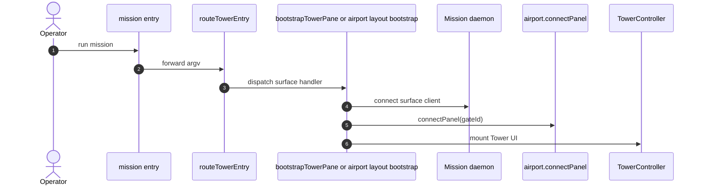

# Tower Layout

The Tower is Mission's terminal surface, not Mission's layout authority.

That distinction matters operationally. The operator sees the Tower, but the daemon and airport control plane own the authoritative gate bindings, focus intent, and panel registration state after startup handoff. Tower projects that state and provides interactive control over it.

## Startup Layering

The current startup path is deliberately layered:

1. `mission` shell entry determines whether to launch Tower directly or bootstrap the broader airport layout.
2. `routeTowerEntry` parses the command and dispatches to the appropriate handler.
3. Mission either boots the airport layout or starts a Tower pane.
4. The pane connects to the daemon and registers itself through `airport.connectPanel(...)`.
5. The UI runtime mounts.
6. `TowerController` becomes the active surface controller.

The public router currently exposes `mission` as the default Tower entry and supports the internal airport pane launch commands only as bootstrap hooks. Those internal hooks are not the public CLI surface.

## Repository Mode Versus Mission Mode

The Tower shell has two top-level contexts:

- repository mode
- mission mode

Launching from a mission worktree auto-selects that mission. Launching from the repository checkout opens repository mode. In the UI controller this distinction becomes a `TowerMode` of either `repository` or `mission`, and the center route is then projected from the selected shell target and the daemon snapshot.

Repository mode is used for repository-wide intake and setup flows. Mission mode is used to inspect and control a selected mission's stage rail, task tree, sessions, and actions.

## The Current Shell Stack

The Tower shell currently renders as a fixed vertical stack:

1. Header
2. Center panel
3. Command panel
4. Key hints row

This is not aspirational. `TowerScreen.tsx` renders those four layers directly.

### Header

The header stays visible at all times. It carries:

- panel title and workspace context
- repository or mission tabs
- stage rail items
- status lines and footer badges

In mission mode, the header reflects the selected mission context and stage rail projection supplied by daemon state.

### Center Panel

The center panel is the main routed surface. The current controller resolves two primary center routes:

- repository flow
- mission control

Which route appears is driven by shell mode and the dashboard airport projection. The center panel is where repository flows and mission-control content are rendered, but it is still downstream of daemon state and airport projection.

### Command Panel

The command panel remains visible across the shell. It is the stable entry point for commands, action execution, and confirmation flows. Repository flows do not replace it.

### Key Hints Row

The bottom row displays command help and key hints based on the current focus area. It is always present and acts as the shell's lightweight interaction legend.

## Gate And Panel Terminology

Tower panels are launched with an injected airport gate id. The current bootstrap expects one of:

- `dashboard`
- `editor`
- `agentSession`

When the Tower pane connects, it registers that gate with the daemon through the airport API. At that point, layout authority belongs to airport state, not to Tower-local assumptions.

This is the boundary to remember:

- Tower is the surface client
- Airport and daemon projections are the layout authority

That boundary is what allows pane registration, focus reconciliation, and mission selection to survive beyond any one surface process.