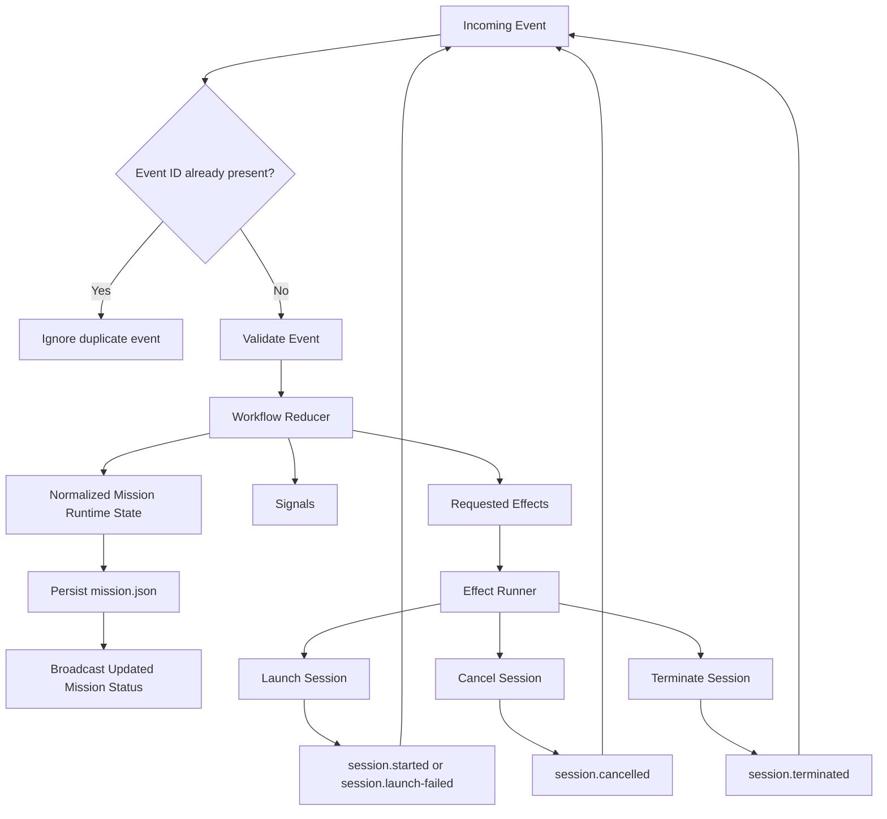
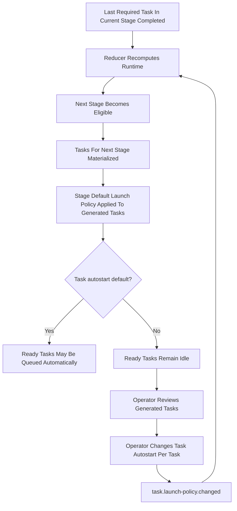

# Workflow Engine Definition Specification

This document defines the target design for the next-generation Mission workflow engine.

This is a from-scratch specification.

It does not preserve compatibility with the current workflow engine, current `mission.json` schema, current stage runtime model, or current imperative gate-check APIs.

The purpose of this document is to establish the exact engine contract before implementation.

## Goals

The workflow engine must be:

- configuration-driven
- mission-local and reproducible
- event-driven
- reducer-based
- explicit about side effects
- human-interruptible by design
- capable of full panic stop behavior
- task-centric in execution semantics
- stage-centric only as a structural and derived concept

## Core Principles

1. Workflow behavior is defined by configuration, not by UI heuristics or daemon loops.
2. Once a mission starts, workflow settings are snapshotted into `mission.json` and become the authoritative runtime policy for that mission.
3. Runtime changes happen only through events.
4. The workflow reducer is the only component allowed to change workflow runtime state.
5. Side effects such as launching or terminating agent sessions are not state transitions. They are requested effects emitted by the reducer.
6. Stages do not execute work. Tasks execute work.
7. Stage state is derived from task state and workflow structure.
8. Human-in-the-loop behavior is implemented as mission orchestration policy, not as stage runtime pause state.
9. Stage checkpoints are modeled as suppression of task auto-launch for newly ready tasks in that stage.
10. Task launch policy is copied from stage defaults into generated task runtime settings and may then be edited per task.

## Non-Goals

This design does not attempt to preserve:

- the current `Mission` aggregate public API
- the current `MissionControlState` schema version
- the current stage `start` and `restart` command contract
- the current autopilot loop behavior as the source of workflow semantics
- the current split between task transition rules and imperative gate evaluation
- the current `MissionControlState` reconstruction flow from filesystem task discovery
- the current `Stage` domain object and any imperative stage runtime behavior
- the current workflow manifest transition evaluators and launch eligibility helpers
- the current protocol shape built around `stage.transition`, `task.activate`, `task.block`, and `task.complete`
- compatibility aliases that preserve old workflow terminology beside the new runtime model

## Clean Break Requirement

This engine is a replacement, not an adaptation layer.

Implementation must assume a full semantic reset of workflow runtime behavior.

That means:

- no backward compatibility layer is required
- no fallback to the previous workflow engine is allowed
- no aliasing of old workflow state types into new runtime types is allowed
- no preservation of legacy command semantics is allowed when they conflict with the new model
- no reuse of existing workflow logic is allowed merely to reduce implementation effort

The purpose of this requirement is to prevent a mixed architecture where the new reducer exists on paper but legacy control flow still determines behavior.

## Legacy Replacement Rules

When implementing the new engine, existing code must be evaluated by role.

### 1. Delete and Replace Legacy Workflow Semantics

Any existing module that encodes workflow semantics from the old architecture must be deleted or replaced, not adapted.

This includes any code that does one or more of the following:

- treats a stage as a runtime actor with start, restart, enter, or adjacency behavior
- reconstructs runtime state by scanning task files or stage directories
- derives authoritative task or stage status from filesystem presence rather than persisted workflow runtime state
- evaluates workflow transitions through imperative manifest rules outside the reducer
- runs daemon-side autopilot loops that mutate task or stage progress outside the event pipeline
- exposes protocol or UI actions centered on stage runtime control rather than mission and task events

### 2. Retain Only Neutral Infrastructure

Existing code may be retained only if it is reduced to neutral infrastructure.

Examples of infrastructure that may survive after refactoring:

- low-level filesystem persistence utilities
- agent runtime providers and session execution adapters
- IPC transport and request routing infrastructure
- task or artifact template rendering utilities

These components must not remain responsible for workflow policy, workflow state transitions, or workflow truth.

### 3. One Authoritative Runtime Record

The new mission runtime document in `mission.json` is the only authoritative workflow runtime record.

Therefore:

- task markdown files are mission artifacts or task definitions, not runtime state
- artifact presence is not workflow state
- directory scans must not rebuild workflow runtime state
- runtime reconciliation must operate from persisted workflow state and external runner facts, not from legacy control-file heuristics

### 4. No Compatibility Terminology Layer

The implementation must not preserve old workflow concepts through renamed wrappers or alias types.

Examples of forbidden patterns:

- exporting old task status enums beside new lifecycle enums
- keeping old stage progress types as "temporary" compatibility shims
- translating new reducer outcomes back into old stage-control terminology for internal use
- retaining old command IDs as hidden synonyms for new commands

If a concept is obsolete in the new model, it should disappear from the workflow implementation surface.

### 5. Rewrite Tests to Match the New Contract

Tests that codify legacy workflow semantics must be removed or rewritten.

The new test suite should validate:

- reducer behavior
- projection derivation
- effect emission
- event ingestion and deduplication
- reconciliation behavior after restart

It should not preserve tests that assert the old stage runtime model, old manifest transition rules, or old autopilot progression behavior.

## Conceptual Model

The system has three layers.

### 1. Workflow Definition

This is static policy.

It defines:

- stage order
- gate rules
- task generation rules
- task template sources
- default task launch policy per stage
- mission-level human interrupt policy
- panic policy
- concurrency policy

Task template files belong to the workflow definition layer.

They are inputs used to generate concrete task runtime records.

They are not live runtime state.

### 2. Mission Runtime State

This is the durable, mission-local state stored in `mission.json`.

It contains:

- snapshotted workflow settings
- mission lifecycle state
- stage projections
- task runtime state
- agent session runtime state
- gate projections
- mission pause state
- panic state
- recent event log

### 3. Workflow Engine

This is a pure reducer plus an effect planner.

It accepts:

- current mission runtime state
- one workflow event

It returns:

- next mission runtime state
- emitted workflow signals
- requested runtime effects

## Execution Ownership

Execution semantics belong to tasks and sessions.

Stages are structural.

`MissionStageId` is configuration-defined.

```ts
export type MissionStageId = string;
```

That means:

- a task may be ready, queued, running, blocked, completed, failed, or cancelled
- a session may be starting, running, completed, failed, cancelled, or terminated
- a stage may be pending, ready, active, blocked, or completed, but only as a derived projection

The engine must not model a stage as a separately paused or running actor.

## Mission Lifecycle

Mission lifecycle is orchestration state.

```ts
export type MissionLifecycleState =
  | 'draft'
  | 'ready'
  | 'running'
  | 'paused'
  | 'panicked'
  | 'completed'
  | 'delivered';
```

Definitions:

- `draft`: mission record exists but runtime has not started yet
- `ready`: mission is initialized and may begin processing
- `running`: engine is allowed to launch work automatically
- `paused`: engine may not auto-launch new work until resumed by a human event
- `panicked`: engine has halted, active sessions are being terminated or already terminated, and no automatic progression is allowed
- `completed`: all workflow work is complete but mission has not yet been delivered
- `delivered`: delivery action has been completed

## Lifecycle Invariants

Mission lifecycle is authoritative.

`pause` and `panic` are supporting state that must remain consistent with lifecycle.

Required invariants:

- if `runtime.lifecycle === 'paused'`, then `runtime.pause.paused` must be `true`
- if `runtime.pause.paused === true`, then `runtime.lifecycle` must be `paused`
- if `runtime.lifecycle === 'panicked'`, then `runtime.panic.active` must be `true`
- if `runtime.panic.active === true`, then `runtime.lifecycle` must be `panicked`
- if `runtime.lifecycle === 'running'`, then `runtime.pause.paused` must be `false` and `runtime.panic.active` must be `false`
- `mission.resumed` must not be accepted while `runtime.panic.active === true`
- `mission.panic.cleared` clears panic state and moves mission lifecycle to `paused`; a separate `mission.resumed` event is required before automatic launches resume

## Derived Stage State

Stage state is derived.

```ts
export type MissionStageDerivedState =
  | 'pending'
  | 'ready'
  | 'active'
  | 'blocked'
  | 'completed';
```

Definitions:

- `pending`: prior stage completion conditions have not been satisfied
- `ready`: the stage is eligible and contains one or more ready tasks, but no tasks are currently queued or running
- `active`: the stage contains one or more queued or running tasks
- `blocked`: the stage is eligible but no progress can be made because relevant remaining tasks are blocked or require manual start
- `completed`: all required tasks in the stage are completed

Important:

- the engine does not store stage runtime control flags like `paused`
- a human checkpoint before a stage does not pause the stage
- it prevents auto-launch of newly ready tasks in that stage

## Task Runtime State

Task runtime state is authoritative for execution.

```ts
export type MissionTaskLifecycleState =
  | 'pending'
  | 'ready'
  | 'queued'
  | 'running'
  | 'blocked'
  | 'completed'
  | 'failed'
  | 'cancelled';

export type MissionTaskLaunchMode = 'automatic' | 'manual';

export interface MissionTaskRuntimeSettings {
  autostart: boolean;
  launchMode: MissionTaskLaunchMode;
}

export interface MissionTaskRuntimeState {
  taskId: string;
  stageId: MissionStageId;
  title: string;
  instruction: string;
  dependsOn: string[];
  lifecycle: MissionTaskLifecycleState;
  blockedByTaskIds: string[];
  runtime: MissionTaskRuntimeSettings;
  agentRunner?: string;
  retries: number;
  createdAt: string;
  updatedAt: string;
  completedAt?: string;
  failedAt?: string;
  cancelledAt?: string;
}
```

The generated task runtime record snapshots the execution payload.

That means:

- rendered title and instruction content used for execution live in task runtime state
- template-backed task definitions may be the source of that content during generation
- after generation, agent sessions launch from generated task runtime state, not by rereading workflow template files
- `blockedByTaskIds` is derived dependency blocking only; it is not a stored explanation for explicit human or system blocking

## Task and Session Coupling

Tasks are the workflow execution unit.

Sessions are external runtime instances that may execute work on behalf of a task.

Rules:

- a task may have multiple historical session records over its lifetime
- a task may have at most one active session at a time, where active means `starting` or `running`
- if the reducer determines that a ready task should launch automatically, it moves that task to `queued`, appends a launch request, and emits `session.launch` in the same reduce cycle
- `task.queued` is reserved for explicit human- or system-triggered queueing of a ready task
- for agent-backed execution, `session.started` moves the task from `queued` to `running`
- `task.started` is reserved for execution paths that do not create an agent session; it should not be emitted redundantly for agent-backed launches
- `session.completed` updates session state only; task completion remains explicit and requires `task.completed`
- `session.failed` moves the task to `failed`
- `session.cancelled` and `session.terminated` move the task to `cancelled`
- `task.reopened` is the only event that returns a `completed`, `failed`, or `cancelled` task to an executable state

### Task Autostart Semantics

`autostart` means:

- if the task becomes `ready`
- and the mission lifecycle allows auto-execution
- and concurrency rules permit new work
- and no panic or global pause is in effect

then the engine may emit a launch effect for the task.

If `autostart` is `false`, the task becomes `ready` but remains idle until a human-triggered event explicitly starts it.

## Stage-Level Task Launch Defaults

Stages define default task launch policy. They do not define stage execution state.

```ts
export interface WorkflowStageTaskLaunchPolicy {
  defaultAutostart: boolean;
  launchMode: MissionTaskLaunchMode;
}

export interface WorkflowStageDefinition {
  stageId: MissionStageId;
  displayName: string;
  taskLaunchPolicy: WorkflowStageTaskLaunchPolicy;
  completionPolicy: {
    requireAllTasksCompleted: boolean;
  };
}

export interface WorkflowGeneratedTaskDefinition {
  taskId: string;
  title: string;
  instruction: string;
  dependsOn: string[];
  agentRunner?: string;
}

export interface WorkflowTaskTemplateSource {
  templateId: string;
  path: string;
}

export interface WorkflowTaskGenerationRule {
  stageId: MissionStageId;
  templateSources: WorkflowTaskTemplateSource[];
  tasks: WorkflowGeneratedTaskDefinition[];
}

export interface WorkflowGateDefinition {
  gateId: string;
  intent: 'implement' | 'verify' | 'audit' | 'deliver';
  stageId?: MissionStageId;
}
```

When tasks are generated for a stage, each task instance receives a copy of the stage default launch policy.

After generation, the task instance owns runtime truth.

That means the operator may change:

- one implementation task to `autostart: true`
- another implementation task to `autostart: false`

without changing stage policy.

Task template source paths belong to workflow definition and may be file-backed, including markdown templates.

Task templates are resolved during task generation and must not be consulted later as live runtime state.

## Human-In-The-Loop Model

Human intervention belongs to mission orchestration.

```ts
export type MissionPauseReason =
  | 'human-requested'
  | 'panic'
  | 'checkpoint'
  | 'agent-failure'
  | 'system';

export interface MissionPauseState {
  paused: boolean;
  reason?: MissionPauseReason;
  requestedAt?: string;
}
```

There is no task-scoped or session-scoped mission pause model in this specification.

Checkpoint behavior is implemented by one or both of these policies:

1. mission lifecycle enters `paused`
2. tasks in a newly eligible stage are created with `autostart: false`

## Panic Model

Panic is a first-class mission runtime state.

```ts
export interface MissionPanicState {
  active: boolean;
  requestedAt?: string;
  requestedBy?: 'human' | 'system';
  terminateSessions: boolean;
  clearLaunchQueue: boolean;
  haltMission: boolean;
}
```

When panic is triggered:

1. the mission lifecycle becomes `panicked`
2. all queued launches are discarded if configured
3. all active sessions receive termination effects if configured
4. no auto-launch is allowed until a human resume event occurs

## Global Workflow Settings


```ts
export interface WorkflowMissionAutostartSettings {
  mission: boolean;
}

export interface WorkflowHumanInLoopSettings {
  enabled: boolean;
  pauseOnMissionStart: boolean;
  pauseOnTaskFailure: boolean;
  pauseOnTaskCompletion: boolean;
}

export interface WorkflowPanicSettings {
  terminateSessions: boolean;
  clearLaunchQueue: boolean;
  haltMission: boolean;
}

export interface WorkflowExecutionSettings {
  maxParallelTasks: number;
  maxParallelSessions: number;
}

export interface WorkflowGlobalSettings {
  autostart: WorkflowMissionAutostartSettings;
  humanInLoop: WorkflowHumanInLoopSettings;
  panic: WorkflowPanicSettings;
  execution: WorkflowExecutionSettings;
  stageOrder: MissionStageId[];
  stages: Record<MissionStageId, WorkflowStageDefinition>;
  taskGeneration: WorkflowTaskGenerationRule[];
  gates: WorkflowGateDefinition[];
}

export interface MissionDaemonSettings {
  agentRunner?: string;
  defaultAgentMode?: 'interactive' | 'autonomous';
  defaultModel?: string;
  cockpitTheme?: string;
  trackingProvider?: 'github';
  instructionsPath?: string;
  skillsPath?: string;
  workflow?: WorkflowGlobalSettings;
}
```

`stageOrder` is authoritative workflow structure.

Rules:

- `stageOrder` must list each configured stage exactly once
- `stages` must contain definitions for every stage id named in `stageOrder`
- task generation rules and gate definitions must reference only configured stage ids

## Mission Snapshot Rule

When a mission starts, the effective workflow settings are copied into `mission.json`.

After that point:

- global settings may change
- existing missions must not change behavior automatically

This is required for reproducibility and debuggability.

The snapshot should also record a workflow definition version identifier.

This may be any stable string such as a settings revision or workflow version.

## Mission Runtime Document

The mission-local runtime document is the authoritative workflow record.

```ts
export interface MissionWorkflowRuntimeDocument {
  schemaVersion: number;
  missionId: string;
  configuration: MissionWorkflowConfigurationSnapshot;
  runtime: MissionWorkflowRuntimeState;
  eventLog: MissionWorkflowEventRecord[];
}

export interface MissionWorkflowConfigurationSnapshot {
  createdAt: string;
  source: 'global-settings';
  workflowVersion: string;
  workflow: WorkflowGlobalSettings;
}

export interface MissionTaskLaunchRequest {
  requestId: string;
  taskId: string;
  requestedAt: string;
  requestedBy: 'system' | 'human' | 'daemon';
  causedByEventId?: string;
}

export interface MissionWorkflowRuntimeState {
  lifecycle: MissionLifecycleState;
  pause: MissionPauseState;
  panic: MissionPanicState;
  stages: MissionStageRuntimeProjection[];
  tasks: MissionTaskRuntimeState[];
  sessions: MissionAgentSessionRuntimeState[];
  gates: MissionGateProjection[];
  launchQueue: MissionTaskLaunchRequest[];
  updatedAt: string;
}
```

`launchQueue` is operational workflow state, not a duplicate task list.

Rules:

- a launch request may exist only for a task whose lifecycle is `queued`
- a task must not have more than one outstanding launch request at a time
- clearing the launch queue removes queued launch requests but does not by itself complete tasks
- when `clearLaunchQueue` is applied during panic, affected queued tasks return to `ready` unless some other rule makes them blocked or cancelled

## Stage Runtime Projection

The stage view in `mission.json` is a projection, not an independently controlled object.

```ts
export interface MissionStageRuntimeProjection {
  stageId: MissionStageId;
  lifecycle: MissionStageDerivedState;
  taskIds: string[];
  readyTaskIds: string[];
  queuedTaskIds: string[];
  runningTaskIds: string[];
  blockedTaskIds: string[];
  completedTaskIds: string[];
  enteredAt?: string;
  completedAt?: string;
}
```

## Agent Session Runtime State

```ts
export type MissionAgentSessionLifecycleState =
  | 'starting'
  | 'running'
  | 'completed'
  | 'failed'
  | 'cancelled'
  | 'terminated';

export interface MissionAgentSessionRuntimeState {
  sessionId: string;
  taskId: string;
  runtimeId: string;
  lifecycle: MissionAgentSessionLifecycleState;
  launchedAt: string;
  updatedAt: string;
  completedAt?: string;
  failedAt?: string;
  cancelledAt?: string;
  terminatedAt?: string;
}
```

## Gate Projections

Gates are projections, not imperative commands.

```ts
export type MissionGateState = 'blocked' | 'passed';

export interface MissionGateProjection {
  gateId: string;
  intent: 'implement' | 'verify' | 'audit' | 'deliver';
  state: MissionGateState;
  stageId?: MissionStageId;
  reasons: string[];
  updatedAt: string;
}
```

Every event that changes task, stage, mission, or session facts must trigger recomputation of gate projections.

Gate evaluation rule:

- a gate with `stageId` evaluates to `passed` exactly when the referenced stage projection is `completed`
- otherwise the gate evaluates to `blocked`
- `reasons` should explain why the referenced stage is not yet completed

## Task Generation Rule

Task materialization is event-driven.

`tasks.generated` is the event that creates task runtime records for a stage.

Rules:

- the reducer must not materialize tasks outside event handling
- when a stage becomes eligible for the first time and no task runtime records exist for that stage, the reducer must emit a `tasks.request-generation` effect
- the external task generation effect handler resolves configured task templates and definitions, then dispatches `tasks.generated`
- automatic launch evaluation for that stage must not proceed until `tasks.generated` has been reduced
- task generation must be deterministic from the workflow configuration snapshot plus the target `stageId`
- a repeated `tasks.generated` event for the same stage must be idempotent and must not create duplicate task runtime records
- `tasks.generated` must carry the full generated task payload needed to create authoritative runtime task records; `taskId` values alone are insufficient
- if a repeated `tasks.generated` event for the same stage carries a different payload for an already existing `taskId`, the event must be rejected rather than partially merged
- if task generation uses template files, the rendered template content must be copied into generated task runtime state at generation time
- agent execution must use the generated task runtime payload, not direct runtime reads of template source files

## Workflow Events

The engine accepts only explicit workflow events.

```ts
export type MissionWorkflowEvent =
  | MissionCreatedEvent
  | MissionStartedEvent
  | MissionResumedEvent
  | MissionPausedEvent
  | PanicStopRequestedEvent
  | PanicStopClearedEvent
  | MissionDeliveredEvent
  | TasksGeneratedEvent
  | TaskLaunchPolicyChangedEvent
  | TaskQueuedEvent
  | TaskStartedEvent
  | TaskMarkedDoneEvent
  | TaskMarkedBlockedEvent
  | TaskReopenedEvent
  | AgentSessionStartedEvent
  | AgentSessionLaunchFailedEvent
  | AgentSessionCompletedEvent
  | AgentSessionFailedEvent
  | AgentSessionCancelledEvent
  | AgentSessionTerminatedEvent;

export interface MissionWorkflowEventBase {
  eventId: string;
  type: string;
  occurredAt: string;
  source: 'system' | 'human' | 'agent' | 'daemon';
  causedByEffectId?: string;
}

export interface MissionCreatedEvent extends MissionWorkflowEventBase {
  type: 'mission.created';
}

export interface MissionStartedEvent extends MissionWorkflowEventBase {
  type: 'mission.started';
}

export interface MissionResumedEvent extends MissionWorkflowEventBase {
  type: 'mission.resumed';
}

export interface MissionPausedEvent extends MissionWorkflowEventBase {
  type: 'mission.paused';
  reason: MissionPauseReason;
}

export interface PanicStopRequestedEvent extends MissionWorkflowEventBase {
  type: 'mission.panic.requested';
}

export interface PanicStopClearedEvent extends MissionWorkflowEventBase {
  type: 'mission.panic.cleared';
}

export interface MissionDeliveredEvent extends MissionWorkflowEventBase {
  type: 'mission.delivered';
}

export interface MissionGeneratedTaskPayload {
  taskId: string;
  title: string;
  instruction: string;
  dependsOn: string[];
  agentRunner?: string;
}

export interface TasksGeneratedEvent extends MissionWorkflowEventBase {
  type: 'tasks.generated';
  stageId: MissionStageId;
  tasks: MissionGeneratedTaskPayload[];
}

export interface TaskLaunchPolicyChangedEvent extends MissionWorkflowEventBase {
  type: 'task.launch-policy.changed';
  taskId: string;
  autostart: boolean;
  launchMode: MissionTaskLaunchMode;
}

export interface TaskQueuedEvent extends MissionWorkflowEventBase {
  type: 'task.queued';
  taskId: string;
}

export interface TaskStartedEvent extends MissionWorkflowEventBase {
  type: 'task.started';
  taskId: string;
}

export interface TaskMarkedDoneEvent extends MissionWorkflowEventBase {
  type: 'task.completed';
  taskId: string;
}

export interface TaskMarkedBlockedEvent extends MissionWorkflowEventBase {
  type: 'task.blocked';
  taskId: string;
  reason?: string;
}

export interface TaskReopenedEvent extends MissionWorkflowEventBase {
  type: 'task.reopened';
  taskId: string;
}

export interface AgentSessionStartedEvent extends MissionWorkflowEventBase {
  type: 'session.started';
  sessionId: string;
  taskId: string;
  runtimeId: string;
}

export interface AgentSessionLaunchFailedEvent extends MissionWorkflowEventBase {
  type: 'session.launch-failed';
  taskId: string;
  reason?: string;
}

export interface AgentSessionCompletedEvent extends MissionWorkflowEventBase {
  type: 'session.completed';
  sessionId: string;
  taskId: string;
}

export interface AgentSessionFailedEvent extends MissionWorkflowEventBase {
  type: 'session.failed';
  sessionId: string;
  taskId: string;
}

export interface AgentSessionCancelledEvent extends MissionWorkflowEventBase {
  type: 'session.cancelled';
  sessionId: string;
  taskId: string;
}

export interface AgentSessionTerminatedEvent extends MissionWorkflowEventBase {
  type: 'session.terminated';
  sessionId: string;
  taskId: string;
}

export interface MissionWorkflowEventRecord {
  eventId: string;
  type: string;
  occurredAt: string;
  source: 'system' | 'human' | 'agent' | 'daemon';
  causedByEffectId?: string;
  payload: Record<string, unknown>;
}
```

## Event Ingestion Rule

Event deduplication happens before reduction.

Rules:

- `eventId` must be unique within a mission event log
- appending an already-seen `eventId` must be rejected or treated as a no-op
- the reducer should only be asked to process newly accepted events
- uniqueness must be checked against the persisted mission event log
- events that fail structural validation, reference unknown entities, or violate required prior-state preconditions must be rejected and must not be appended to the event log
- there is no append-invalid-event diagnostic mode in this specification
- an accepted event and the resulting next runtime state must be persisted together as one authoritative mission document update before external effects are executed

## Reducer Contract

The reducer is pure.

The reducer returns the fully normalized persisted `nextState`.

That means:

- task lifecycle normalization
- launch queue normalization
- stage projections
- gate projections
- mission completion projection

are part of reduction and must already be reflected in `nextState`.

There is no second post-reduction state builder allowed to change persisted workflow state after `reduce()` returns.

```ts
export interface MissionWorkflowSignal {
  signalId: string;
  type:
    | 'stage.ready'
    | 'stage.completed'
    | 'task.ready'
    | 'gate.passed'
    | 'gate.blocked'
    | 'mission.completed'
    | 'mission.delivered-ready';
  emittedAt: string;
  payload: Record<string, unknown>;
}

export interface MissionWorkflowEffect {
  effectId: string;
  type:
    | 'tasks.request-generation'
    | 'session.launch'
    | 'session.terminate'
    | 'session.cancel'
    | 'mission.pause'
    | 'mission.mark-completed';
  payload: Record<string, unknown>;
}

export interface MissionWorkflowReducerResult {
  nextState: MissionWorkflowRuntimeState;
  signals: MissionWorkflowSignal[];
  effects: MissionWorkflowEffect[];
}

export interface MissionWorkflowReducer {
  reduce(
    current: MissionWorkflowRuntimeState,
    event: MissionWorkflowEvent,
    configuration: MissionWorkflowConfigurationSnapshot
  ): MissionWorkflowReducerResult;
}
```

## Effect Runner Contract

The effect runner is not part of the reducer.

It performs requested effects and feeds completion back into the engine as new events.

Requested effects do not create a second durable runtime state machine.

The authoritative durable record remains mission runtime state plus the mission event log.

When an effect outcome is reported back into the engine, the resulting event may include `causedByEffectId` to preserve lightweight correlation.

Examples:

- `session.launch` effect succeeds and generates `session.started`
- a running session later exits successfully and generates `session.completed`
- panic policy emits `session.terminate` for all running sessions

On daemon startup, the effect runner must reload persisted mission runtime, reconcile known session and task facts with the external runner state, and emit follow-up events if needed to restore consistency.

## Core Flow

The runtime flow is:

1. load the persisted mission runtime document
2. receive one event
3. reject the event if its `eventId` already exists in the persisted event log
4. validate event structure and prior-state preconditions; reject the event if validation fails
5. reduce current state using the accepted event
6. receive a fully normalized next runtime state, signals, and requested effects from the reducer
7. persist updated `mission.json` with appended event log entry and next runtime state
8. publish signals and updated mission status
9. execute requested effects outside the reducer
10. feed resulting effect outcomes back as new events

## Mermaid Flow



## Stage Checkpoint Flow

This diagram shows the intended behavior for a stage boundary where the next stage does not auto-launch tasks.



## Critical Derived Rules

The engine must recompute all of the following after every event:

- task blocked-by set
- task readiness
- launch queue eligibility
- stage lifecycle projection
- gate projections
- mission completion projection

The engine must not require a separate imperative “gate check again” operation.

## Stage Completion Rule

A stage becomes `completed` when:

1. its completion policy is satisfied
2. all required tasks in that stage are `completed`

A stage becomes `active` when:

1. it is eligible
2. and one or more tasks in the stage are `queued` or `running`

A stage becomes `ready` when:

1. it is eligible
2. it is not `completed`
3. it has one or more `ready` tasks
4. it has no `queued` or `running` tasks

## Mission Pause Rule

Mission pause prevents auto-launch of new work.

Mission pause does not necessarily:

- terminate active sessions
- cancel queued work

Those behaviors are controlled separately by panic or explicit human commands.

## Panic Rule

Panic always suppresses new launches.

Depending on configured policy, panic may also:

- terminate all active sessions
- clear queued tasks
- force mission lifecycle to remain halted until resume

When panic is cleared:

- `runtime.panic.active` becomes `false`
- `runtime.lifecycle` becomes `paused`
- automatic launch remains suppressed until `mission.resumed`

When panic clears a launch queue:

- launch requests are removed from `launchQueue`
- affected tasks leave `queued`
- affected tasks return to `ready` unless another rule places them in `blocked` or `cancelled`

## Command Model Implication

The daemon and UI should expose commands against these first-class concepts:

- pause mission
- resume mission
- panic stop mission
- clear panic
- mark task done
- mark task blocked
- reopen task
- set task autostart on
- set task autostart off
- start ready task manually

The daemon and UI should not require commands like:

- pause stage
- resume stage
- start stage

unless those commands are purely projections over task policy and mission orchestration, not true runtime stage actions.

## Implementation Consequences

The future implementation should introduce:

1. a new workflow settings object in daemon settings
2. a new mission-local runtime schema in `mission.json`
3. a reducer-driven workflow engine module
4. an effect runner module
5. a projection builder used by the reducer for stage, gate, and command status
6. a migration strategy only if migration is explicitly desired later

No compatibility layer is assumed by this specification.

Implementation should prefer deletion over adaptation when existing code carries old workflow semantics.

The new engine must not be layered on top of the current workflow runtime, current manifest transition system, or current daemon autopilot loop.

## Normative Operational Addendum

This section is normative and closes the minimum operational gaps required for implementation handoff.

### 1. Event Validation Rule

After deduplication by `eventId`, the engine must validate each event before reduction.

Validation failures include:

- unknown `taskId`, `sessionId`, or `stageId` references
- `tasks.generated` for a stage that is not currently eligible
- impossible prior-state transitions
- attempts to mutate entities that this specification treats as immutable for the requested event

Validation failure means:

- the event is rejected
- the event is not appended to the event log
- the reducer is not called

Duplicate `eventId` handling remains a separate no-op rule.

### 2. Task and Session Transition Contract

The engine must enforce at least the following event transition rules.

| Event | Valid prior state | Result |
| --- | --- | --- |
| `mission.started` | `draft` or `ready` | mission enters `running` unless human-in-loop policy requires immediate `paused` |
| `mission.resumed` | `paused` | mission enters `running` |
| `mission.panic.requested` | any non-`delivered` state | mission enters `panicked` |
| `mission.panic.cleared` | `panicked` | mission enters `paused` |
| `mission.delivered` | `completed` | mission enters `delivered` |
| `task.queued` | task `ready` and stage eligible | task enters `queued` and one launch request is appended in the same reduce cycle |
| `task.started` | task `queued` and no agent session is being used | task enters `running` |
| `task.completed` | task `ready` or `running` | task enters `completed` |
| `task.blocked` | task `pending`, `ready`, `queued`, or `running` | task enters `blocked` |
| `task.reopened` | task `completed`, `failed`, or `cancelled` | task re-enters the executable pipeline and is then normalized to `pending`, `ready`, or `blocked` by the reducer |
| `session.started` | task `queued`, no active session for task, matching launch request exists | session record is created, task enters `running`, matching launch request is removed |
| `session.launch-failed` | task `queued`, matching launch request exists, no session exists yet | task enters `failed`, matching launch request is removed |
| `session.completed` | referenced session exists and is `starting` or `running` | session enters `completed`; task state does not complete implicitly |
| `session.failed` | referenced session exists and is `starting` or `running` | session enters `failed`; task enters `failed` |
| `session.cancelled` | referenced session exists and is `starting` or `running` | session enters `cancelled`; task enters `cancelled` |
| `session.terminated` | referenced session exists and is `starting` or `running` | session enters `terminated`; task enters `cancelled` |

Events outside these prior-state rules are invalid and must be rejected.

### 3. Stage Eligibility and Reopen Rule

Stage eligibility is determined strictly by `stageOrder`.

- a stage is eligible exactly when every earlier stage in `stageOrder` is `completed`
- completed stages remain `completed` as projections
- at most one incomplete stage may be eligible at a time: the earliest stage in `stageOrder` whose predecessors are all completed

`task.reopened` in an earlier stage has the following cascade effect:

- the reopened task's stage immediately ceases to be `completed`
- all later incomplete stages become ineligible and therefore project as `pending`
- existing later-stage task records are retained, but they may not be queued or auto-launched while their stage is ineligible
- `task.reopened` must be rejected if any later-stage task is currently `queued` or `running`, or if any later-stage session is `starting` or `running`

This specification does not define automatic downstream rollback beyond those rules.

### 4. Launch Queue and Scheduling Rule

Launch queue ownership is strict.

- when the reducer queues a task, it must set task lifecycle to `queued` and append exactly one matching `launchQueue` entry in the same reduce cycle
- a launch request remains present until one of these events removes it: `session.started`, `session.launch-failed`, panic queue clearing, or explicit cancellation logic
- `launchMode: 'manual'` prevents automatic queueing but does not prevent a human-triggered `task.queued`

Concurrency is counted as follows:

- `maxParallelTasks` counts tasks in `queued` or `running`
- `maxParallelSessions` counts sessions in `starting` or `running`
- a task may be auto-queued only if both limits would still be satisfied after the queue operation

When multiple tasks are eligible for automatic queueing, selection must be deterministic:

- earlier stage in `stageOrder` first
- then lexical `taskId` order within the stage

### 5. Mission Completion and Delivery Rule

Mission completion is derived from workflow state.

- the mission becomes `completed` exactly when every configured stage projection is `completed` and no task remains `queued` or `running` and no session remains `starting` or `running`
- the reducer, not the effect runner, performs the lifecycle transition to `completed`
- `mission.mark-completed`, if emitted, is only an external notification hook and must not be used to mutate workflow state
- when the mission first becomes `completed`, the reducer should emit `mission.completed` and `mission.delivered-ready`
- `mission.delivered` is the only event that moves lifecycle from `completed` to `delivered`

### 6. Reconciliation Rule

Reconciliation after restart must operate by emitting normal workflow events only.

- reconciliation must never mutate persisted workflow state directly
- if persisted runtime says a launch request exists but no session was ever created and the external runner reports launch failure, reconciliation emits `session.launch-failed`
- if persisted runtime says a session is active and the external runner reports it still active, reconciliation emits no state change event
- if persisted runtime says a session is active and the external runner reports terminal completion, reconciliation emits the corresponding terminal session event

These reconciliation events are subject to the same validation, reduction, persistence, and deduplication rules as any other workflow event.

## Decision Summary

This specification establishes the following design decisions:

1. stages are derived, not executed
2. tasks are the execution unit
3. stage checkpoints suppress task auto-launch rather than pausing stages
4. stage launch policy is copied into generated tasks as task runtime policy
5. task runtime launch policy may be edited per task after generation
6. all runtime changes happen via events
7. all external work happens via requested effects
8. mission-level orchestration owns pause and panic behavior
9. gates are derived projections, not imperative checks
10. event deduplication happens at event ingestion, before reduction
11. effect correlation may be recorded via `effectId`, but requested effects do not become a separate durable state machine
12. crash recovery is handled by runtime reconciliation and follow-up events, not by implicit replay heuristics
13. the new engine is a clean-break replacement and must not preserve legacy workflow semantics through fallbacks, aliases, or adaptation layers
14. only neutral infrastructure may be reused; legacy workflow behavior must be deleted or replaced
15. `mission.json` runtime state is the sole authoritative workflow runtime record
