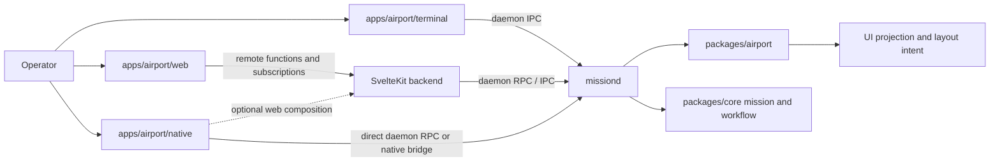

# Application Landscape

This document defines the target application landscape for Airport after Mission expands beyond the terminal-only surface.

It is normative.

It assumes that Mission keeps one daemon-owned runtime authority and adds multiple operator surfaces over that authority.

It does not permit each surface to invent its own backend, projection rules, or application semantics.

This document defines the authoritative structure for:

- the retained Airport terminal surface
- the new Airport web surface
- the new Airport native surface
- the daemon-facing backend boundary for each surface
- the ownership split between daemon, airport projection, web backend, and host-specific adapters

## Status

This is a design specification.

It defines the intended repository and runtime landscape before the new web and native surfaces are fully implemented.

It is allowed to invalidate assumptions that only made sense for the terminal-only product.

That is expected.

## Relationship To Other Specifications

This document must be read alongside the Airport control plane specification and the workflow, mission-model, and agent-runtime specifications.

Priority rule:

1. workflow and mission specifications define mission execution truth and domain ownership
2. the airport control plane specification defines airport selection, layout, and projection authority
3. this document defines how multiple Airport applications and hosts are arranged around that authority
4. individual UI surfaces are implementation details that must conform to the daemon and airport contracts defined above

If a surface-specific implementation conflicts with daemon authority, airport projection authority, or the application boundary rules in this document, the surface implementation is wrong and must change.

## Problem Statement

Mission no longer has only one operator surface problem.

It now has an application landscape problem.

The system must support:

- an existing terminal Airport surface
- a web Airport surface built with SvelteKit and Svelte 5
- a native Airport surface built with Tauri
- one daemon-owned runtime model
- one airport-owned projection layer for UI-facing state
- multiple transports and hosts without duplicating application semantics

The failure mode to avoid is obvious:

- one backend contract for terminal
- a second app-shaped backend hidden inside SvelteKit
- a third backend hidden inside Tauri commands
- duplicated view-model shaping across web and native
- inconsistent action semantics between surfaces
- platform APIs leaking into otherwise shared UI logic

That architecture would produce three applications that happen to share a name.

Mission must instead build one Airport application model with multiple surfaces and hosts.

## Goals

The application landscape must be:

- daemon-authoritative
- projection-oriented
- surface-agnostic at the domain boundary
- explicit about host-specific versus shared application code
- suitable for one shared Svelte application across web and native
- suitable for terminal coexistence during migration
- free of duplicate backend semantics across SvelteKit and Tauri
- suitable for future transport evolution without rewriting the UI twice

## Non-Goals

This specification does not define:

- detailed visual design for the Svelte UI
- the exact Tauri crate configuration
- the exact remote-function file layout for SvelteKit routes
- the exact native packaging or installer strategy
- the retirement plan for the terminal surface

This specification also does not require the terminal surface to be removed before web or native ship.

## Architectural Summary

Mission has one authoritative backend runtime:

- `missiond`

Mission has one repository-scoped UI projection authority:

- `packages/airport`

Mission has three operator-facing Airport surfaces:

1. `apps/airport/terminal`
2. `apps/airport/web`
3. `apps/airport/native`

Those surfaces do not own mission truth.

They do not own airport truth.

They do not define their own command semantics.

They consume daemon-owned and airport-owned semantics through explicitly bounded transports.

## Target Repository Landscape

The target repository landscape is:

| Path | Role |
| --- | --- |
| `packages/core` | daemon, mission, workflow, runtime, repository, and IPC authority |
| `packages/airport` | airport projection and application-facing state shaping over daemon truth |
| `apps/airport/terminal` | existing terminal host and OpenTUI surface |
| `apps/airport/web` | SvelteKit web application and web-specific backend facade |
| `apps/airport/native` | Tauri native host for the same Airport application |

The decisive rule is:

- `apps/airport/web` and `apps/airport/native` are not two different products
- they are two hosts for the same Airport application model

## Topology

Interpretation rules:

- `missiond` remains the only runtime authority.
- `packages/airport` remains the airport projection layer, not a terminal-only package.
- `apps/airport/web` owns web hosting concerns.
- `apps/airport/native` owns native hosting concerns.
- the native surface may compose with web infrastructure for convenience, but that does not make the web backend the new system authority.

## Surface Roles

### `apps/airport/terminal`

The terminal app remains a valid Airport surface.

Its responsibilities remain:

- terminal entry routing
- terminal-manager bootstrap and substrate interaction
- terminal-native rendering
- terminal-only affordances during coexistence

It must continue to behave as a daemon client.

It must not become a compatibility layer that all future surfaces are forced through.

### `apps/airport/web`

The web app is the primary Svelte application host.

It owns:

- SvelteKit routing
- Svelte 5 client UI
- web session and browser delivery concerns
- web-facing server functions and remote functions
- web-specific authentication and request context if needed later

It does not own mission truth.

It does not own airport truth.

It does not replace the daemon.

Its backend role is a web-specific facade over daemon and airport contracts.

### `apps/airport/native`

The native app is the native host for the same Airport application.

It owns:

- Tauri windowing and native packaging
- native permissions and capability wiring
- native-only integrations such as filesystem, notifications, process launching, and OS window control
- native boot and runtime supervision concerns

It must not become a second copy of the Airport frontend.

It should reuse the shared Svelte application rather than reimplementing routes, view-model shaping, and interaction flows separately.

## Shared Application Rule

There must be one shared Airport application at the UI level.

That rule means:

- the route model should be shared
- the component model should be shared
- the application state model should be shared
- query, command, and subscription semantics should be shared
- host-specific APIs must sit behind adapters

The native host must not fork the Svelte application into a second frontend tree unless a native-only screen has no sensible web equivalent.

If native and web diverge heavily in implementation, the architecture has failed.

## Ownership Boundaries

### Daemon ownership

`missiond` owns:

- mission execution truth
- workflow state transitions
- repository and mission selection state
- agent runtime supervision
- airport control and layout truth
- authoritative command semantics

### Airport ownership

`packages/airport` owns:

- projection of daemon and repository state into Airport-facing UI models
- layout intent and selection projection
- surface-facing airport view state contracts
- airport effects and substrate-oriented semantics where relevant

`packages/airport` must not become:

- a Svelte package
- a Tauri plugin layer
- a browser-only state store
- a terminal-only compatibility package

It is the application projection layer, not the renderer.

### Web backend ownership

The SvelteKit backend owns only web-facing application server concerns:

- remote functions
- request-scoped orchestration for browser clients
- web subscription endpoints or web transport adapters
- optional web auth/session mediation

The SvelteKit backend is a backend-for-frontend.

It is not the canonical system boundary.

### Native host ownership

The Tauri layer owns only native host concerns:

- native capability exposure
- native process or daemon launch supervision if required
- secure bridging between frontend code and OS capabilities
- native event forwarding where direct frontend access is not appropriate

The Tauri layer must not redefine business actions or projection rules.

## Transport Model

The transport model is intentionally asymmetric.

### Web transport

The web surface should talk to the SvelteKit backend through web-native application contracts such as:

- remote functions for queries and commands
- WebSocket, SSE, or equivalent subscription transport for live updates

That is a good fit for browser delivery.

### Native transport

The native surface should prefer a direct daemon-facing path for core application data and commands when that path is practical and secure.

Examples include:

- direct daemon RPC over the existing Mission client protocol
- a thin Tauri bridge that forwards typed commands to the daemon
- native event bridging for subscriptions

The native app may use the SvelteKit backend for composition convenience, but that is optional.

It must not be a required extra authority hop for all native behavior unless there is a clear operational reason.

### Canonical rule

The canonical application contract is the daemon and airport contract, not the SvelteKit remote-function surface.

Remote functions are an excellent web adapter.

They are not the canonical definition of Airport itself.

## Backend Boundary Rules

The following rules are mandatory:

1. Web-specific server code must stay inside the web app boundary.
2. Native-specific capability code must stay inside the native app boundary.
3. Shared Svelte UI code must depend on abstract application clients, not directly on `fetch`, remote functions, or Tauri APIs.
4. Shared UI code must not know whether it is running in browser or native host unless the feature is explicitly host-specific.
5. The daemon-facing contract must remain typed and stable enough to support both web and native adapters.

## Recommended Application Interface Shape

The shared Airport application should consume an abstract client surface with three categories:

- queries
- commands
- subscriptions

Representative examples:

- `getOperatorStatus()`
- `getMissionSnapshot(...)`
- `runOperatorAction(...)`
- `setAirportSelection(...)`
- `observeAirportState(...)`
- `observeMissionEvents(...)`

The exact function names may differ.

The architectural requirement is that the shared UI depends on one app-facing interface rather than host APIs directly.

## Why SvelteKit Still Matters

The SvelteKit app is still the primary application shell even though it is not the system authority.

That is correct.

It should own:

- route composition
- page-level data loading shape
- browser delivery
- local client interaction flows
- shared component tree
- UI state and view logic

In other words, the Svelte application is the main operator product.

The daemon is the authority.

The web backend is the web facade.

The native host is the native shell.

Those roles are distinct and must stay distinct.

## Native Composition Rule

The native app should be treated as a host around the shared Svelte application.

That means one of the following implementation strategies is valid:

1. the Tauri app packages the shared SvelteKit frontend build
2. the Tauri app consumes a shared frontend package extracted from the web app
3. the Tauri app reuses the same route and component tree with only host adapters swapped

The invalid strategy is:

- rebuilding the same Airport UI separately inside `apps/airport/native`

## Rollout Guidance

The rollout should proceed in this order:

1. keep `apps/airport/terminal` working as the current operational surface
2. create `apps/airport/web` as the first Svelte-based Airport surface
3. shape the shared Airport application contracts while building web
4. add `apps/airport/native` as a Tauri host over the shared Svelte application
5. move host-specific capabilities behind explicit web and native adapters
6. retire terminal-only assumptions gradually rather than forcing a second rewrite later

This order minimizes duplication.

It also ensures that the Svelte application is designed as a reusable product before the native host arrives.

## Repository Boundary Rules

The repository must preserve these package and application boundaries:

- `packages/core` must not absorb UI framework code
- `packages/airport` must not absorb renderer-specific framework code
- `apps/airport/web` must not become the new daemon authority
- `apps/airport/native` must not become a second application implementation
- `apps/airport/terminal` must not become a required dependency for web or native

## Decision Summary

The target Mission application landscape is therefore:

- one daemon authority
- one airport projection layer
- one terminal surface during coexistence
- one shared Svelte Airport application
- one web host for that application
- one Tauri native host for that application
- web-specific remote functions as an adapter, not as the canonical domain boundary
- native direct daemon access or thin native bridging for native-first capabilities

Anything that produces separate backend semantics or separate frontend application trees for web and native is architectural drift and should be rejected.
