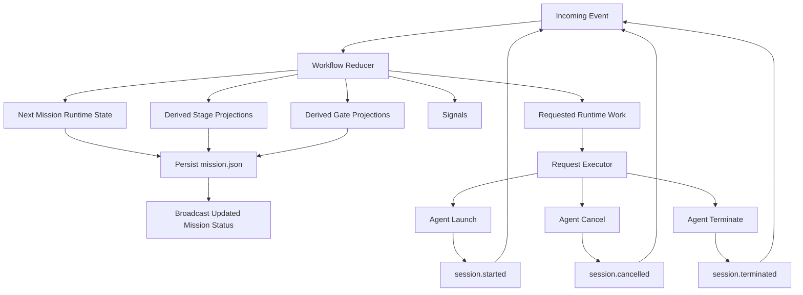
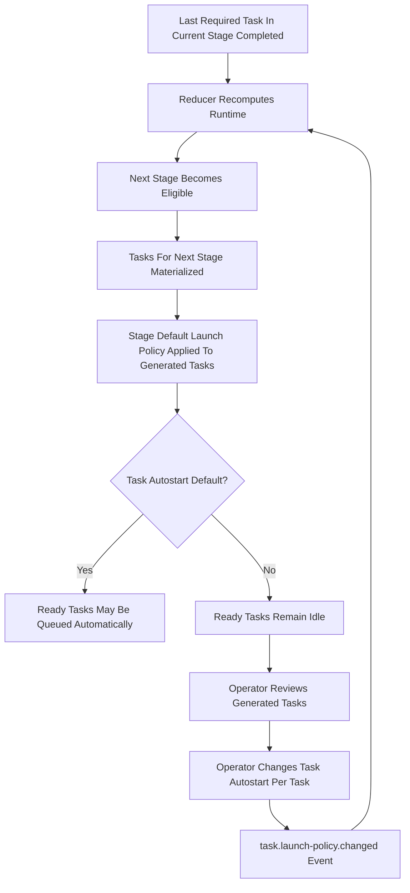

# Workflow Engine

This document defines the target design for the next-generation Mission workflow engine.

This is a from-scratch specification.

It does not preserve compatibility with the current workflow engine, current `mission.json` schema, current stage runtime model, or current imperative gate-check APIs.

The purpose of this document is to establish the exact engine contract before implementation.

## Relationship To Other Specifications

This document must be read alongside the airport control plane specification, the core object model specification, the mission model, the agent runtime specification, and the workflow control surface specification.

Priority rule:

1. this workflow engine specification defines semantic mission runtime truth and valid workflow events
2. the airport control plane specification defines daemon-wide composite state, layout truth, panel projections, and substrate reconciliation
3. the agent runtime specification defines the provider-neutral agent execution boundary used by workflow requests
4. the control surface specification defines how surfaces project workflow and airport state without becoming authorities

If a document assigns layout, focus, panel, client, or substrate ownership to the workflow engine, that document is wrong and must change.

## Goals

The workflow engine must be:

- configuration-driven
- mission-local and reproducible
- event-driven
- reducer-based
- explicit about side effects
- human-interruptible by design
- capable of full panic stop behavior
- task-centric in execution semantics
- stage-centric only as a structural and derived concept

## Core Principles

1. Workflow behavior is defined by configuration, not by UI heuristics or daemon loops.
2. Once a mission starts, workflow settings are snapshotted into `mission.json` and become the authoritative runtime policy for that mission.
3. Runtime changes happen only through events.
4. The workflow reducer is the only component allowed to change workflow runtime state.
5. Side effects such as launching or terminating agent sessions are not state transitions. They are requested effects emitted by the reducer.
6. Stages do not execute work. Tasks execute work.
7. Stage state is derived from task state and workflow structure.
8. Human-in-the-loop behavior is implemented as mission orchestration policy, not as stage runtime pause state.
9. Stage checkpoints are modeled as suppression of task auto-launch for newly ready tasks in that stage.
10. Task launch policy is copied from stage defaults into generated task runtime settings and may then be edited per task.

## Non-Goals

This design does not attempt to preserve:

- the current `Mission` aggregate public API
- the current `MissionControlState` schema version
- the current stage `start` and `restart` command contract
- the current autopilot loop behavior as the source of workflow semantics
- the current split between task transition rules and imperative gate evaluation

## Conceptual Model

The system has three layers.

### 1. Workflow Definition

This is static policy.

It defines:

- stage order
- gate rules
- task generation rules
- default task launch policy per stage
- mission-level human interrupt policy
- panic policy
- concurrency policy

### 2. Mission Runtime State

This is the durable, mission-local state stored in `mission.json`.

It contains:

- snapshotted workflow settings
- mission lifecycle state
- stage projections
- task runtime state
- agent session runtime state
- gate projections
- mission pause state
- panic state
- recent event log

It does not contain:

- airport gate bindings
- airport focus intent or observed focus
- panel registrations or client registrations
- terminal-manager pane ids as application routing truth
- substrate attachment observations

### 3. Workflow Engine

This is a pure reducer plus an effect planner.

It accepts:

- current mission runtime state
- one workflow event

It returns:

- next mission runtime state
- emitted workflow signals
- requested runtime effects

## Execution Ownership

Execution semantics belong to tasks and sessions.

Stages are structural.

That means:

- a task may be ready, queued, running, blocked, completed, failed, or cancelled
- a session may be starting, running, completed, failed, cancelled, or terminated
- a stage may be pending, ready, active, blocked, or completed, but only as a derived projection

The engine must not model a stage as a separately paused or running actor.

## Mission Lifecycle

Mission lifecycle is orchestration state.

```ts
export type MissionLifecycleState =
  | 'draft'
  | 'ready'
  | 'running'
  | 'paused'
  | 'panicked'
  | 'completed'
  | 'delivered';
```

Definitions:

- `draft`: mission record exists but runtime has not started yet
- `ready`: mission is initialized and may begin processing
- `running`: engine is allowed to launch work automatically
- `paused`: engine may not auto-launch new work until resumed by a human event
- `panicked`: engine has halted, active sessions are being terminated or already terminated, and no automatic progression is allowed
- `completed`: all workflow work is complete but mission has not yet been delivered
- `delivered`: delivery action has been completed

## Derived Stage State

Stage state is derived.

```ts
export type MissionStageDerivedState =
  | 'pending'
  | 'ready'
  | 'active'
  | 'blocked'
  | 'completed';
```

Definitions:

- `pending`: prior stage completion conditions have not been satisfied
- `ready`: the stage is eligible and contains one or more ready tasks, but no tasks are currently queued or running
- `active`: the stage contains one or more queued or running tasks
- `blocked`: the stage is eligible but no progress can be made because relevant remaining tasks are blocked or require manual start
- `completed`: all required tasks in the stage are completed

Important:

- the engine does not store stage runtime control flags like `paused`
- a human checkpoint before a stage does not pause the stage
- it prevents auto-launch of newly ready tasks in that stage

## Task Runtime State

Task runtime state is authoritative for execution.

```ts
export type MissionTaskLifecycleState =
  | 'pending'
  | 'ready'
  | 'queued'
  | 'running'
  | 'blocked'
  | 'completed'
  | 'failed'
  | 'cancelled';

export interface MissionTaskRuntimeSettings {
  autostart: boolean;
  agentMetadata?: Record<string, string | number | boolean | null>;
}

export interface MissionTaskRuntimeState {
  taskId: string;
  stageId: MissionStageId;
  title: string;
  instruction: string;
  dependsOn: string[];
  lifecycle: MissionTaskLifecycleState;
  blockedByTaskIds: string[];
  runtime: MissionTaskRuntimeSettings;
  agentRunner?: string;
  retries: number;
  createdAt: string;
  updatedAt: string;
  completedAt?: string;
  failedAt?: string;
  cancelledAt?: string;
}
```

`agentRunner` selects the adapter family.

`runtime.agentMetadata` is an opaque adapter configuration bag.

The workflow engine stores and snapshots it, but does not interpret provider-specific keys semantically.

### Task Autostart Semantics

`autostart` means:

- if the task becomes `ready`
- and the mission lifecycle allows auto-execution
- and concurrency rules permit new work
- and no panic or global pause is in effect

then the engine may queue the task and emit a session launch effect for it.

If `autostart` is `false`, the task becomes `ready` but remains idle until a human-triggered event explicitly starts it.

## Stage-Level Task Launch Defaults

Stages define default task launch policy. They do not define stage execution state.

```ts
export interface WorkflowStageTaskLaunchPolicy {
  defaultAutostart: boolean;
}

export interface WorkflowStageDefinition {
  stageId: MissionStageId;
  displayName: string;
  taskLaunchPolicy: WorkflowStageTaskLaunchPolicy;
  completionPolicy: {
    requireAllTasksCompleted: boolean;
  };
}
```

When tasks are generated for a stage, each task instance receives a copy of the stage default launch policy.

After generation, the task instance owns runtime truth.

That means the operator may change:

- one implementation task to `autostart: true`
- another implementation task to `autostart: false`

without changing stage policy.

## Human-In-The-Loop Model

Human intervention belongs to mission orchestration.

```ts
export type MissionPauseReason =
  | 'human-requested'
  | 'panic'
  | 'checkpoint'
  | 'agent-failure'
  | 'system';

export interface MissionPauseState {
  paused: boolean;
  reason?: MissionPauseReason;
  targetType?: 'mission' | 'task' | 'session';
  targetId?: string;
  requestedAt?: string;
}
```

There is no stage pause state.

Checkpoint behavior is implemented by one or both of these policies:

1. mission lifecycle enters `paused`
2. tasks in a newly eligible stage are created with `autostart: false`

## Panic Model

Panic is a first-class mission runtime state.

```ts
export interface MissionPanicState {
  active: boolean;
  requestedAt?: string;
  requestedBy?: 'human' | 'system';
  terminateSessions: boolean;
  clearLaunchQueue: boolean;
  haltMission: boolean;
}
```

When panic is triggered:

1. the mission lifecycle becomes `panicked`
2. all queued launches are discarded if configured
3. all active sessions receive termination effects if configured
4. no auto-launch is allowed until a human resume event occurs

## Global Workflow Settings

These settings belong in daemon-level global settings.

They are defaults for future missions only.

```ts
export interface WorkflowMissionAutostartSettings {
  mission: boolean;
}

export interface WorkflowHumanInLoopSettings {
  enabled: boolean;
  pauseOnMissionStart: boolean;
  pauseOnTaskFailure: boolean;
  pauseOnTaskCompletion: boolean;
}

export interface WorkflowPanicSettings {
  terminateSessions: boolean;
  clearLaunchQueue: boolean;
  haltMission: boolean;
}

export interface WorkflowExecutionSettings {
  maxParallelTasks: number;
  maxParallelSessions: number;
}

export interface WorkflowGlobalSettings {
  autostart: WorkflowMissionAutostartSettings;
  humanInLoop: WorkflowHumanInLoopSettings;
  panic: WorkflowPanicSettings;
  execution: WorkflowExecutionSettings;
  stages: Record<MissionStageId, WorkflowStageDefinition>;
}

export interface MissionDaemonSettings {
  agentRunner?: string;
  defaultAgentMode?: 'interactive' | 'autonomous';
  defaultModel?: string;
  defaultAgentMetadata?: Record<string, string | number | boolean | null>;
  towerTheme?: string;
  trackingProvider?: 'github';
  instructionsPath?: string;
  skillsPath?: string;
  workflow?: WorkflowGlobalSettings;
}
```

`defaultAgentMode` and `defaultModel` remain scalar Mission preferences because they are already used as cross-runner setup defaults.

Runner-specific launch knobs that do not generalize across adapters belong in opaque metadata instead of new top-level core fields.

## Mission Snapshot Rule

When a mission starts, the effective workflow settings are copied into `mission.json`.

After that point:

- global settings may change
- existing missions must not change behavior automatically

This is required for reproducibility and debuggability.

## Mission Runtime Document

The mission-local runtime document is the authoritative workflow record.

```ts
export interface MissionWorkflowRuntimeDocument {
  schemaVersion: number;
  missionId: string;
  configuration: MissionWorkflowConfigurationSnapshot;
  runtime: MissionWorkflowRuntimeState;
  eventLog: MissionWorkflowEventRecord[];
}

export interface MissionWorkflowConfigurationSnapshot {
  createdAt: string;
  source: 'global-settings';
  workflow: WorkflowGlobalSettings;
}

export interface MissionWorkflowRuntimeState {
  lifecycle: MissionLifecycleState;
  pause: MissionPauseState;
  panic: MissionPanicState;
  activeStageId?: MissionStageId;
  stages: MissionStageRuntimeProjection[];
  tasks: MissionTaskRuntimeState[];
  sessions: MissionAgentSessionRuntimeState[];
  gates: MissionGateProjection[];
  launchQueue: MissionTaskLaunchRequest[];
  updatedAt: string;
}
```

This mission-local runtime document is the semantic workflow slice only.

The daemon-wide authoritative state described by the airport control plane specification is a larger composite state rooted at `MissionSystemState`.

`mission.json` must not be treated as the full application state root.

## Workflow And Airport Boundary

The workflow engine owns only semantic mission runtime truth.

That means:

- task lifecycle, session lifecycle, pause state, panic state, stage projections, and workflow gate projections belong here
- airport gate bindings, panel identity, focus intent, observed focus, client state, and substrate observations do not belong here
- workflow reduction must not inspect terminal-manager, panel processes, or client focus directly
- any substrate or panel fact that matters to application behavior must be reduced elsewhere in the daemon-owned airport loop

## Stage Runtime Projection

The stage view in `mission.json` is a projection, not an independently controlled object.

```ts
export interface MissionStageRuntimeProjection {
  stageId: MissionStageId;
  lifecycle: MissionStageDerivedState;
  taskIds: string[];
  readyTaskIds: string[];
  queuedTaskIds: string[];
  runningTaskIds: string[];
  blockedTaskIds: string[];
  completedTaskIds: string[];
  enteredAt?: string;
  completedAt?: string;
}
```

## Agent Session Runtime State

```ts
export type MissionAgentSessionLifecycleState =
  | 'starting'
  | 'running'
  | 'completed'
  | 'failed'
  | 'cancelled'
  | 'terminated';

export interface MissionAgentSessionRuntimeState {
  sessionId: string;
  taskId: string;
  runtimeId: string;
  lifecycle: MissionAgentSessionLifecycleState;
  launchedAt: string;
  updatedAt: string;
  completedAt?: string;
  failedAt?: string;
  cancelledAt?: string;
  terminatedAt?: string;
}
```

## Gate Projections

Gates are projections, not imperative commands.

These are workflow gates, not airport layout gates.

They represent semantic workflow checkpoints such as implementation, verification, audit, or delivery readiness.

They are not `dashboard`, `editor`, or `agentSession`, and they must not be used as terminal layout slots, focus targets, or panel identities.

```ts
export type MissionGateState = 'blocked' | 'passed';

export interface MissionGateProjection {
  gateId: string;
  intent: 'implement' | 'verify' | 'audit' | 'deliver';
  state: MissionGateState;
  stageId?: MissionStageId;
  reasons: string[];
  updatedAt: string;
}
```

Every event that changes task, stage, mission, or session facts must trigger recomputation of gate projections.

## Workflow Events

The engine accepts only explicit workflow events.

```ts
export type MissionWorkflowEvent =
  | MissionCreatedEvent
  | MissionStartedEvent
  | MissionResumedEvent
  | MissionPausedEvent
  | PanicStopRequestedEvent
  | PanicStopClearedEvent
  | TasksGeneratedEvent
  | TaskLaunchPolicyChangedEvent
  | TaskMarkedReadyEvent
  | TaskQueuedEvent
  | TaskStartedEvent
  | TaskMarkedDoneEvent
  | TaskMarkedBlockedEvent
  | TaskReopenedEvent
  | AgentSessionStartedEvent
  | AgentSessionCompletedEvent
  | AgentSessionFailedEvent
  | AgentSessionCancelledEvent
  | AgentSessionTerminatedEvent;

export interface MissionWorkflowEventBase {
  eventId: string;
  type: string;
  occurredAt: string;
  source: 'system' | 'human' | 'agent' | 'daemon';
}

export interface MissionCreatedEvent extends MissionWorkflowEventBase {
  type: 'mission.created';
}

export interface MissionStartedEvent extends MissionWorkflowEventBase {
  type: 'mission.started';
}

export interface MissionResumedEvent extends MissionWorkflowEventBase {
  type: 'mission.resumed';
}

export interface MissionPausedEvent extends MissionWorkflowEventBase {
  type: 'mission.paused';
  reason: MissionPauseReason;
}

export interface PanicStopRequestedEvent extends MissionWorkflowEventBase {
  type: 'mission.panic.requested';
}

export interface PanicStopClearedEvent extends MissionWorkflowEventBase {
  type: 'mission.panic.cleared';
}

export interface TasksGeneratedEvent extends MissionWorkflowEventBase {
  type: 'tasks.generated';
  stageId: MissionStageId;
  taskIds: string[];
}

export interface TaskLaunchPolicyChangedEvent extends MissionWorkflowEventBase {
  type: 'task.launch-policy.changed';
  taskId: string;
  autostart: boolean;
}

export interface TaskMarkedReadyEvent extends MissionWorkflowEventBase {
  type: 'task.ready';
  taskId: string;
}

export interface TaskQueuedEvent extends MissionWorkflowEventBase {
  type: 'task.queued';
  taskId: string;
}

Manual task start is modeled as a human-emitted `task.queued` event.

There is no separate agent-session auto-launch mode and no separate `/launch` task action.

export interface TaskStartedEvent extends MissionWorkflowEventBase {
  type: 'task.started';
  taskId: string;
}

export interface TaskMarkedDoneEvent extends MissionWorkflowEventBase {
  type: 'task.completed';
  taskId: string;
}

export interface TaskMarkedBlockedEvent extends MissionWorkflowEventBase {
  type: 'task.blocked';
  taskId: string;
  reason?: string;
}

export interface TaskReopenedEvent extends MissionWorkflowEventBase {
  type: 'task.reopened';
  taskId: string;
}

export interface AgentSessionStartedEvent extends MissionWorkflowEventBase {
  type: 'session.started';
  sessionId: string;
  taskId: string;
}

export interface AgentSessionCompletedEvent extends MissionWorkflowEventBase {
  type: 'session.completed';
  sessionId: string;
  taskId: string;
}

export interface AgentSessionFailedEvent extends MissionWorkflowEventBase {
  type: 'session.failed';
  sessionId: string;
  taskId: string;
}

export interface AgentSessionCancelledEvent extends MissionWorkflowEventBase {
  type: 'session.cancelled';
  sessionId: string;
  taskId: string;
}

export interface AgentSessionTerminatedEvent extends MissionWorkflowEventBase {
  type: 'session.terminated';
  sessionId: string;
  taskId: string;
}

export interface MissionWorkflowEventRecord {
  eventId: string;
  type: string;
  occurredAt: string;
  source: 'system' | 'human' | 'agent' | 'daemon';
  payload: Record<string, unknown>;
}
```

## Reducer Contract

The reducer is pure.

```ts
export interface MissionWorkflowSignal {
  signalId: string;
  type:
    | 'stage.ready'
    | 'stage.completed'
    | 'task.ready'
    | 'gate.passed'
    | 'gate.blocked'
    | 'mission.completed'
    | 'mission.delivered-ready';
  emittedAt: string;
  payload: Record<string, unknown>;
}

export interface MissionWorkflowRequest {
  requestId: string;
  type:
    | 'session.launch'
    | 'session.prompt'
    | 'session.command'
    | 'session.terminate'
    | 'session.cancel'
    | 'mission.pause'
    | 'mission.mark-completed';
  payload: Record<string, unknown>;
}

export interface MissionWorkflowReducerResult {
  nextState: MissionWorkflowRuntimeState;
  signals: MissionWorkflowSignal[];
  requests: MissionWorkflowRequest[];
}

export interface MissionWorkflowReducer {
  reduce(
    current: MissionWorkflowRuntimeState,
    event: MissionWorkflowEvent,
    configuration: MissionWorkflowConfigurationSnapshot
  ): MissionWorkflowReducerResult;
}
```

## Request Executor Contract

The request executor is not part of the reducer.

It performs requested runtime work and feeds completion back into the engine as new events.

It must route all live session work through the daemon-owned agent control path built on `AgentRunner` and `AgentSession`.

Examples:

- `session.launch` request succeeds and generates `session.started`
- a running session later exits successfully and generates `session.completed`
- panic policy emits `session.terminate` requests for all running sessions

## Core Flow

The runtime flow is:

1. load mission runtime state
2. receive one event
3. reduce state
4. recompute stage projections and gate projections
5. emit signals
6. emit requests
7. persist new `mission.json`
8. execute requests outside the reducer
9. feed resulting request outcomes back as new events

## Mermaid Flow



## Stage Checkpoint Flow

This diagram shows the intended behavior for a stage boundary where the next stage does not auto-launch tasks.



## Critical Derived Rules

The engine must recompute all of the following after every event:

- task blocked-by set
- task readiness
- launch queue eligibility
- stage lifecycle projection
- gate projections
- mission completion projection

The engine must not require a separate imperative “gate check again” operation.

## Stage Completion Rule

A stage becomes `completed` when:

1. its completion policy is satisfied
2. all required tasks in that stage are `completed`

A stage becomes `active` when:

1. it is eligible
2. and one or more tasks in the stage are `queued` or `running`

A stage becomes `ready` when:

1. it is eligible
2. it is not `completed`
3. it has one or more `ready` tasks
4. it has no `queued` or `running` tasks

## Mission Pause Rule

Mission pause prevents auto-launch of new work.

Mission pause does not necessarily:

- terminate active sessions
- cancel queued work

Those behaviors are controlled separately by panic or explicit human commands.

## Panic Rule

Panic always suppresses new launches.

Depending on configured policy, panic may also:

- terminate all active sessions
- clear queued tasks
- force mission lifecycle to remain halted until resume

## Command Model Implication

The daemon and UI should expose commands against these first-class concepts:

- pause mission
- resume mission
- panic stop mission
- clear panic
- mark task done
- mark task blocked
- reopen task
- set task autostart on
- set task autostart off
- start ready task manually

The daemon and UI should not require commands like:

- pause stage
- resume stage
- start stage

unless those commands are purely projections over task policy and mission orchestration, not true runtime stage actions.

## Implementation Consequences

The future implementation should introduce:

1. a new workflow settings object in daemon settings
2. a new mission-local runtime schema in `mission.json`
3. a reducer-driven workflow engine module
4. a request executor module
5. a projection builder for stage, gate, and command status
6. a migration strategy only if migration is explicitly desired later

No compatibility layer is assumed by this specification.

## Decision Summary

This specification establishes the following design decisions:

1. stages are derived, not executed
2. tasks are the execution unit
3. stage checkpoints suppress task auto-launch rather than pausing stages
4. stage launch policy is copied into generated tasks as task runtime policy
5. task runtime launch policy may be edited per task after generation
6. all runtime changes happen via events
7. all external work happens via requested runtime work
8. mission-level orchestration owns pause and panic behavior
9. gates are derived projections, not imperative checks
